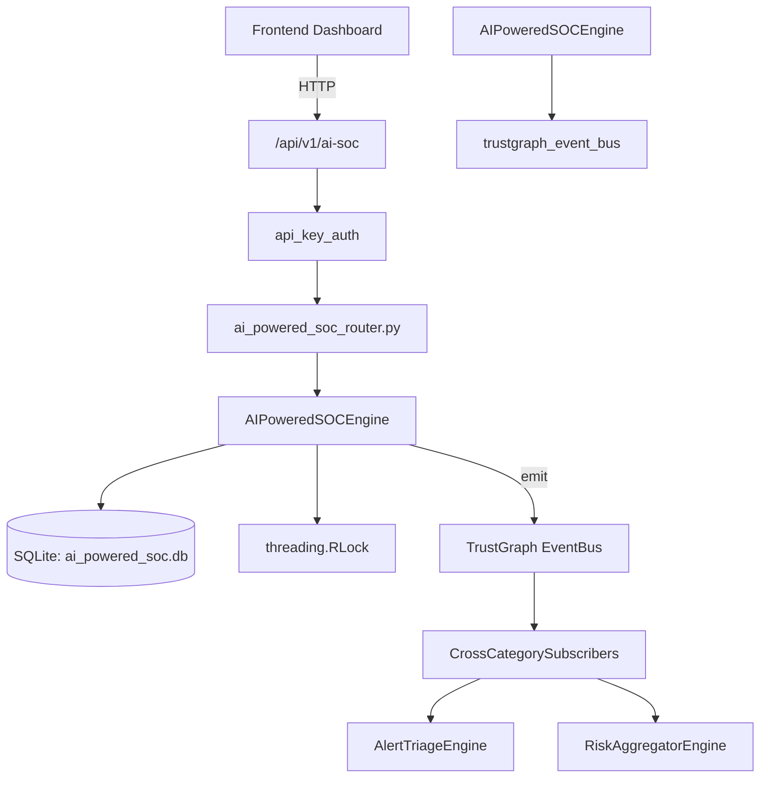

# US-0006: Ai Powered Soc

## Sub-Epic: AI Intelligence
**Master Goal**: ALDECI — $35/mo enterprise security intelligence platform replacing $50K-500K/yr tools

## User Story
As a **Chris Lee (Security Data Scientist)**, I need to leverage AI/ML for threat detection and analysis
so that the platform delivers enterprise-grade ai intelligence capabilities at 1/1000th the cost of legacy tools.

## Why This Matters
Ai Powered Soc replaces functionality found in enterprise tools like CrowdStrike, Wiz, Snyk, and Rapid7.
By building this into ALDECI's $35/mo stack, customers save $50K+/yr on standalone AI Intelligence tooling.

## Architecture

## Current State: 95% Complete
- ✅ `record_detection()` — Record a new AI-driven detection. (line 147)
- ✅ `list_detections()` — List detections with optional filters. (line 211)
- ✅ `triage_detection()` — Update the status of a detection (triage workflow). (line 235)
- ✅ `register_model()` — Register an AI/ML model for the SOC. (line 282)
- ✅ `update_model_status()` — Update a model's status (and optionally last_retrained timestamp). (line 325)
- ✅ `list_models()` — List models with optional filters. (line 355)
- ❌ TrustGraph event emission — not yet verified

## Key Functions (from `suite-core/core/ai_powered_soc_engine.py` — 549 lines)
- `AIPoweredSOCEngine.record_detection()` — Record a new AI-driven detection. (line 147)
- `AIPoweredSOCEngine.list_detections()` — List detections with optional filters. (line 211)
- `AIPoweredSOCEngine.triage_detection()` — Update the status of a detection (triage workflow). (line 235)
- `AIPoweredSOCEngine.register_model()` — Register an AI/ML model for the SOC. (line 282)
- `AIPoweredSOCEngine.update_model_status()` — Update a model's status (and optionally last_retrained timestamp). (line 325)
- `AIPoweredSOCEngine.list_models()` — List models with optional filters. (line 355)
- `AIPoweredSOCEngine.create_automation_rule()` — Create an automation rule. (line 379)
- `AIPoweredSOCEngine.execute_automation()` — Increment execution counters for an automation rule. (line 421)

## Dependencies
- **Depends on**: trustgraph_event_bus
- **Depended by**: Routers, TrustGraph EventBus, CrossCategorySubscribers
- **TrustGraph**: Event emission wired via ResponseInterceptorMiddleware
- **Source file**: `suite-core/core/ai_powered_soc_engine.py` (549 lines)
- **Router file**: `suite-api/apps/api/ai_powered_soc_router.py`

## API Endpoints
| Method | Path | Description |
|--------|------|-------------|
| POST | `/api/v1/ai-soc/detections` | record detection |
| GET | `/api/v1/ai-soc/detections` | list detections |
| PUT | `/api/v1/ai-soc/detections/{detection_id}/triage` | triage detection |
| POST | `/api/v1/ai-soc/models` | register model |
| GET | `/api/v1/ai-soc/models` | list models |
| PUT | `/api/v1/ai-soc/models/{model_id}/status` | update model status |
| POST | `/api/v1/ai-soc/automation` | create automation rule |
| GET | `/api/v1/ai-soc/automation` | list automation rules |
| PUT | `/api/v1/ai-soc/automation/{rule_id}/execute` | execute automation |
| GET | `/api/v1/ai-soc/stats` | get soc stats |

## Tasks Remaining
1. Verify TrustGraph event emission works end-to-end (2h)
2. Add integration test with real persona workflow (2h)
3. Wire CrossCategorySubscriber consumer chain (1h)
4. Validate with 30-persona walkthrough (1h)
5. Optimize query performance for large datasets (2h)
6. Expand test coverage to edge cases (2h)

## Definition of Done
- [ ] Chris Lee (Security Data Scientist) can access /api/v1/ai-soc and get meaningful data
- [ ] All CRUD operations return correct HTTP status codes
- [ ] TrustGraph receives events from this engine
- [ ] 46+ tests passing in `tests/test_ai_powered_soc_engine.py`
- [ ] 30-persona walkthrough includes this endpoint at 100%
- [ ] No hardcoded org_id — all queries are org-scoped

## Sprint: Wave 42 (est. April 18-20, 2026)

## Test Coverage
- **Test file**: `tests/test_ai_powered_soc_engine.py`
- **Tests**: 46 tests
- **Status**: Passing
