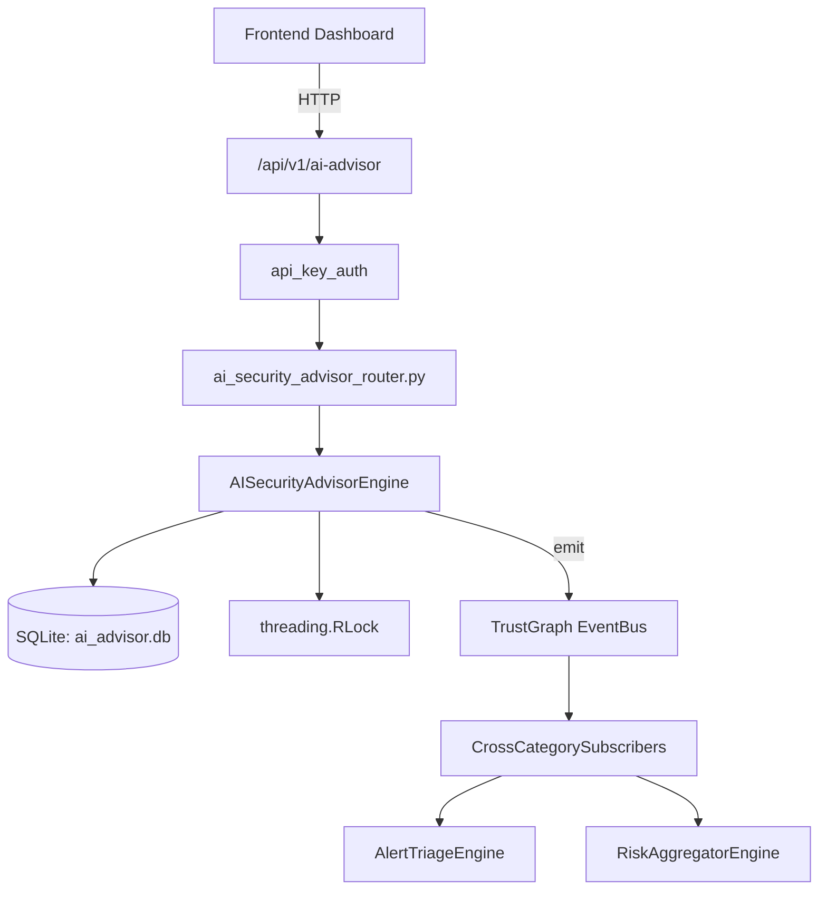

# US-0007: Ai Security Advisor

## Sub-Epic: AI Intelligence
**Master Goal**: ALDECI — $35/mo enterprise security intelligence platform replacing $50K-500K/yr tools

## User Story
As a **Chris Lee (Security Data Scientist)**, I need to leverage AI/ML for threat detection and analysis
so that the platform delivers enterprise-grade ai intelligence capabilities at 1/1000th the cost of legacy tools.

## Why This Matters
Ai Security Advisor replaces functionality found in enterprise tools like CrowdStrike, Wiz, Snyk, and Rapid7.
By building this into ALDECI's $35/mo stack, customers save $50K+/yr on standalone AI Intelligence tooling.

## Architecture

## Current State: 95% Complete
- ✅ `generate_posture_recommendations()` — Generate 5 prioritised security recommendations from posture context. (line 453)
- ✅ `analyze_incident()` — Analyse a security incident and generate structured findings. (line 520)
- ✅ `generate_remediation_plan()` — Generate a step-by-step remediation plan for a vulnerability. (line 580)
- ✅ `get_threat_briefing()` — Generate an executive threat briefing. (line 648)
- ✅ `ask_advisor()` — Free-form security question answered by the AI advisor. (line 723)
- ✅ `list_sessions()` — List advisor sessions for an org, optionally filtered by type. (line 765)
- ❌ TrustGraph event emission — not yet verified

## Key Functions (from `suite-core/core/ai_security_advisor_engine.py` — 964 lines)
- `AISecurityAdvisorEngine.generate_posture_recommendations()` — Generate 5 prioritised security recommendations from posture context. (line 453)
- `AISecurityAdvisorEngine.analyze_incident()` — Analyse a security incident and generate structured findings. (line 520)
- `AISecurityAdvisorEngine.generate_remediation_plan()` — Generate a step-by-step remediation plan for a vulnerability. (line 580)
- `AISecurityAdvisorEngine.get_threat_briefing()` — Generate an executive threat briefing. (line 648)
- `AISecurityAdvisorEngine.ask_advisor()` — Free-form security question answered by the AI advisor. (line 723)
- `AISecurityAdvisorEngine.list_sessions()` — List advisor sessions for an org, optionally filtered by type. (line 765)
- `AISecurityAdvisorEngine.get_session()` — Get a session with its recommendations. (line 793)
- `AISecurityAdvisorEngine.list_recommendations()` — List recommendations with optional filters. (line 828)

## Dependencies
- **Depends on**: standalone
- **Depended by**: Routers, TrustGraph EventBus, CrossCategorySubscribers
- **TrustGraph**: Event emission wired via ResponseInterceptorMiddleware
- **Source file**: `suite-core/core/ai_security_advisor_engine.py` (964 lines)
- **Router file**: `suite-api/apps/api/ai_security_advisor_router.py`

## API Endpoints
| Method | Path | Description |
|--------|------|-------------|
| POST | `/api/v1/ai-advisor/posture-review` | generate posture recommendations |
| POST | `/api/v1/ai-advisor/analyze-incident` | analyze incident |
| POST | `/api/v1/ai-advisor/remediation-plan` | generate remediation plan |
| POST | `/api/v1/ai-advisor/threat-briefing` | get threat briefing |
| POST | `/api/v1/ai-advisor/ask` | ask advisor |
| GET | `/api/v1/ai-advisor/sessions` | list sessions |
| GET | `/api/v1/ai-advisor/sessions/{session_id}` | get session |
| GET | `/api/v1/ai-advisor/recommendations` | list recommendations |
| PATCH | `/api/v1/ai-advisor/recommendations/{rec_id}/status` | update recommendation status |
| GET | `/api/v1/ai-advisor/stats` | get stats |

## Tasks Remaining
1. Verify TrustGraph event emission works end-to-end (2h)
2. Add integration test with real persona workflow (2h)
3. Wire CrossCategorySubscriber consumer chain (1h)
4. Validate with 30-persona walkthrough (1h)
5. Optimize query performance for large datasets (2h)
6. Expand test coverage to edge cases (2h)

## Definition of Done
- [ ] Chris Lee (Security Data Scientist) can access /api/v1/ai-advisor and get meaningful data
- [ ] All CRUD operations return correct HTTP status codes
- [ ] TrustGraph receives events from this engine
- [ ] 45+ tests passing in `tests/test_ai_security_advisor_engine.py`
- [ ] 30-persona walkthrough includes this endpoint at 100%
- [ ] No hardcoded org_id — all queries are org-scoped

## Sprint: Wave 42 (est. April 18-20, 2026)

## Test Coverage
- **Test file**: `tests/test_ai_security_advisor_engine.py`
- **Tests**: 45 tests
- **Status**: Passing
