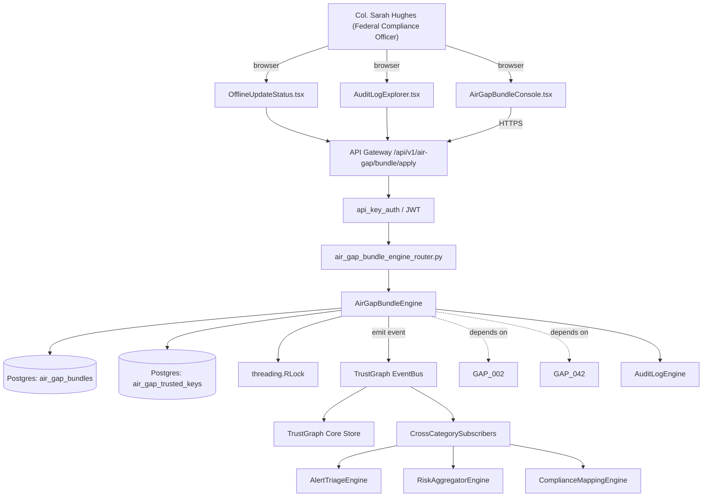

# US-0001: Ship air-gap signed intelligence bundle + two-machine update-tool workflow (SAGE-equivalent)

## Sub-Epic: Air-gap/On-prem
**Master Goal**: ALDECI — tiered $199-$1,499/mo enterprise security intelligence platform replacing $50K-$500K/yr tools

## User Story
As a **Col. Sarah Hughes (Federal Compliance Officer)**, I need to ship air-gap signed intelligence bundle + two-machine update-tool workflow so that Fixops meets DoD IL4/IL5, FedRAMP High, and air-gapped customer requirements without SAGE-class gaps.

## Why This Matters
Per competitor-sonatype.md §0 and §8, Sonatype's single biggest federal/defense win is SAGE: CLI produces a signed daily bundle (vulns, policies, malicious-pkg feed, mirrored artifacts) on an internet-connected machine; a second CLI applies it to the classified side. Fixops must match this exactly: signed tarball, documented schema, verification on import, no HTTPS-proxy handwave. Build a `fixops-offline-bundle` CLI + import-side REST API + UI.

This work is called out as a P0 gap in `competitor-sonatype.md`. Shipping it is load-bearing for ALDECI's tiered $199-$1,499/mo positioning against $50K-$500K/yr incumbents: every delayed gap becomes a displacement deal we lose.

## Architecture

## Current State: 0% — MISSING (new engine)
- [ ] Engine module `suite-core/core/air_gap_bundle_engine.py` does not exist yet
- [ ] Router `suite-api/apps/api/air_gap_bundle_engine_router.py` does not exist yet
- [ ] DB tables listed under Data Model do not exist yet
- [ ] Frontend screens listed under Key Functions do not exist yet
- [ ] No TrustGraph events emitted yet

## Key Functions
**Backend (engine methods):**
- `create_apply()` — backs `POST /api/v1/air-gap/bundle/apply`
- `get_status()` — backs `GET /api/v1/air-gap/bundle/status`
- `get_history()` — backs `GET /api/v1/air-gap/bundle/history`
- `get_feed_status()` — backs `GET /api/v1/air-gap/feed-status`

**Frontend screens:**
- `AirGapBundleConsole.tsx` — operator-facing UI surface for this gap
- `OfflineUpdateStatus.tsx` — operator-facing UI surface for this gap
- `AuditLogExplorer.tsx` — operator-facing UI surface for this gap

## API Endpoints
| Method | Path | Auth | Purpose |
|--------|------|------|---------|
| POST | `/api/v1/air-gap/bundle/apply` | api_key_auth | bundle apply |
| GET | `/api/v1/air-gap/bundle/status` | api_key_auth | bundle status |
| GET | `/api/v1/air-gap/bundle/history` | api_key_auth | bundle history |
| GET | `/api/v1/air-gap/feed-status` | api_key_auth | air gap feed status |

## Data Model
- add air_gap_bundles table: id, bundle_hash, signature_fingerprint, feed_version, applied_at, applied_by, source_bundle_date, content_summary (JSONB)
- add air_gap_trusted_keys table: id, public_key_pem, fingerprint, added_at, added_by, active (bool)

## Dependencies
**Depends on**: GAP-002, GAP-042
**Depended by**: Router layer, TrustGraph EventBus, CrossCategorySubscribers, CrossCategoryEvidenceBuilder, AuditLogEngine
**New engine module**: `suite-core/core/air_gap_bundle_engine.py`
**New router module**: `suite-api/apps/api/air_gap_bundle_engine_router.py`
**Master gap id**: `GAP-001` (priority P0, effort L)

## Tasks Remaining
1. Schema migration: add air_gap_bundles table (4h)
2. Schema migration: add air_gap_trusted_keys table (4h)
3. Implement endpoint POST /api/v1/air-gap/bundle/apply (6h)
4. Implement endpoint GET /api/v1/air-gap/bundle/status (6h)
5. Implement endpoint GET /api/v1/air-gap/bundle/history (6h)
6. Implement endpoint GET /api/v1/air-gap/feed-status (6h)
7. Wire frontend screen AirGapBundleConsole.tsx (5h)
8. Wire frontend screen OfflineUpdateStatus.tsx (5h)
9. Wire frontend screen AuditLogExplorer.tsx (5h)
10. Write 5 pytest cases: test_bundle_signature_verification_happy_path, test_bundle_signature_rejection_on_tamper… (6h)
11. Wire TrustGraph event emission + CrossCategorySubscriber consumers (4h)
12. Persona walkthrough + integration test (3h)
13. Docs + API reference update (2h)

## Definition of Done
- [ ] Given an internet-connected machine with `fixops-offline-bundle export --out feed.tar.zst`, When the command runs, Then it emits a tarball containing intel, policies, feed-version manifest, and a detached Ed25519 signature over the manifest.
- [ ] Given an air-gapped Fixops instance, When an admin uploads the bundle via `POST /api/v1/air-gap/bundle/apply`, Then the server verifies the Ed25519 signature using the pre-provisioned public key, rejects if signature/date/chain invalid, and records the apply event in the audit log.
- [ ] Given a successful bundle apply, When the admin visits AirGapBundleConsole.tsx, Then the UI shows the feed version, signature fingerprint, apply timestamp, and diff of new CVEs/policies vs prior bundle.
- [ ] Given two bundles applied 24h apart, When the audit log is queried via GET /api/v1/audit-log?resource_type=air_gap_bundle, Then both apply events are present with actor, bundle hash, and outcome.
- [ ] Given an invalid or tampered bundle, When apply is attempted, Then the API returns HTTP 409 with error_code=BUNDLE_SIGNATURE_INVALID and the server state is unchanged.
- [ ] Given the CLI and server docs, When a user follows the two-machine runbook end-to-end, Then they can complete export-transfer-apply in under 30 minutes with no internet access on the target side.
- [ ] All endpoints are org-scoped (no hardcoded org_id) and gated by `api_key_auth`.
- [ ] TrustGraph emits at least one event type for this engine and a CrossCategorySubscriber consumes it.
- [ ] `Col. Sarah Hughes (Federal Compliance Officer)` can execute the full workflow in the 30-persona walkthrough.

## Tests Required
- `test_bundle_signature_verification_happy_path`
- `test_bundle_signature_rejection_on_tamper`
- `test_bundle_apply_audit_log_entry`
- `test_bundle_feed_version_monotonic_enforcement`
- `test_cli_export_reproducible_with_fixed_seed`

## Sprint: Wave 43 (est. Apr 22-Apr 28, 2026)

## Citation
Source research: `competitor-sonatype.md` (gap `GAP-001`, priority `P0`, effort `L`)
