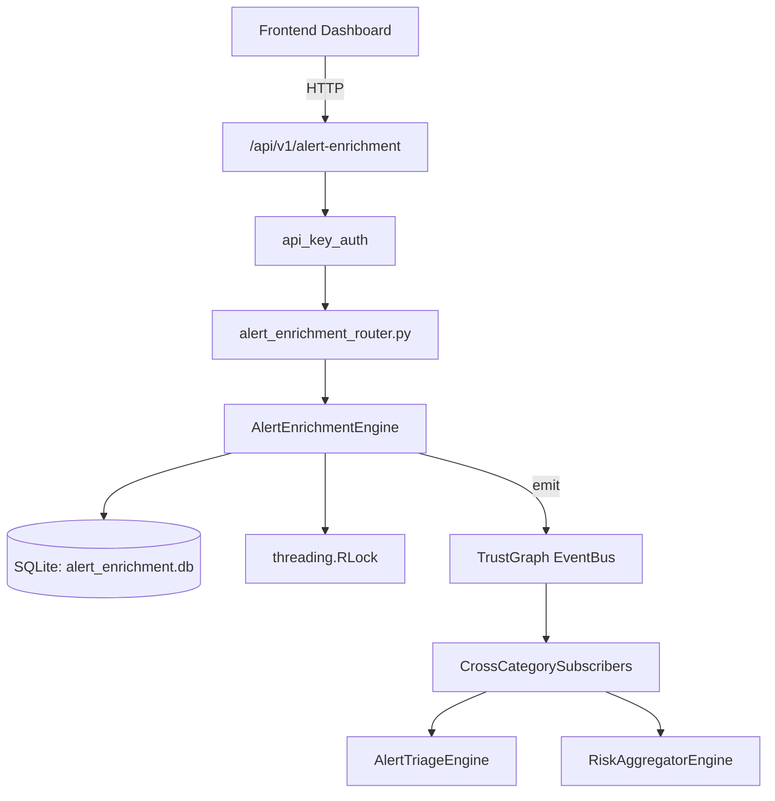

# US-0008: Alert Enrichment

## Sub-Epic: SOC
**Master Goal**: ALDECI — $35/mo enterprise security intelligence platform replacing $50K-500K/yr tools

## User Story
As a **Alex Rivera (SOC T1 Analyst)**, I need to triage and prioritize security alerts efficiently
so that the platform delivers enterprise-grade soc capabilities at 1/1000th the cost of legacy tools.

## Why This Matters
Alert Enrichment replaces functionality found in enterprise tools like CrowdStrike, Wiz, Snyk, and Rapid7.
By building this into ALDECI's $35/mo stack, customers save $50K+/yr on standalone SOC tooling.

## Architecture

## Current State: 95% Complete
- ✅ `submit_alert()` — Submit an alert for enrichment. (line 138)
- ✅ `enrich_alert()` — Record enrichment result for an alert. (line 192)
- ✅ `mark_failed()` — Mark enrichment as failed for an alert from a specific source. (line 272)
- ✅ `add_context()` — Update threat_context and asset_context (non-empty values only). (line 327)
- ✅ `register_source()` — Register an enrichment source. (line 364)
- ✅ `toggle_source()` — Enable or disable an enrichment source. (line 404)
- ❌ TrustGraph event emission — not yet verified

## Key Functions (from `suite-core/core/alert_enrichment_engine.py` — 540 lines)
- `AlertEnrichmentEngine.submit_alert()` — Submit an alert for enrichment. (line 138)
- `AlertEnrichmentEngine.enrich_alert()` — Record enrichment result for an alert. (line 192)
- `AlertEnrichmentEngine.mark_failed()` — Mark enrichment as failed for an alert from a specific source. (line 272)
- `AlertEnrichmentEngine.add_context()` — Update threat_context and asset_context (non-empty values only). (line 327)
- `AlertEnrichmentEngine.register_source()` — Register an enrichment source. (line 364)
- `AlertEnrichmentEngine.toggle_source()` — Enable or disable an enrichment source. (line 404)
- `AlertEnrichmentEngine.get_enrichment_queue()` — Return pending alerts ordered by severity (critical first), then created_at. (line 426)
- `AlertEnrichmentEngine.get_alert_detail()` — Return enriched alert record plus enrichment history. (line 447)

## Dependencies
- **Depends on**: standalone
- **Depended by**: Routers, TrustGraph EventBus, CrossCategorySubscribers
- **TrustGraph**: Event emission wired via ResponseInterceptorMiddleware
- **Source file**: `suite-core/core/alert_enrichment_engine.py` (540 lines)
- **Router file**: `suite-api/apps/api/alert_enrichment_router.py`

## API Endpoints
| Method | Path | Description |
|--------|------|-------------|
| POST | `/api/v1/alert-enrichment/alerts` | submit alert |
| POST | `/api/v1/alert-enrichment/alerts/{alert_id}/enrich` | enrich alert |
| POST | `/api/v1/alert-enrichment/alerts/{alert_id}/fail` | mark failed |
| PUT | `/api/v1/alert-enrichment/alerts/{alert_id}/context` | add context |
| POST | `/api/v1/alert-enrichment/sources` | register source |
| PUT | `/api/v1/alert-enrichment/sources/{source_id}/toggle` | toggle source |
| GET | `/api/v1/alert-enrichment/queue` | get enrichment queue |
| GET | `/api/v1/alert-enrichment/alerts/{alert_id}` | get alert detail |
| GET | `/api/v1/alert-enrichment/summary` | get enrichment summary |
| GET | `/api/v1/alert-enrichment/high-risk` | get high risk alerts |

## Tasks Remaining
1. Verify TrustGraph event emission works end-to-end (2h)
2. Add integration test with real persona workflow (2h)
3. Wire CrossCategorySubscriber consumer chain (1h)
4. Validate with 30-persona walkthrough (1h)
5. Optimize query performance for large datasets (2h)
6. Expand test coverage to edge cases (2h)

## Definition of Done
- [ ] Alex Rivera (SOC T1 Analyst) can access /api/v1/alert-enrichment and get meaningful data
- [ ] All CRUD operations return correct HTTP status codes
- [ ] TrustGraph receives events from this engine
- [ ] 42+ tests passing in `tests/test_alert_enrichment_engine.py`
- [ ] 30-persona walkthrough includes this endpoint at 100%
- [ ] No hardcoded org_id — all queries are org-scoped

## Sprint: Wave 42 (est. April 18-20, 2026)

## Test Coverage
- **Test file**: `tests/test_alert_enrichment_engine.py`
- **Tests**: 42 tests
- **Status**: Passing
