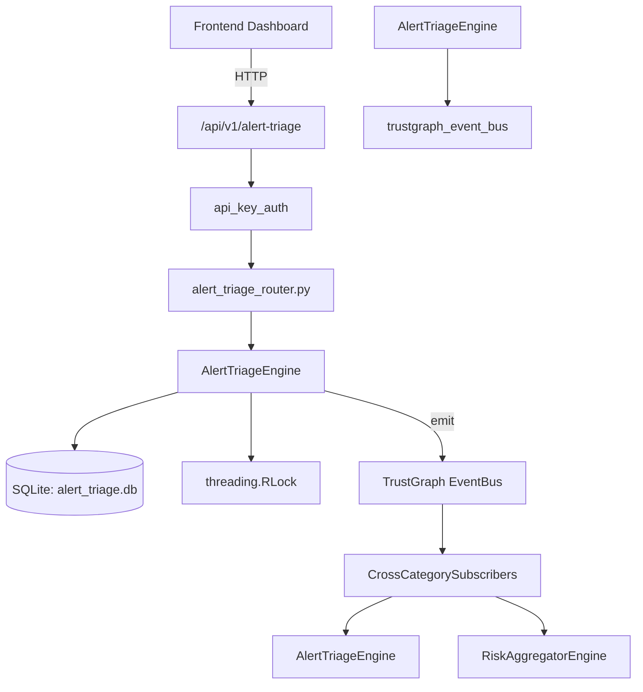

# US-0009: Alert Triage

## Sub-Epic: SOC
**Master Goal**: ALDECI — $35/mo enterprise security intelligence platform replacing $50K-500K/yr tools

## User Story
As a **Alex Rivera (SOC T1 Analyst)**, I need to triage and prioritize security alerts efficiently
so that the platform delivers enterprise-grade soc capabilities at 1/1000th the cost of legacy tools.

## Why This Matters
Alert Triage replaces functionality found in enterprise tools like CrowdStrike, Wiz, Snyk, and Rapid7.
By building this into ALDECI's $35/mo stack, customers save $50K+/yr on standalone SOC tooling.

## Architecture

## Current State: 95% Complete
- ✅ `ingest_alert()` — Ingest a new alert with auto-priority assignment. (line 114)
- ✅ `list_alerts()` — List alerts with optional filters, newest first. (line 173)
- ✅ `get_alert()` — Retrieve a single alert by ID (org-scoped). (line 204)
- ✅ `triage_alert()` — Update alert triage status and metadata. (line 213)
- ✅ `bulk_triage()` — Apply the same triage action to multiple alerts. (line 263)
- ✅ `get_triage_queue()` — Return new + triaging alerts ordered by priority (p1 first) then ingested_at. (line 309)
- ❌ TrustGraph event emission — not yet verified

## Key Functions (from `suite-core/core/alert_triage_engine.py` — 470 lines)
- `AlertTriageEngine.ingest_alert()` — Ingest a new alert with auto-priority assignment. (line 114)
- `AlertTriageEngine.list_alerts()` — List alerts with optional filters, newest first. (line 173)
- `AlertTriageEngine.get_alert()` — Retrieve a single alert by ID (org-scoped). (line 204)
- `AlertTriageEngine.triage_alert()` — Update alert triage status and metadata. (line 213)
- `AlertTriageEngine.bulk_triage()` — Apply the same triage action to multiple alerts. (line 263)
- `AlertTriageEngine.get_triage_queue()` — Return new + triaging alerts ordered by priority (p1 first) then ingested_at. (line 309)
- `AlertTriageEngine.get_alert_context()` — Query TrustGraph for cross-domain context about an alert. (line 335)
- `AlertTriageEngine.get_triage_stats()` — Return aggregate triage statistics for the org. (line 391)

## Dependencies
- **Depends on**: trustgraph_event_bus
- **Depended by**: Routers, TrustGraph EventBus, CrossCategorySubscribers
- **TrustGraph**: Event emission wired via ResponseInterceptorMiddleware
- **Source file**: `suite-core/core/alert_triage_engine.py` (470 lines)
- **Router file**: `suite-api/apps/api/alert_triage_router.py`

## API Endpoints
| Method | Path | Description |
|--------|------|-------------|
| POST | `/api/v1/alert-triage/alerts` | ingest alert |
| GET | `/api/v1/alert-triage/alerts` | list alerts |
| GET | `/api/v1/alert-triage/alerts/{alert_id}` | get alert |
| PATCH | `/api/v1/alert-triage/alerts/{alert_id}/triage` | triage alert |
| POST | `/api/v1/alert-triage/bulk-triage` | bulk triage |
| GET | `/api/v1/alert-triage/queue` | get triage queue |
| GET | `/api/v1/alert-triage/stats` | get triage stats |
| GET | `/api/v1/alert-triage/alerts/{alert_id}/context` | get alert context |

## Tasks Remaining
1. Verify TrustGraph event emission works end-to-end (2h)
2. Add integration test with real persona workflow (2h)
3. Wire CrossCategorySubscriber consumer chain (1h)
4. Validate with 30-persona walkthrough (1h)
5. Optimize query performance for large datasets (2h)
6. Expand test coverage to edge cases (2h)

## Definition of Done
- [ ] Alex Rivera (SOC T1 Analyst) can access /api/v1/alert-triage and get meaningful data
- [ ] All CRUD operations return correct HTTP status codes
- [ ] TrustGraph receives events from this engine
- [ ] 41+ tests passing in `tests/test_alert_triage_engine.py`
- [ ] 30-persona walkthrough includes this endpoint at 100%
- [ ] No hardcoded org_id — all queries are org-scoped

## Sprint: Wave 42 (est. April 18-20, 2026)

## Test Coverage
- **Test file**: `tests/test_alert_triage_engine.py`
- **Tests**: 41 tests
- **Status**: Passing
