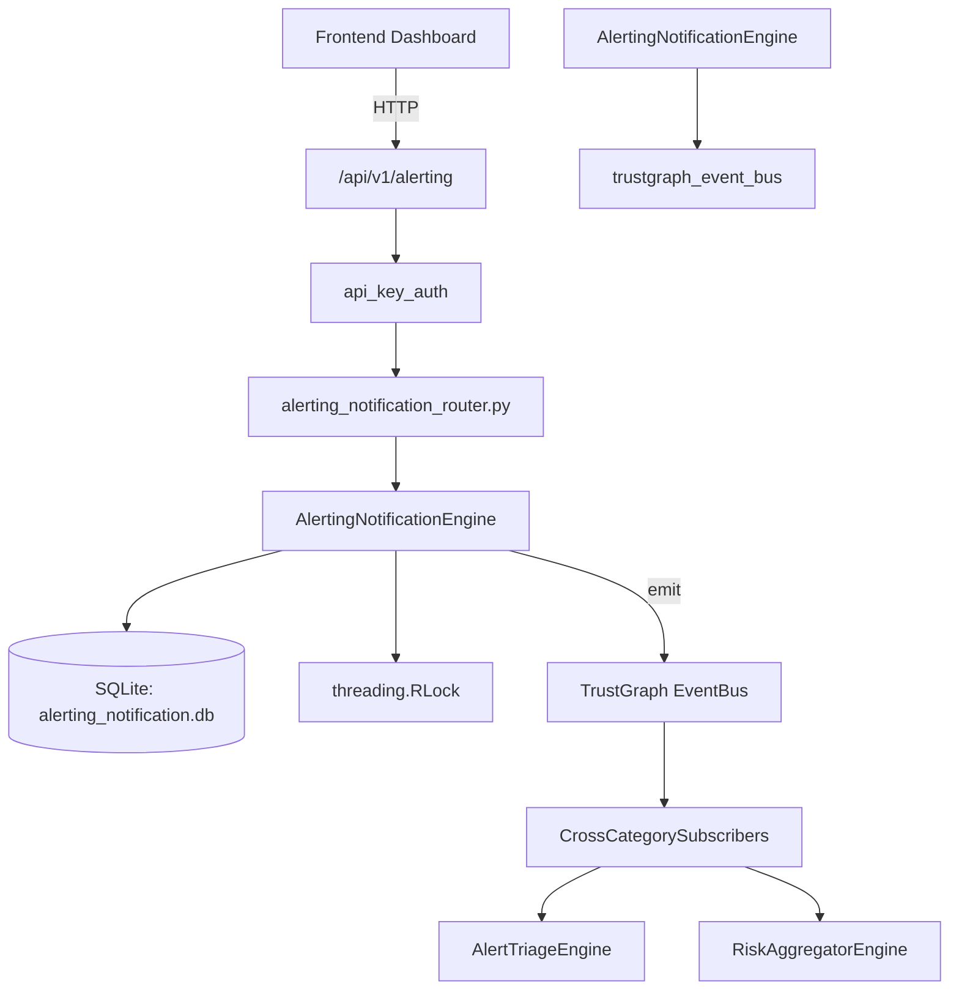

# US-0010: Alerting Notification

## Sub-Epic: SOC
**Master Goal**: ALDECI — $35/mo enterprise security intelligence platform replacing $50K-500K/yr tools

## User Story
As a **Alex Rivera (SOC T1 Analyst)**, I need to triage and prioritize security alerts efficiently
so that the platform delivers enterprise-grade soc capabilities at 1/1000th the cost of legacy tools.

## Why This Matters
Alerting Notification replaces functionality found in enterprise tools like CrowdStrike, Wiz, Snyk, and Rapid7.
By building this into ALDECI's $35/mo stack, customers save $50K+/yr on standalone SOC tooling.

## Architecture

## Current State: 95% Complete
- ✅ `create_alert_policy()` — Create an alert policy. (line 133)
- ✅ `list_alert_policies()` — List alert policies for an org, optionally filtered by enabled state. (line 190)
- ✅ `trigger_alert()` — Trigger a new alert. (line 208)
- ✅ `list_alerts()` — List alerts with optional filters. (line 261)
- ✅ `acknowledge_alert()` — Acknowledge an open alert. (line 286)
- ✅ `resolve_alert()` — Resolve an open or acknowledged alert. (line 311)
- ❌ TrustGraph event emission — not yet verified

## Key Functions (from `suite-core/core/alerting_notification_engine.py` — 432 lines)
- `AlertingNotificationEngine.create_alert_policy()` — Create an alert policy. (line 133)
- `AlertingNotificationEngine.list_alert_policies()` — List alert policies for an org, optionally filtered by enabled state. (line 190)
- `AlertingNotificationEngine.trigger_alert()` — Trigger a new alert. (line 208)
- `AlertingNotificationEngine.list_alerts()` — List alerts with optional filters. (line 261)
- `AlertingNotificationEngine.acknowledge_alert()` — Acknowledge an open alert. (line 286)
- `AlertingNotificationEngine.resolve_alert()` — Resolve an open or acknowledged alert. (line 311)
- `AlertingNotificationEngine.get_alert_history()` — Return alerts triggered within the last N hours. (line 345)
- `AlertingNotificationEngine.get_alerting_stats()` — Return aggregated alerting statistics. (line 365)

## Dependencies
- **Depends on**: trustgraph_event_bus
- **Depended by**: Routers, TrustGraph EventBus, CrossCategorySubscribers
- **TrustGraph**: Event emission wired via ResponseInterceptorMiddleware
- **Source file**: `suite-core/core/alerting_notification_engine.py` (432 lines)
- **Router file**: `suite-api/apps/api/alerting_notification_router.py`

## API Endpoints
| Method | Path | Description |
|--------|------|-------------|
| POST | `/api/v1/alerting/policies` | create alert policy |
| GET | `/api/v1/alerting/policies` | list alert policies |
| POST | `/api/v1/alerting/trigger` | trigger alert |
| GET | `/api/v1/alerting/alerts` | list alerts |
| PATCH | `/api/v1/alerting/alerts/{alert_id}/acknowledge` | acknowledge alert |
| PATCH | `/api/v1/alerting/alerts/{alert_id}/resolve` | resolve alert |
| GET | `/api/v1/alerting/history` | get alert history |
| GET | `/api/v1/alerting/stats` | get alerting stats |

## Tasks Remaining
1. Verify TrustGraph event emission works end-to-end (2h)
2. Add integration test with real persona workflow (2h)
3. Wire CrossCategorySubscriber consumer chain (1h)
4. Validate with 30-persona walkthrough (1h)
5. Optimize query performance for large datasets (2h)
6. Expand test coverage to edge cases (2h)

## Definition of Done
- [ ] Alex Rivera (SOC T1 Analyst) can access /api/v1/alerting and get meaningful data
- [ ] All CRUD operations return correct HTTP status codes
- [ ] TrustGraph receives events from this engine
- [ ] 35+ tests passing in `tests/test_alerting_notification_engine.py`
- [ ] 30-persona walkthrough includes this endpoint at 100%
- [ ] No hardcoded org_id — all queries are org-scoped

## Sprint: Wave 42 (est. April 18-20, 2026)

## Test Coverage
- **Test file**: `tests/test_alerting_notification_engine.py`
- **Tests**: 35 tests
- **Status**: Passing
