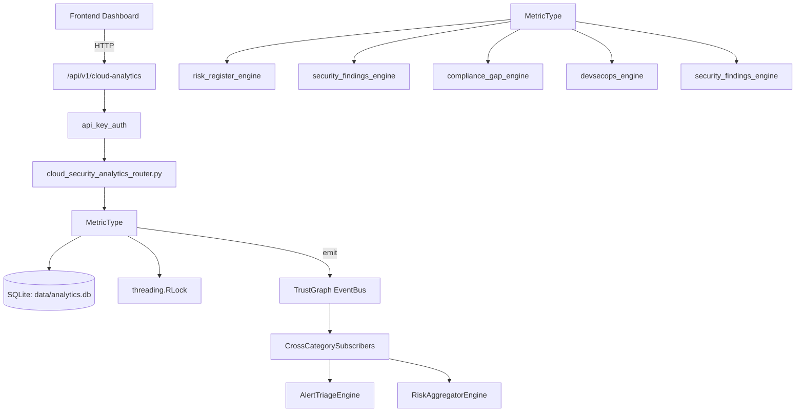

# US-0011: Analytics

## Sub-Epic: Advanced
**Master Goal**: ALDECI — $35/mo enterprise security intelligence platform replacing $50K-500K/yr tools

## User Story
As a **Chris Lee (Security Data Scientist)**, I need to analyze security data for trends and insights
so that the platform delivers enterprise-grade advanced capabilities at 1/1000th the cost of legacy tools.

## Why This Matters
Analytics replaces functionality found in enterprise tools like CrowdStrike, Wiz, Snyk, and Rapid7.
By building this into ALDECI's $35/mo stack, customers save $50K+/yr on standalone Advanced tooling.

## Architecture

## Current State: 95% Complete
- ✅ `record_metric()` — Record a metric data point. (line 179)
- ✅ `query_metric()` — Query aggregated metric for time window. (line 232)
- ✅ `get_trend()` — Get time-series trend data. (line 316)
- ✅ `get_percentile()` — Calculate percentile metric value. (line 377)
- ✅ `get_builtin_metrics()` — Fetch all built-in CTEM metrics for org. (line 441)
- ✅ `get_ciso_dashboard()` — Generate CISO (executive) dashboard. (line 490)
- ❌ TrustGraph event emission — not yet verified

## Key Functions (from `suite-core/core/analytics_engine.py` — 919 lines)
- `AnalyticsEngine.record_metric()` — Record a metric data point. (line 179)
- `AnalyticsEngine.query_metric()` — Query aggregated metric for time window. (line 232)
- `AnalyticsEngine.get_trend()` — Get time-series trend data. (line 316)
- `AnalyticsEngine.get_percentile()` — Calculate percentile metric value. (line 377)
- `AnalyticsEngine.get_builtin_metrics()` — Fetch all built-in CTEM metrics for org. (line 441)
- `PersonaDashboard.get_ciso_dashboard()` — Generate CISO (executive) dashboard. (line 490)
- `PersonaDashboard.get_devsecops_dashboard()` — Generate DevSecOps dashboard. (line 590)
- `PersonaDashboard.get_compliance_dashboard()` — Generate Compliance Officer dashboard. (line 673)

## Dependencies
- **Depends on**: risk_register_engine, security_findings_engine, compliance_gap_engine, devsecops_engine, security_findings_engine
- **Depended by**: Routers, TrustGraph EventBus, CrossCategorySubscribers
- **TrustGraph**: Event emission wired via ResponseInterceptorMiddleware
- **Source file**: `suite-core/core/analytics_engine.py` (919 lines)
- **Router file**: `suite-api/apps/api/cloud_security_analytics_router.py`

## API Endpoints
| Method | Path | Description |
|--------|------|-------------|
| POST | `/api/v1/cloud-analytics/events` | record event |
| GET | `/api/v1/cloud-analytics/events` | list events |
| POST | `/api/v1/cloud-analytics/anomalies` | record anomaly |
| GET | `/api/v1/cloud-analytics/anomalies` | list anomalies |
| PUT | `/api/v1/cloud-analytics/anomalies/{anomaly_id}/status` | update anomaly status |
| POST | `/api/v1/cloud-analytics/rules` | create rule |
| GET | `/api/v1/cloud-analytics/rules` | list rules |
| PUT | `/api/v1/cloud-analytics/rules/{rule_id}/trigger` | trigger rule |
| GET | `/api/v1/cloud-analytics/stats` | get analytics stats |

## Tasks Remaining
1. Verify TrustGraph event emission works end-to-end (2h)
2. Add integration test with real persona workflow (2h)
3. Wire CrossCategorySubscriber consumer chain (1h)
4. Validate with 30-persona walkthrough (1h)
5. Optimize query performance for large datasets (2h)
6. Expand test coverage to edge cases (2h)

## Definition of Done
- [ ] Chris Lee (Security Data Scientist) can access /api/v1/cloud-analytics and get meaningful data
- [ ] All CRUD operations return correct HTTP status codes
- [ ] TrustGraph receives events from this engine
- [ ] 50+ tests passing in `tests/test_analytics_engine.py`
- [ ] 30-persona walkthrough includes this endpoint at 100%
- [ ] No hardcoded org_id — all queries are org-scoped

## Sprint: Wave 42 (est. April 18-20, 2026)

## Test Coverage
- **Test file**: `tests/test_analytics_engine.py`
- **Tests**: 50 tests
- **Status**: Passing
