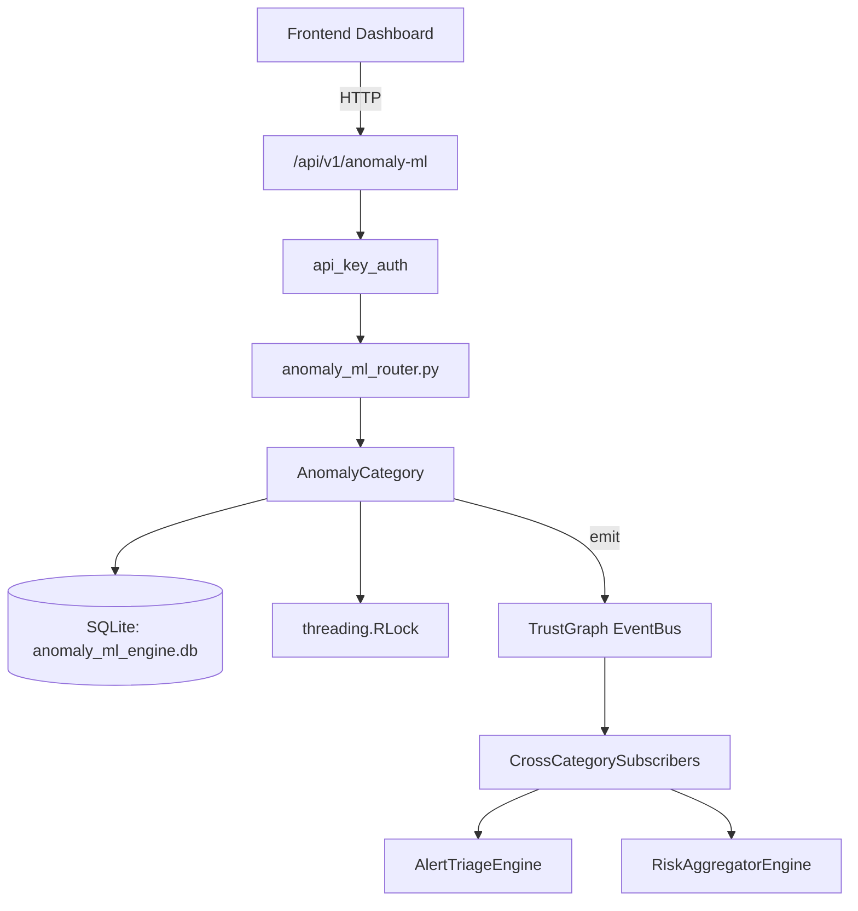

# US-0012: Anomaly Ml

## Sub-Epic: Advanced
**Master Goal**: ALDECI — $35/mo enterprise security intelligence platform replacing $50K-500K/yr tools

## User Story
As a **James Wilson (Security Engineer)**, I need to manage security operations
so that the platform delivers enterprise-grade advanced capabilities at 1/1000th the cost of legacy tools.

## Why This Matters
Anomaly Ml replaces functionality found in enterprise tools like CrowdStrike, Wiz, Snyk, and Rapid7.
By building this into ALDECI's $35/mo stack, customers save $50K+/yr on standalone Advanced tooling.

## Architecture

## Current State: 95% Complete
- ✅ `fit()` — Recursively build the tree. (line 191)
- ✅ `path_length()` — Return the path length (isolation depth) for a point. (line 222)
- ✅ `fit()` — Train the forest on feature vectors. (line 259)
- ✅ `score()` — Anomaly score for a single point. (line 273)
- ✅ `record_event()` — Store a time-series observation for an entity. (line 384)
- ✅ `build_baseline()` — Compute statistical baseline (mean, std_dev, min, max) for an entity/metric. (line 425)
- ❌ TrustGraph event emission — not yet verified

## Key Functions (from `suite-core/core/anomaly_ml_engine.py` — 1300 lines)
- `_IsolationTree.fit()` — Recursively build the tree. (line 191)
- `_IsolationTree.path_length()` — Return the path length (isolation depth) for a point. (line 222)
- `IsolationForest.fit()` — Train the forest on feature vectors. (line 259)
- `IsolationForest.score()` — Anomaly score for a single point. (line 273)
- `AnomalyMLEngine.record_event()` — Store a time-series observation for an entity. (line 384)
- `AnomalyMLEngine.build_baseline()` — Compute statistical baseline (mean, std_dev, min, max) for an entity/metric. (line 425)
- `AnomalyMLEngine.detect_zscore()` — Compute z-score for value against the entity's baseline. (line 477)
- `AnomalyMLEngine.score_isolation()` — Score a feature vector against historical data using Isolation Forest. (line 536)

## Dependencies
- **Depends on**: standalone
- **Depended by**: Routers, TrustGraph EventBus, CrossCategorySubscribers
- **TrustGraph**: Event emission wired via ResponseInterceptorMiddleware
- **Source file**: `suite-core/core/anomaly_ml_engine.py` (1300 lines)
- **Router file**: `suite-api/apps/api/anomaly_ml_router.py`

## API Endpoints
| Method | Path | Description |
|--------|------|-------------|
| POST | `/api/v1/anomaly-ml/events` | record event |
| POST | `/api/v1/anomaly-ml/detect/zscore` | detect zscore |
| POST | `/api/v1/anomaly-ml/detect/isolation` | score isolation |
| POST | `/api/v1/anomaly-ml/detect/timeseries` | analyze timeseries |
| GET | `/api/v1/anomaly-ml/ueba/{user_id}` | get user risk |
| GET | `/api/v1/anomaly-ml/groups` | list alert groups |
| GET | `/api/v1/anomaly-ml/anomalies` | list anomalies |
| POST | `/api/v1/anomaly-ml/feedback` | submit feedback |

## Tasks Remaining
1. Verify TrustGraph event emission works end-to-end (2h)
2. Add integration test with real persona workflow (2h)
3. Wire CrossCategorySubscriber consumer chain (1h)
4. Validate with 30-persona walkthrough (1h)
5. Optimize query performance for large datasets (2h)
6. Expand test coverage to edge cases (2h)

## Definition of Done
- [ ] James Wilson (Security Engineer) can access /api/v1/anomaly-ml and get meaningful data
- [ ] All CRUD operations return correct HTTP status codes
- [ ] TrustGraph receives events from this engine
- [ ] 29+ tests passing in `tests/test_anomaly_ml_engine.py`
- [ ] 30-persona walkthrough includes this endpoint at 100%
- [ ] No hardcoded org_id — all queries are org-scoped

## Sprint: Wave 42 (est. April 18-20, 2026)

## Test Coverage
- **Test file**: `tests/test_anomaly_ml_engine.py`
- **Tests**: 29 tests
- **Status**: Passing
