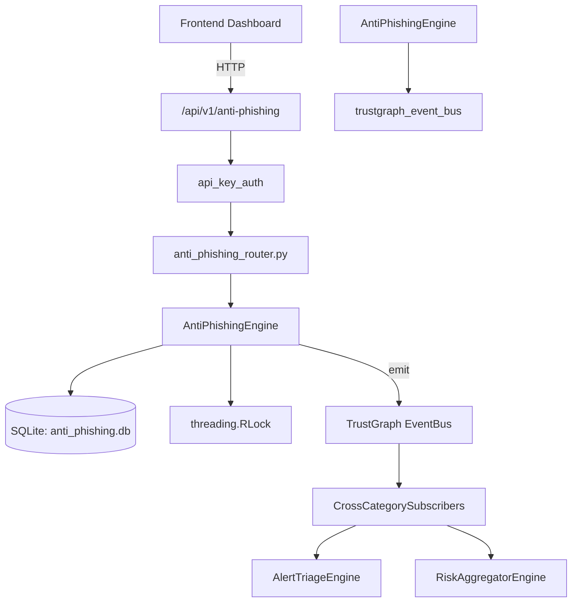

# US-0013: Anti Phishing

## Sub-Epic: Advanced
**Master Goal**: ALDECI — $35/mo enterprise security intelligence platform replacing $50K-500K/yr tools

## User Story
As a **James Wilson (Security Engineer)**, I need to manage security operations
so that the platform delivers enterprise-grade advanced capabilities at 1/1000th the cost of legacy tools.

## Why This Matters
Anti Phishing replaces functionality found in enterprise tools like CrowdStrike, Wiz, Snyk, and Rapid7.
By building this into ALDECI's $35/mo stack, customers save $50K+/yr on standalone Advanced tooling.

## Architecture

## Current State: 95% Complete
- ✅ `submit_url()` — Submit a URL for phishing analysis. (line 115)
- ✅ `analyze_url()` — Record analysis verdict for a submitted URL. (line 161)
- ✅ `list_urls()` — List submitted URLs for the org, optionally filtered by verdict and status. (line 195)
- ✅ `get_url()` — Get a single URL submission by ID for the org. (line 215)
- ✅ `record_simulation()` — Create a phishing simulation campaign. (line 250)
- ✅ `update_simulation_results()` — Update simulation results and mark as completed. (line 298)
- ❌ TrustGraph event emission — not yet verified

## Key Functions (from `suite-core/core/anti_phishing_engine.py` — 415 lines)
- `AntiPhishingEngine.submit_url()` — Submit a URL for phishing analysis. (line 115)
- `AntiPhishingEngine.analyze_url()` — Record analysis verdict for a submitted URL. (line 161)
- `AntiPhishingEngine.list_urls()` — List submitted URLs for the org, optionally filtered by verdict and status. (line 195)
- `AntiPhishingEngine.get_url()` — Get a single URL submission by ID for the org. (line 215)
- `AntiPhishingEngine.record_simulation()` — Create a phishing simulation campaign. (line 250)
- `AntiPhishingEngine.update_simulation_results()` — Update simulation results and mark as completed. (line 298)
- `AntiPhishingEngine.list_simulations()` — List simulation campaigns for the org, optionally filtered by status. (line 335)
- `AntiPhishingEngine.get_anti_phishing_stats()` — Return anti-phishing statistics for the org. (line 372)

## Dependencies
- **Depends on**: trustgraph_event_bus
- **Depended by**: Routers, TrustGraph EventBus, CrossCategorySubscribers
- **TrustGraph**: Event emission wired via ResponseInterceptorMiddleware
- **Source file**: `suite-core/core/anti_phishing_engine.py` (415 lines)
- **Router file**: `suite-api/apps/api/anti_phishing_router.py`

## API Endpoints
| Method | Path | Description |
|--------|------|-------------|
| POST | `/api/v1/anti-phishing/urls` | submit url |
| GET | `/api/v1/anti-phishing/urls` | list urls |
| GET | `/api/v1/anti-phishing/urls/{url_id}` | get url |
| POST | `/api/v1/anti-phishing/urls/{url_id}/analyze` | analyze url |
| POST | `/api/v1/anti-phishing/simulations` | record simulation |
| PUT | `/api/v1/anti-phishing/simulations/{sim_id}/results` | update simulation results |
| GET | `/api/v1/anti-phishing/simulations` | list simulations |
| GET | `/api/v1/anti-phishing/stats` | get anti phishing stats |

## Tasks Remaining
1. Verify TrustGraph event emission works end-to-end (2h)
2. Add integration test with real persona workflow (2h)
3. Wire CrossCategorySubscriber consumer chain (1h)
4. Validate with 30-persona walkthrough (1h)
5. Optimize query performance for large datasets (2h)
6. Expand test coverage to edge cases (2h)

## Definition of Done
- [ ] James Wilson (Security Engineer) can access /api/v1/anti-phishing and get meaningful data
- [ ] All CRUD operations return correct HTTP status codes
- [ ] TrustGraph receives events from this engine
- [ ] 35+ tests passing in `tests/test_anti_phishing_engine.py`
- [ ] 30-persona walkthrough includes this endpoint at 100%
- [ ] No hardcoded org_id — all queries are org-scoped

## Sprint: Wave 42 (est. April 18-20, 2026)

## Test Coverage
- **Test file**: `tests/test_anti_phishing_engine.py`
- **Tests**: 35 tests
- **Status**: Passing
