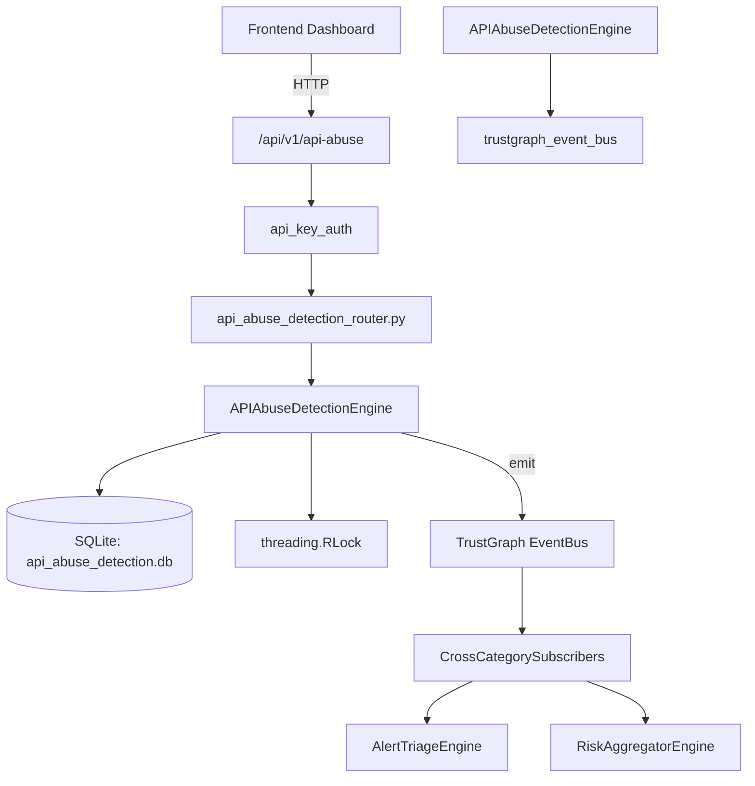

# US-0014: Api Abuse Detection

## Sub-Epic: ASPM
**Master Goal**: ALDECI — $35/mo enterprise security intelligence platform replacing $50K-500K/yr tools

## User Story
As a **Emma Davis (DevSecOps Engineer)**, I need to secure APIs against OWASP Top 10 threats
so that the platform delivers enterprise-grade aspm capabilities at 1/1000th the cost of legacy tools.

## Why This Matters
Api Abuse Detection replaces functionality found in enterprise tools like CrowdStrike, Wiz, Snyk, and Rapid7.
By building this into ALDECI's $35/mo stack, customers save $50K+/yr on standalone ASPM tooling.

## Architecture

## Current State: 95% Complete
- ✅ `register_endpoint()` — Register an API endpoint for monitoring. Returns the endpoint record. (line 132)
- ✅ `list_endpoints()` — List endpoints for org, optionally filtered. (line 172)
- ✅ `get_endpoint()` — Fetch a single endpoint scoped to org_id. Returns None if not found. (line 192)
- ✅ `record_incident()` — Record an abuse incident. Returns the incident record. (line 205)
- ✅ `list_incidents()` — List incidents for org, optionally filtered. (line 246)
- ✅ `update_incident_status()` — Update incident status. Returns updated record. (line 270)
- ❌ TrustGraph event emission — not yet verified

## Key Functions (from `suite-core/core/api_abuse_detection_engine.py` — 429 lines)
- `APIAbuseDetectionEngine.register_endpoint()` — Register an API endpoint for monitoring. Returns the endpoint record. (line 132)
- `APIAbuseDetectionEngine.list_endpoints()` — List endpoints for org, optionally filtered. (line 172)
- `APIAbuseDetectionEngine.get_endpoint()` — Fetch a single endpoint scoped to org_id. Returns None if not found. (line 192)
- `APIAbuseDetectionEngine.record_incident()` — Record an abuse incident. Returns the incident record. (line 205)
- `APIAbuseDetectionEngine.list_incidents()` — List incidents for org, optionally filtered. (line 246)
- `APIAbuseDetectionEngine.update_incident_status()` — Update incident status. Returns updated record. (line 270)
- `APIAbuseDetectionEngine.create_rule()` — Create a detection rule. Returns the rule record. (line 302)
- `APIAbuseDetectionEngine.list_rules()` — List rules for org, optionally filtered. (line 333)

## Dependencies
- **Depends on**: trustgraph_event_bus
- **Depended by**: Routers, TrustGraph EventBus, CrossCategorySubscribers
- **TrustGraph**: Event emission wired via ResponseInterceptorMiddleware
- **Source file**: `suite-core/core/api_abuse_detection_engine.py` (429 lines)
- **Router file**: `suite-api/apps/api/api_abuse_detection_router.py`

## API Endpoints
| Method | Path | Description |
|--------|------|-------------|
| POST | `/api/v1/api-abuse/endpoints` | register endpoint |
| GET | `/api/v1/api-abuse/endpoints` | list endpoints |
| GET | `/api/v1/api-abuse/endpoints/{endpoint_id}` | get endpoint |
| POST | `/api/v1/api-abuse/incidents` | record incident |
| GET | `/api/v1/api-abuse/incidents` | list incidents |
| PUT | `/api/v1/api-abuse/incidents/{incident_id}/status` | update incident status |
| POST | `/api/v1/api-abuse/rules` | create rule |
| GET | `/api/v1/api-abuse/rules` | list rules |
| GET | `/api/v1/api-abuse/stats` | get abuse stats |

## Tasks Remaining
1. Verify TrustGraph event emission works end-to-end (2h)
2. Add integration test with real persona workflow (2h)
3. Wire CrossCategorySubscriber consumer chain (1h)
4. Validate with 30-persona walkthrough (1h)
5. Optimize query performance for large datasets (2h)
6. Expand test coverage to edge cases (2h)

## Definition of Done
- [ ] Emma Davis (DevSecOps Engineer) can access /api/v1/api-abuse and get meaningful data
- [ ] All CRUD operations return correct HTTP status codes
- [ ] TrustGraph receives events from this engine
- [ ] 58+ tests passing in `tests/test_api_abuse_detection_engine.py`
- [ ] 30-persona walkthrough includes this endpoint at 100%
- [ ] No hardcoded org_id — all queries are org-scoped

## Sprint: Wave 42 (est. April 18-20, 2026)

## Test Coverage
- **Test file**: `tests/test_api_abuse_detection_engine.py`
- **Tests**: 58 tests
- **Status**: Passing
