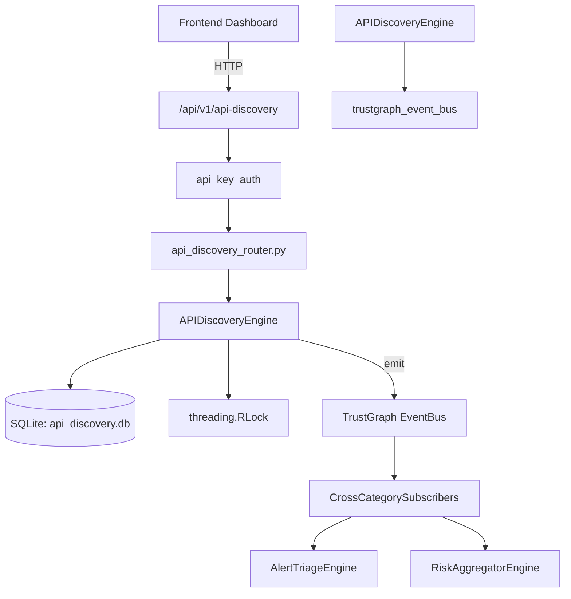

# US-0015: Api Discovery

## Sub-Epic: ASPM
**Master Goal**: ALDECI — $35/mo enterprise security intelligence platform replacing $50K-500K/yr tools

## User Story
As a **Emma Davis (DevSecOps Engineer)**, I need to secure APIs against OWASP Top 10 threats
so that the platform delivers enterprise-grade aspm capabilities at 1/1000th the cost of legacy tools.

## Why This Matters
Api Discovery replaces functionality found in enterprise tools like CrowdStrike, Wiz, Snyk, and Rapid7.
By building this into ALDECI's $35/mo stack, customers save $50K+/yr on standalone ASPM tooling.

## Architecture

## Current State: 95% Complete
- ✅ `register_endpoint()` — Register a discovered API endpoint. (line 135)
- ✅ `list_endpoints()` — List endpoints with optional filters. (line 200)
- ✅ `get_endpoint()` — Get endpoint by UUID. Returns None if not found or wrong org. (line 228)
- ✅ `mark_as_shadow()` — Mark an endpoint as a shadow API and set risk_level=high. (line 237)
- ✅ `mark_as_documented()` — Mark an endpoint as documented. (line 256)
- ✅ `create_scan()` — Create a new API discovery scan. (line 277)
- ❌ TrustGraph event emission — not yet verified

## Key Functions (from `suite-core/core/api_discovery_engine.py` — 471 lines)
- `APIDiscoveryEngine.register_endpoint()` — Register a discovered API endpoint. (line 135)
- `APIDiscoveryEngine.list_endpoints()` — List endpoints with optional filters. (line 200)
- `APIDiscoveryEngine.get_endpoint()` — Get endpoint by UUID. Returns None if not found or wrong org. (line 228)
- `APIDiscoveryEngine.mark_as_shadow()` — Mark an endpoint as a shadow API and set risk_level=high. (line 237)
- `APIDiscoveryEngine.mark_as_documented()` — Mark an endpoint as documented. (line 256)
- `APIDiscoveryEngine.create_scan()` — Create a new API discovery scan. (line 277)
- `APIDiscoveryEngine.complete_scan()` — Mark a scan as completed with results. (line 318)
- `APIDiscoveryEngine.record_change()` — Record an API change event. (line 345)

## Dependencies
- **Depends on**: trustgraph_event_bus
- **Depended by**: Routers, TrustGraph EventBus, CrossCategorySubscribers
- **TrustGraph**: Event emission wired via ResponseInterceptorMiddleware
- **Source file**: `suite-core/core/api_discovery_engine.py` (471 lines)
- **Router file**: `suite-api/apps/api/api_discovery_router.py`

## API Endpoints
| Method | Path | Description |
|--------|------|-------------|
| POST | `/api/v1/api-discovery/endpoints` | register endpoint |
| GET | `/api/v1/api-discovery/endpoints` | list endpoints |
| GET | `/api/v1/api-discovery/endpoints/{endpoint_id}` | get endpoint |
| PUT | `/api/v1/api-discovery/endpoints/{endpoint_id}/mark-shadow` | mark as shadow |
| PUT | `/api/v1/api-discovery/endpoints/{endpoint_id}/mark-documented` | mark as documented |
| POST | `/api/v1/api-discovery/scans` | create scan |
| PUT | `/api/v1/api-discovery/scans/{scan_id}/complete` | complete scan |
| POST | `/api/v1/api-discovery/changes` | record change |
| GET | `/api/v1/api-discovery/changes` | list changes |
| GET | `/api/v1/api-discovery/stats` | get api stats |

## Tasks Remaining
1. Verify TrustGraph event emission works end-to-end (2h)
2. Add integration test with real persona workflow (2h)
3. Wire CrossCategorySubscriber consumer chain (1h)
4. Validate with 30-persona walkthrough (1h)
5. Optimize query performance for large datasets (2h)
6. Expand test coverage to edge cases (2h)

## Definition of Done
- [ ] Emma Davis (DevSecOps Engineer) can access /api/v1/api-discovery and get meaningful data
- [ ] All CRUD operations return correct HTTP status codes
- [ ] TrustGraph receives events from this engine
- [ ] 51+ tests passing in `tests/test_api_discovery_engine.py`
- [ ] 30-persona walkthrough includes this endpoint at 100%
- [ ] No hardcoded org_id — all queries are org-scoped

## Sprint: Wave 42 (est. April 18-20, 2026)

## Test Coverage
- **Test file**: `tests/test_api_discovery_engine.py`
- **Tests**: 51 tests
- **Status**: Passing
