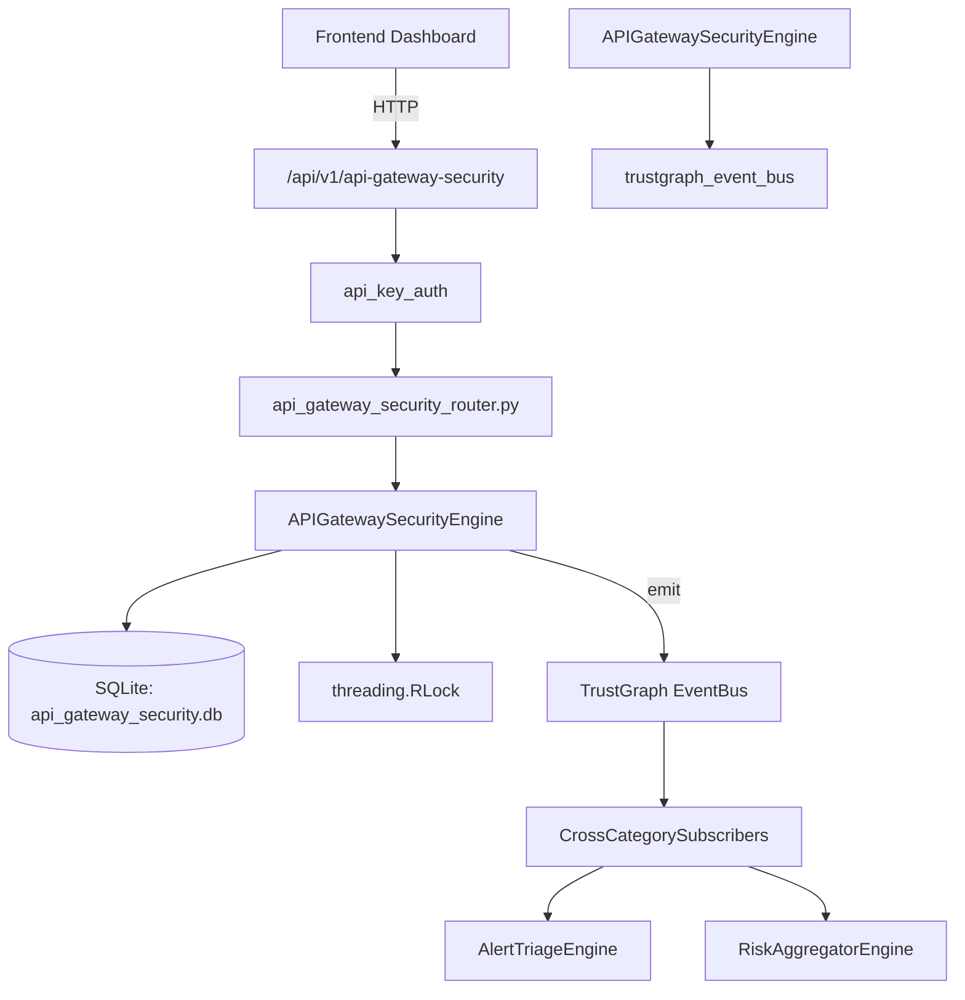

# US-0016: Api Gateway Security

## Sub-Epic: ASPM
**Master Goal**: ALDECI — $35/mo enterprise security intelligence platform replacing $50K-500K/yr tools

## User Story
As a **Emma Davis (DevSecOps Engineer)**, I need to secure APIs against OWASP Top 10 threats
so that the platform delivers enterprise-grade aspm capabilities at 1/1000th the cost of legacy tools.

## Why This Matters
Api Gateway Security replaces functionality found in enterprise tools like CrowdStrike, Wiz, Snyk, and Rapid7.
By building this into ALDECI's $35/mo stack, customers save $50K+/yr on standalone ASPM tooling.

## Architecture

## Current State: 95% Complete
- ✅ `register_gateway()` — Register an API gateway for security monitoring. (line 129)
- ✅ `list_gateways()` — Return all gateways for an org. (line 188)
- ✅ `register_api()` — Register an API on a gateway for security tracking. (line 201)
- ✅ `list_apis()` — Return APIs for an org, optionally filtered by gateway. (line 260)
- ✅ `record_security_event()` — Record a security event against an API. (line 279)
- ✅ `list_security_events()` — Return security events filtered by org, event_type, and/or severity. (line 337)
- ❌ TrustGraph event emission — not yet verified

## Key Functions (from `suite-core/core/api_gateway_security_engine.py` — 474 lines)
- `APIGatewaySecurityEngine.register_gateway()` — Register an API gateway for security monitoring. (line 129)
- `APIGatewaySecurityEngine.list_gateways()` — Return all gateways for an org. (line 188)
- `APIGatewaySecurityEngine.register_api()` — Register an API on a gateway for security tracking. (line 201)
- `APIGatewaySecurityEngine.list_apis()` — Return APIs for an org, optionally filtered by gateway. (line 260)
- `APIGatewaySecurityEngine.record_security_event()` — Record a security event against an API. (line 279)
- `APIGatewaySecurityEngine.list_security_events()` — Return security events filtered by org, event_type, and/or severity. (line 337)
- `APIGatewaySecurityEngine.get_api_threat_summary()` — Return a threat summary for a specific API. (line 366)
- `APIGatewaySecurityEngine.get_gateway_stats()` — Return a summary of gateway security posture for an org. (line 431)

## Dependencies
- **Depends on**: trustgraph_event_bus
- **Depended by**: Routers, TrustGraph EventBus, CrossCategorySubscribers
- **TrustGraph**: Event emission wired via ResponseInterceptorMiddleware
- **Source file**: `suite-core/core/api_gateway_security_engine.py` (474 lines)
- **Router file**: `suite-api/apps/api/api_gateway_security_router.py`

## API Endpoints
| Method | Path | Description |
|--------|------|-------------|
| POST | `/api/v1/api-gateway-security/gateways` | register gateway |
| GET | `/api/v1/api-gateway-security/gateways` | list gateways |
| POST | `/api/v1/api-gateway-security/apis` | register api |
| GET | `/api/v1/api-gateway-security/apis` | list apis |
| POST | `/api/v1/api-gateway-security/events` | record security event |
| GET | `/api/v1/api-gateway-security/events` | list security events |
| GET | `/api/v1/api-gateway-security/apis/{api_id}/threat-summary` | get api threat summary |
| GET | `/api/v1/api-gateway-security/stats` | get gateway stats |

## Tasks Remaining
1. Verify TrustGraph event emission works end-to-end (2h)
2. Add integration test with real persona workflow (2h)
3. Wire CrossCategorySubscriber consumer chain (1h)
4. Validate with 30-persona walkthrough (1h)
5. Optimize query performance for large datasets (2h)
6. Expand test coverage to edge cases (2h)

## Definition of Done
- [ ] Emma Davis (DevSecOps Engineer) can access /api/v1/api-gateway-security and get meaningful data
- [ ] All CRUD operations return correct HTTP status codes
- [ ] TrustGraph receives events from this engine
- [ ] 42+ tests passing in `tests/test_api_gateway_security_engine.py`
- [ ] 30-persona walkthrough includes this endpoint at 100%
- [ ] No hardcoded org_id — all queries are org-scoped

## Sprint: Wave 42 (est. April 18-20, 2026)

## Test Coverage
- **Test file**: `tests/test_api_gateway_security_engine.py`
- **Tests**: 42 tests
- **Status**: Passing
