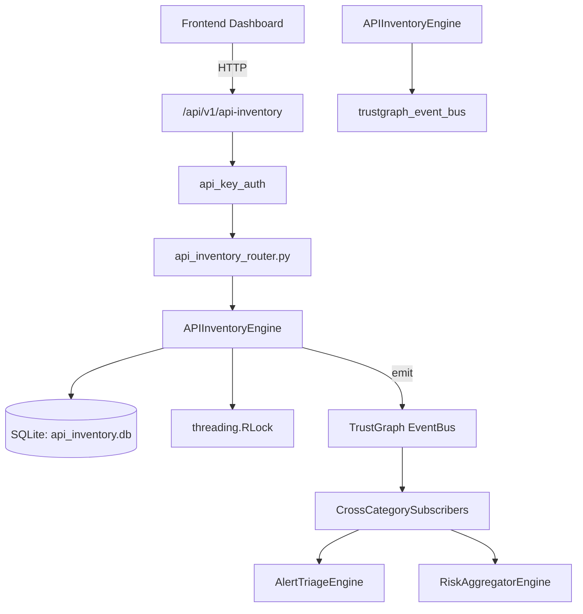

# US-0017: Api Inventory

## Sub-Epic: ASPM
**Master Goal**: ALDECI — $35/mo enterprise security intelligence platform replacing $50K-500K/yr tools

## User Story
As a **Emma Davis (DevSecOps Engineer)**, I need to secure APIs against OWASP Top 10 threats
so that the platform delivers enterprise-grade aspm capabilities at 1/1000th the cost of legacy tools.

## Why This Matters
Api Inventory replaces functionality found in enterprise tools like CrowdStrike, Wiz, Snyk, and Rapid7.
By building this into ALDECI's $35/mo stack, customers save $50K+/yr on standalone ASPM tooling.

## Architecture

## Current State: 95% Complete
- ✅ `register_api()` — Register a new API. (line 117)
- ✅ `list_apis()` — List APIs with optional filters. (line 169)
- ✅ `get_api()` — Get a single API by ID. (line 190)
- ✅ `update_api_status()` — Update an API's status. Returns updated record or None if not found. (line 200)
- ✅ `add_endpoint()` — Add an endpoint to an API. Increments api.endpoint_count. (line 217)
- ✅ `list_endpoints()` — List endpoints with optional filters. (line 258)
- ❌ TrustGraph event emission — not yet verified

## Key Functions (from `suite-core/core/api_inventory_engine.py` — 337 lines)
- `APIInventoryEngine.register_api()` — Register a new API. (line 117)
- `APIInventoryEngine.list_apis()` — List APIs with optional filters. (line 169)
- `APIInventoryEngine.get_api()` — Get a single API by ID. (line 190)
- `APIInventoryEngine.update_api_status()` — Update an API's status. Returns updated record or None if not found. (line 200)
- `APIInventoryEngine.add_endpoint()` — Add an endpoint to an API. Increments api.endpoint_count. (line 217)
- `APIInventoryEngine.list_endpoints()` — List endpoints with optional filters. (line 258)
- `APIInventoryEngine.get_api_stats()` — Return aggregated API inventory statistics for the org. (line 287)

## Dependencies
- **Depends on**: trustgraph_event_bus
- **Depended by**: Routers, TrustGraph EventBus, CrossCategorySubscribers
- **TrustGraph**: Event emission wired via ResponseInterceptorMiddleware
- **Source file**: `suite-core/core/api_inventory_engine.py` (337 lines)
- **Router file**: `suite-api/apps/api/api_inventory_router.py`

## API Endpoints
| Method | Path | Description |
|--------|------|-------------|
| POST | `/api/v1/api-inventory/apis` | register api |
| GET | `/api/v1/api-inventory/apis` | list apis |
| GET | `/api/v1/api-inventory/apis/{api_id}` | get api |
| PATCH | `/api/v1/api-inventory/apis/{api_id}/status` | update api status |
| POST | `/api/v1/api-inventory/apis/{api_id}/endpoints` | add endpoint |
| GET | `/api/v1/api-inventory/endpoints` | list endpoints |
| GET | `/api/v1/api-inventory/stats` | get api stats |

## Tasks Remaining
1. Verify TrustGraph event emission works end-to-end (2h)
2. Add integration test with real persona workflow (2h)
3. Wire CrossCategorySubscriber consumer chain (1h)
4. Validate with 30-persona walkthrough (1h)
5. Optimize query performance for large datasets (2h)
6. Expand test coverage to edge cases (2h)

## Definition of Done
- [ ] Emma Davis (DevSecOps Engineer) can access /api/v1/api-inventory and get meaningful data
- [ ] All CRUD operations return correct HTTP status codes
- [ ] TrustGraph receives events from this engine
- [ ] 39+ tests passing in `tests/test_api_inventory_engine.py`
- [ ] 30-persona walkthrough includes this endpoint at 100%
- [ ] No hardcoded org_id — all queries are org-scoped

## Sprint: Wave 42 (est. April 18-20, 2026)

## Test Coverage
- **Test file**: `tests/test_api_inventory_engine.py`
- **Tests**: 39 tests
- **Status**: Passing
