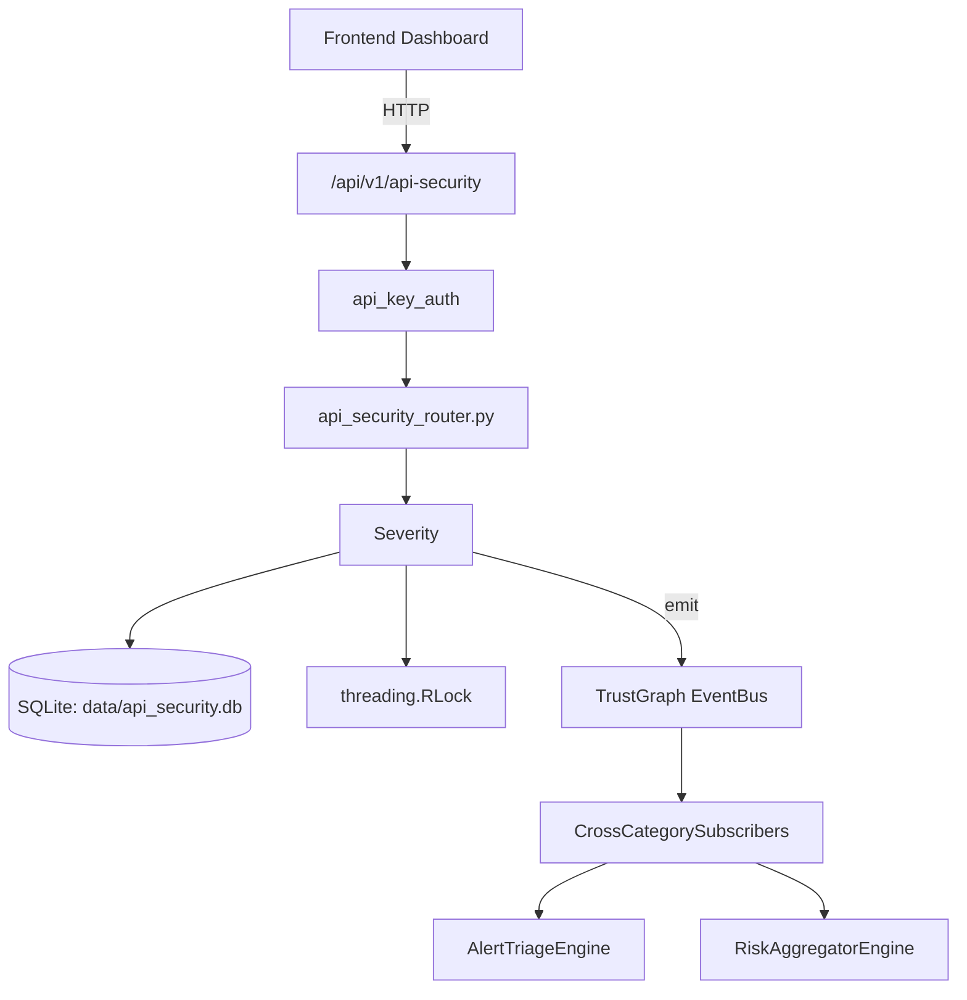

# US-0018: Api Security

## Sub-Epic: ASPM
**Master Goal**: ALDECI — $35/mo enterprise security intelligence platform replacing $50K-500K/yr tools

## User Story
As a **Emma Davis (DevSecOps Engineer)**, I need to secure APIs against OWASP Top 10 threats
so that the platform delivers enterprise-grade aspm capabilities at 1/1000th the cost of legacy tools.

## Why This Matters
Api Security replaces functionality found in enterprise tools like CrowdStrike, Wiz, Snyk, and Rapid7.
By building this into ALDECI's $35/mo stack, customers save $50K+/yr on standalone ASPM tooling.

## Architecture

## Current State: 95% Complete
- ✅ `to_dict()` — implemented (line 82)
- ✅ `to_dict()` — implemented (line 117)
- ✅ `to_dict()` — implemented (line 152)
- ✅ `to_dict()` — implemented (line 177)
- ✅ `to_dict()` — implemented (line 202)
- ✅ `to_dict()` — implemented (line 235)
- ❌ TrustGraph event emission — not yet verified

## Key Functions (from `suite-core/core/api_security_engine.py` — 1515 lines)
- `ApiEndpoint.to_dict()` — Handle to dict (line 82)
- `SecurityFinding.to_dict()` — Handle to dict (line 117)
- `RateLimitResult.to_dict()` — Handle to dict (line 152)
- `SchemaIssue.to_dict()` — Handle to dict (line 177)
- `AuthAnalysis.to_dict()` — Handle to dict (line 202)
- `ScanResult.to_dict()` — Handle to dict (line 235)
- `OpenAPIParser.parse()` — Handle parse (line 356)
- `BOLAChecker.check()` — Handle check (line 460)

## Dependencies
- **Depends on**: standalone
- **Depended by**: Routers, TrustGraph EventBus, CrossCategorySubscribers
- **TrustGraph**: Event emission wired via ResponseInterceptorMiddleware
- **Source file**: `suite-core/core/api_security_engine.py` (1515 lines)
- **Router file**: `suite-api/apps/api/api_security_router.py`

## API Endpoints
| Method | Path | Description |
|--------|------|-------------|
| POST | `/api/v1/api-security/scan` | scan api |
| GET | `/api/v1/api-security/findings` | get findings |
| GET | `/api/v1/api-security/inventory` | get inventory |
| GET | `/api/v1/api-security/auth-analysis` | get auth analysis |
| GET | `/api/v1/api-security/rate-limits` | get rate limits |
| GET | `/api/v1/api-security/schema-issues` | get schema issues |
| GET | `/api/v1/api-security/health` | health |

## Tasks Remaining
1. Verify TrustGraph event emission works end-to-end (2h)
2. Add integration test with real persona workflow (2h)
3. Wire CrossCategorySubscriber consumer chain (1h)
4. Validate with 30-persona walkthrough (1h)
5. Optimize query performance for large datasets (2h)
6. Expand test coverage to edge cases (2h)

## Definition of Done
- [ ] Emma Davis (DevSecOps Engineer) can access /api/v1/api-security and get meaningful data
- [ ] All CRUD operations return correct HTTP status codes
- [ ] TrustGraph receives events from this engine
- [ ] 32+ tests passing in `tests/test_api_security_engine.py`
- [ ] 30-persona walkthrough includes this endpoint at 100%
- [ ] No hardcoded org_id — all queries are org-scoped

## Sprint: Wave 42 (est. April 18-20, 2026)

## Test Coverage
- **Test file**: `tests/test_api_security_engine.py`
- **Tests**: 32 tests
- **Status**: Passing
