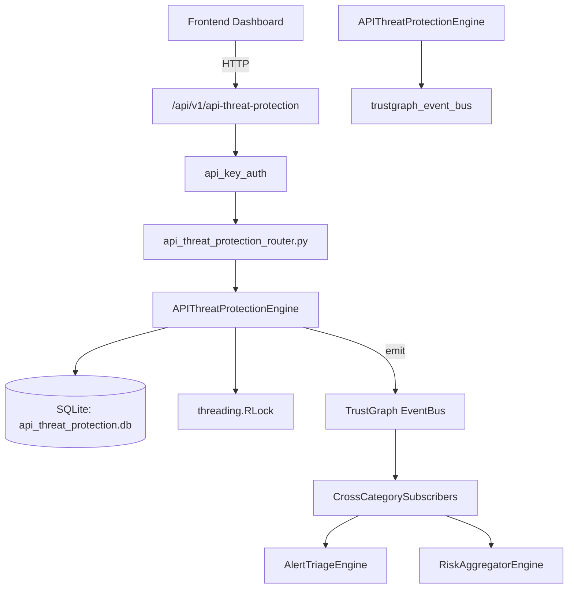

# US-0020: Api Threat Protection

## Sub-Epic: ASPM
**Master Goal**: ALDECI — $35/mo enterprise security intelligence platform replacing $50K-500K/yr tools

## User Story
As a **Emma Davis (DevSecOps Engineer)**, I need to secure APIs against OWASP Top 10 threats
so that the platform delivers enterprise-grade aspm capabilities at 1/1000th the cost of legacy tools.

## Why This Matters
Api Threat Protection replaces functionality found in enterprise tools like CrowdStrike, Wiz, Snyk, and Rapid7.
By building this into ALDECI's $35/mo stack, customers save $50K+/yr on standalone ASPM tooling.

## Architecture

## Current State: 95% Complete
- ✅ `create_protection_rule()` — Create a new API threat protection rule. (line 92)
- ✅ `list_rules()` — List protection rules, optionally filtered by threat_type and status. (line 138)
- ✅ `get_rule()` — Get a single rule by id, org-isolated. (line 159)
- ✅ `update_rule_status()` — Update a rule's status. (line 169)
- ✅ `record_threat_event()` — Record a threat event and increment triggered_count on the associated rule. (line 193)
- ✅ `list_threat_events()` — List threat events with optional filters, ordered by detected_at DESC. (line 234)
- ❌ TrustGraph event emission — not yet verified

## Key Functions (from `suite-core/core/api_threat_protection_engine.py` — 317 lines)
- `APIThreatProtectionEngine.create_protection_rule()` — Create a new API threat protection rule. (line 92)
- `APIThreatProtectionEngine.list_rules()` — List protection rules, optionally filtered by threat_type and status. (line 138)
- `APIThreatProtectionEngine.get_rule()` — Get a single rule by id, org-isolated. (line 159)
- `APIThreatProtectionEngine.update_rule_status()` — Update a rule's status. (line 169)
- `APIThreatProtectionEngine.record_threat_event()` — Record a threat event and increment triggered_count on the associated rule. (line 193)
- `APIThreatProtectionEngine.list_threat_events()` — List threat events with optional filters, ordered by detected_at DESC. (line 234)
- `APIThreatProtectionEngine.get_protection_stats()` — Return aggregate protection statistics for the org. (line 263)

## Dependencies
- **Depends on**: trustgraph_event_bus
- **Depended by**: Routers, TrustGraph EventBus, CrossCategorySubscribers
- **TrustGraph**: Event emission wired via ResponseInterceptorMiddleware
- **Source file**: `suite-core/core/api_threat_protection_engine.py` (317 lines)
- **Router file**: `suite-api/apps/api/api_threat_protection_router.py`

## API Endpoints
| Method | Path | Description |
|--------|------|-------------|
| POST | `/api/v1/api-threat-protection/rules` | create protection rule |
| GET | `/api/v1/api-threat-protection/rules` | list rules |
| GET | `/api/v1/api-threat-protection/rules/{rule_id}` | get rule |
| POST | `/api/v1/api-threat-protection/events` | record threat event |
| GET | `/api/v1/api-threat-protection/events` | list threat events |
| PATCH | `/api/v1/api-threat-protection/rules/{rule_id}/status` | update rule status |
| GET | `/api/v1/api-threat-protection/stats` | get protection stats |

## Tasks Remaining
1. Verify TrustGraph event emission works end-to-end (2h)
2. Add integration test with real persona workflow (2h)
3. Wire CrossCategorySubscriber consumer chain (1h)
4. Validate with 30-persona walkthrough (1h)
5. Optimize query performance for large datasets (2h)
6. Expand test coverage to edge cases (2h)

## Definition of Done
- [ ] Emma Davis (DevSecOps Engineer) can access /api/v1/api-threat-protection and get meaningful data
- [ ] All CRUD operations return correct HTTP status codes
- [ ] TrustGraph receives events from this engine
- [ ] 39+ tests passing in `tests/test_api_threat_protection_engine.py`
- [ ] 30-persona walkthrough includes this endpoint at 100%
- [ ] No hardcoded org_id — all queries are org-scoped

## Sprint: Wave 42 (est. April 18-20, 2026)

## Test Coverage
- **Test file**: `tests/test_api_threat_protection_engine.py`
- **Tests**: 39 tests
- **Status**: Passing
