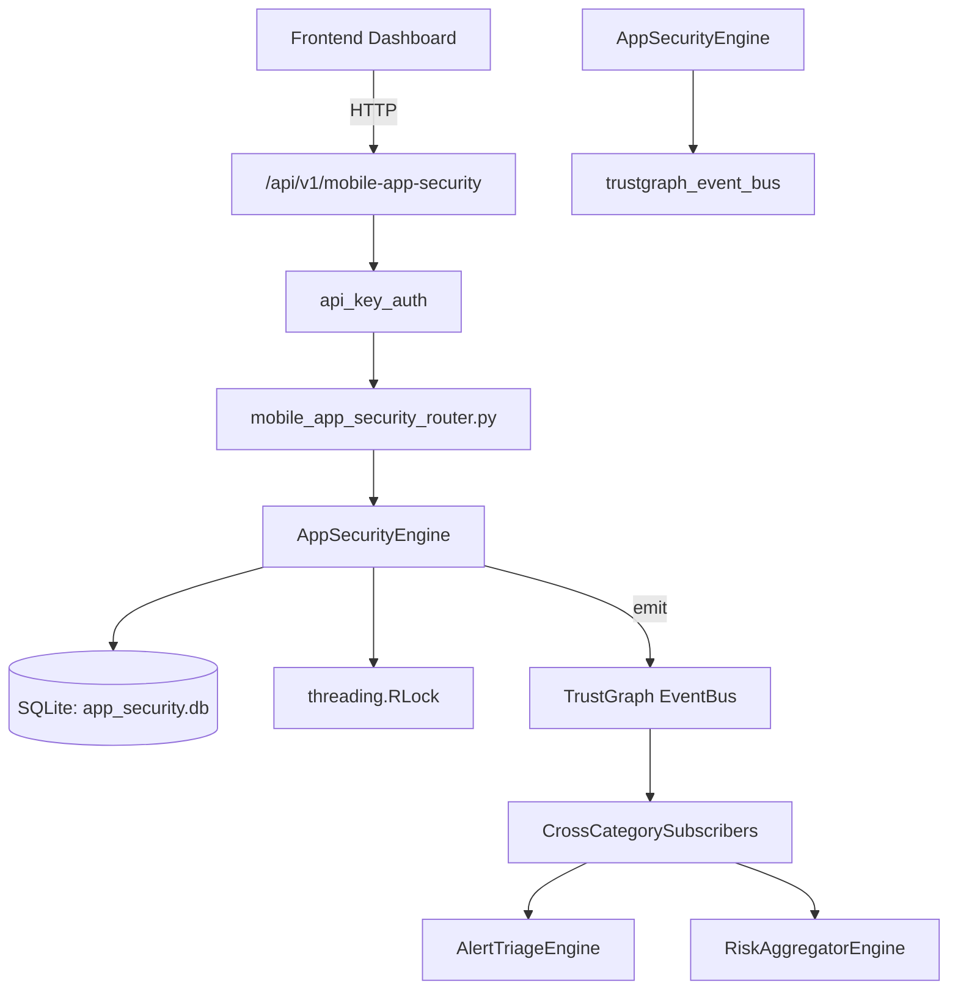

# US-0021: App Security

## Sub-Epic: ASPM
**Master Goal**: ALDECI — $35/mo enterprise security intelligence platform replacing $50K-500K/yr tools

## User Story
As a **Tom Anderson (AppSec Lead)**, I need to manage application security scanning and findings
so that the platform delivers enterprise-grade aspm capabilities at 1/1000th the cost of legacy tools.

## Why This Matters
App Security replaces functionality found in enterprise tools like CrowdStrike, Wiz, Snyk, and Rapid7.
By building this into ALDECI's $35/mo stack, customers save $50K+/yr on standalone ASPM tooling.

## Architecture

## Current State: 95% Complete
- ✅ `register_app()` — Register a new application. Returns the created record. (line 200)
- ✅ `list_apps()` — Return all applications for an org. (line 246)
- ✅ `create_sast_scan()` — Create a SAST scan record. Returns the created record. (line 259)
- ✅ `create_dast_scan()` — Create a DAST scan record. Returns the created record. (line 267)
- ✅ `list_scans()` — Return scans for an org, optionally filtered by app_id and/or scan_type. (line 323)
- ✅ `create_finding()` — Create an application security finding. Returns the created record. (line 358)
- ❌ TrustGraph event emission — not yet verified

## Key Functions (from `suite-core/core/app_security_engine.py` — 511 lines)
- `AppSecurityEngine.register_app()` — Register a new application. Returns the created record. (line 200)
- `AppSecurityEngine.list_apps()` — Return all applications for an org. (line 246)
- `AppSecurityEngine.create_sast_scan()` — Create a SAST scan record. Returns the created record. (line 259)
- `AppSecurityEngine.create_dast_scan()` — Create a DAST scan record. Returns the created record. (line 267)
- `AppSecurityEngine.list_scans()` — Return scans for an org, optionally filtered by app_id and/or scan_type. (line 323)
- `AppSecurityEngine.create_finding()` — Create an application security finding. Returns the created record. (line 358)
- `AppSecurityEngine.list_findings()` — Return findings for an org, optionally filtered. (line 404)
- `AppSecurityEngine.update_finding_status()` — Update the status of a finding. Returns True if updated. (line 428)

## Dependencies
- **Depends on**: trustgraph_event_bus
- **Depended by**: Routers, TrustGraph EventBus, CrossCategorySubscribers
- **TrustGraph**: Event emission wired via ResponseInterceptorMiddleware
- **Source file**: `suite-core/core/app_security_engine.py` (511 lines)
- **Router file**: `suite-api/apps/api/mobile_app_security_router.py`

## API Endpoints
| Method | Path | Description |
|--------|------|-------------|
| POST | `/api/v1/mobile-app-security/apps` | register app |
| GET | `/api/v1/mobile-app-security/apps` | list apps |
| GET | `/api/v1/mobile-app-security/apps/{app_id}` | get app |
| POST | `/api/v1/mobile-app-security/findings` | record finding |
| GET | `/api/v1/mobile-app-security/findings` | list findings |
| PUT | `/api/v1/mobile-app-security/findings/{finding_id}/status` | update finding status |
| POST | `/api/v1/mobile-app-security/scans` | create scan |
| PUT | `/api/v1/mobile-app-security/scans/{scan_id}/complete` | complete scan |
| GET | `/api/v1/mobile-app-security/scans` | list scans |
| GET | `/api/v1/mobile-app-security/stats` | get mobile stats |

## Tasks Remaining
1. Verify TrustGraph event emission works end-to-end (2h)
2. Add integration test with real persona workflow (2h)
3. Wire CrossCategorySubscriber consumer chain (1h)
4. Validate with 30-persona walkthrough (1h)
5. Optimize query performance for large datasets (2h)
6. Expand test coverage to edge cases (2h)

## Definition of Done
- [ ] Tom Anderson (AppSec Lead) can access /api/v1/mobile-app-security and get meaningful data
- [ ] All CRUD operations return correct HTTP status codes
- [ ] TrustGraph receives events from this engine
- [ ] 29+ tests passing in `tests/test_app_security_engine.py`
- [ ] 30-persona walkthrough includes this endpoint at 100%
- [ ] No hardcoded org_id — all queries are org-scoped

## Sprint: Wave 42 (est. April 18-20, 2026)

## Test Coverage
- **Test file**: `tests/test_app_security_engine.py`
- **Tests**: 29 tests
- **Status**: Passing
