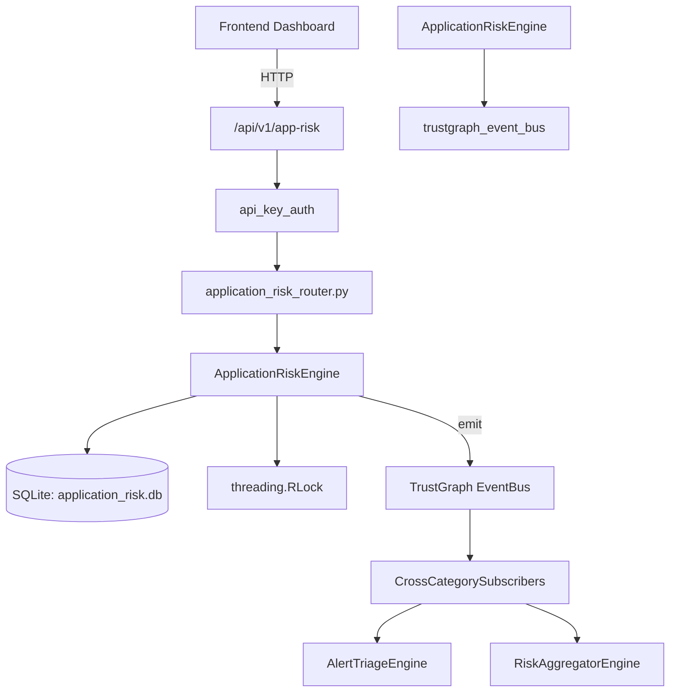

# US-0022: Application Risk

## Sub-Epic: ASPM
**Master Goal**: ALDECI — $35/mo enterprise security intelligence platform replacing $50K-500K/yr tools

## User Story
As a **Tom Anderson (AppSec Lead)**, I need to manage application security scanning and findings
so that the platform delivers enterprise-grade aspm capabilities at 1/1000th the cost of legacy tools.

## Why This Matters
Application Risk replaces functionality found in enterprise tools like CrowdStrike, Wiz, Snyk, and Rapid7.
By building this into ALDECI's $35/mo stack, customers save $50K+/yr on standalone ASPM tooling.

## Architecture

## Current State: 95% Complete
- ✅ `register_application()` — Register a new application. (line 132)
- ✅ `list_applications()` — List applications with optional filters. (line 188)
- ✅ `get_application()` — Get a single application by id, scoped to org. (line 208)
- ✅ `assess_risk()` — Compute and store risk score for an application. (line 217)
- ✅ `add_finding()` — Add a security finding to an application. (line 286)
- ✅ `list_findings()` — List findings with optional filters. (line 331)
- ❌ TrustGraph event emission — not yet verified

## Key Functions (from `suite-core/core/application_risk_engine.py` — 427 lines)
- `ApplicationRiskEngine.register_application()` — Register a new application. (line 132)
- `ApplicationRiskEngine.list_applications()` — List applications with optional filters. (line 188)
- `ApplicationRiskEngine.get_application()` — Get a single application by id, scoped to org. (line 208)
- `ApplicationRiskEngine.assess_risk()` — Compute and store risk score for an application. (line 217)
- `ApplicationRiskEngine.add_finding()` — Add a security finding to an application. (line 286)
- `ApplicationRiskEngine.list_findings()` — List findings with optional filters. (line 331)
- `ApplicationRiskEngine.resolve_finding()` — Mark a finding as resolved with a resolution note. (line 355)
- `ApplicationRiskEngine.get_app_risk_stats()` — Aggregated application risk statistics for an org. (line 382)

## Dependencies
- **Depends on**: trustgraph_event_bus
- **Depended by**: Routers, TrustGraph EventBus, CrossCategorySubscribers
- **TrustGraph**: Event emission wired via ResponseInterceptorMiddleware
- **Source file**: `suite-core/core/application_risk_engine.py` (427 lines)
- **Router file**: `suite-api/apps/api/application_risk_router.py`

## API Endpoints
| Method | Path | Description |
|--------|------|-------------|
| POST | `/api/v1/app-risk/applications` | register application |
| GET | `/api/v1/app-risk/applications` | list applications |
| GET | `/api/v1/app-risk/applications/{app_id}` | get application |
| POST | `/api/v1/app-risk/applications/{app_id}/assess` | assess risk |
| POST | `/api/v1/app-risk/applications/{app_id}/findings` | add finding |
| GET | `/api/v1/app-risk/findings` | list findings |
| POST | `/api/v1/app-risk/findings/{finding_id}/resolve` | resolve finding |
| GET | `/api/v1/app-risk/stats` | get app risk stats |

## Tasks Remaining
1. Verify TrustGraph event emission works end-to-end (2h)
2. Add integration test with real persona workflow (2h)
3. Wire CrossCategorySubscriber consumer chain (1h)
4. Validate with 30-persona walkthrough (1h)
5. Optimize query performance for large datasets (2h)
6. Expand test coverage to edge cases (2h)

## Definition of Done
- [ ] Tom Anderson (AppSec Lead) can access /api/v1/app-risk and get meaningful data
- [ ] All CRUD operations return correct HTTP status codes
- [ ] TrustGraph receives events from this engine
- [ ] 42+ tests passing in `tests/test_application_risk_engine.py`
- [ ] 30-persona walkthrough includes this endpoint at 100%
- [ ] No hardcoded org_id — all queries are org-scoped

## Sprint: Wave 42 (est. April 18-20, 2026)

## Test Coverage
- **Test file**: `tests/test_application_risk_engine.py`
- **Tests**: 42 tests
- **Status**: Passing
