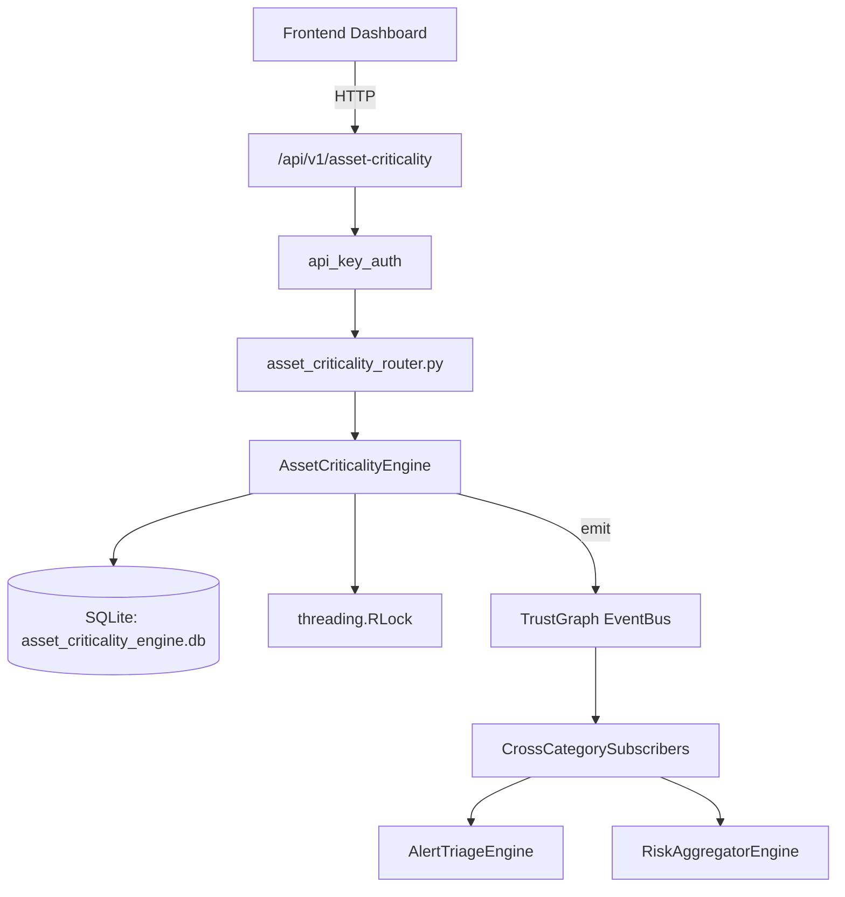

# US-0024: Asset Criticality

## Sub-Epic: Advanced
**Master Goal**: ALDECI — $35/mo enterprise security intelligence platform replacing $50K-500K/yr tools

## User Story
As a **Maria Lopez (IT Director)**, I need to maintain accurate asset inventory and risk scoring
so that the platform delivers enterprise-grade advanced capabilities at 1/1000th the cost of legacy tools.

## Why This Matters
Asset Criticality replaces functionality found in enterprise tools like CrowdStrike, Wiz, Snyk, and Rapid7.
By building this into ALDECI's $35/mo stack, customers save $50K+/yr on standalone Advanced tooling.

## Architecture

## Current State: 95% Complete
- ✅ `register_asset()` — Register a new asset. criticality_score=0, criticality_tier=unassessed. (line 144)
- ✅ `score_asset()` — Score an asset using weighted factors. (line 216)
- ✅ `add_dependency()` — Add a dependency between two assets. (line 286)
- ✅ `get_asset()` — Return asset with its factors and dependencies. (line 331)
- ✅ `list_assets()` — List assets with optional filters. (line 356)
- ✅ `get_critical_path()` — BFS traversal of asset dependencies up to max_hops (default 3). (line 379)
- ❌ TrustGraph event emission — not yet verified

## Key Functions (from `suite-core/core/asset_criticality_engine.py` — 466 lines)
- `AssetCriticalityEngine.register_asset()` — Register a new asset. criticality_score=0, criticality_tier=unassessed. (line 144)
- `AssetCriticalityEngine.score_asset()` — Score an asset using weighted factors. (line 216)
- `AssetCriticalityEngine.add_dependency()` — Add a dependency between two assets. (line 286)
- `AssetCriticalityEngine.get_asset()` — Return asset with its factors and dependencies. (line 331)
- `AssetCriticalityEngine.list_assets()` — List assets with optional filters. (line 356)
- `AssetCriticalityEngine.get_critical_path()` — BFS traversal of asset dependencies up to max_hops (default 3). (line 379)
- `AssetCriticalityEngine.get_criticality_summary()` — Return count by tier, avg score, unassessed count, top 5 most critical. (line 420)

## Dependencies
- **Depends on**: standalone
- **Depended by**: Routers, TrustGraph EventBus, CrossCategorySubscribers
- **TrustGraph**: Event emission wired via ResponseInterceptorMiddleware
- **Source file**: `suite-core/core/asset_criticality_engine.py` (466 lines)
- **Router file**: `suite-api/apps/api/asset_criticality_router.py`

## API Endpoints
| Method | Path | Description |
|--------|------|-------------|
| POST | `/api/v1/asset-criticality/assets` | register asset |
| POST | `/api/v1/asset-criticality/assets/{asset_id}/score` | score asset |
| POST | `/api/v1/asset-criticality/assets/{asset_id}/dependencies` | add dependency |
| GET | `/api/v1/asset-criticality/assets/{asset_id}` | get asset |
| GET | `/api/v1/asset-criticality/assets` | list assets |
| GET | `/api/v1/asset-criticality/assets/{asset_id}/critical-path` | get critical path |
| GET | `/api/v1/asset-criticality/summary` | get criticality summary |

## Tasks Remaining
1. Verify TrustGraph event emission works end-to-end (2h)
2. Add integration test with real persona workflow (2h)
3. Wire CrossCategorySubscriber consumer chain (1h)
4. Validate with 30-persona walkthrough (1h)
5. Optimize query performance for large datasets (2h)
6. Expand test coverage to edge cases (2h)

## Definition of Done
- [ ] Maria Lopez (IT Director) can access /api/v1/asset-criticality and get meaningful data
- [ ] All CRUD operations return correct HTTP status codes
- [ ] TrustGraph receives events from this engine
- [ ] 42+ tests passing in `tests/test_asset_criticality_engine.py`
- [ ] 30-persona walkthrough includes this endpoint at 100%
- [ ] No hardcoded org_id — all queries are org-scoped

## Sprint: Wave 42 (est. April 18-20, 2026)

## Test Coverage
- **Test file**: `tests/test_asset_criticality_engine.py`
- **Tests**: 42 tests
- **Status**: Passing
