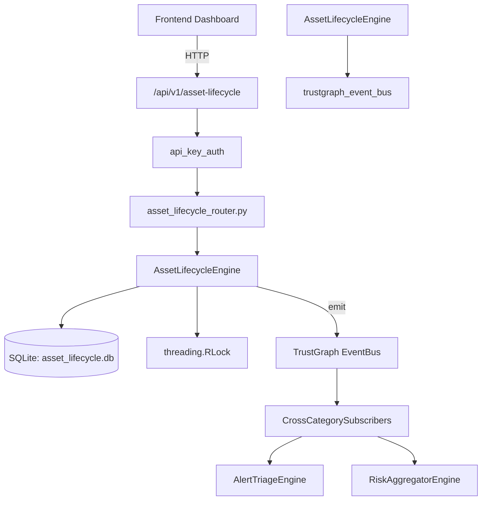

# US-0026: Asset Lifecycle

## Sub-Epic: Advanced
**Master Goal**: ALDECI — $35/mo enterprise security intelligence platform replacing $50K-500K/yr tools

## User Story
As a **Maria Lopez (IT Director)**, I need to maintain accurate asset inventory and risk scoring
so that the platform delivers enterprise-grade advanced capabilities at 1/1000th the cost of legacy tools.

## Why This Matters
Asset Lifecycle replaces functionality found in enterprise tools like CrowdStrike, Wiz, Snyk, and Rapid7.
By building this into ALDECI's $35/mo stack, customers save $50K+/yr on standalone Advanced tooling.

## Architecture

## Current State: 95% Complete
- ✅ `register_asset()` — Register a new asset. (line 162)
- ✅ `list_assets()` — List assets for an org with optional filters. (line 247)
- ✅ `get_asset()` — Retrieve a single asset by ID. (line 276)
- ✅ `update_lifecycle_phase()` — Transition an asset to a new lifecycle phase. (line 293)
- ✅ `record_maintenance()` — Record a maintenance event for an asset. (line 337)
- ✅ `decommission_asset()` — Decommission an asset — sets lifecycle_phase=decommission and status=decommissio (line 401)
- ❌ TrustGraph event emission — not yet verified

## Key Functions (from `suite-core/core/asset_lifecycle_engine.py` — 491 lines)
- `AssetLifecycleEngine.register_asset()` — Register a new asset. (line 162)
- `AssetLifecycleEngine.list_assets()` — List assets for an org with optional filters. (line 247)
- `AssetLifecycleEngine.get_asset()` — Retrieve a single asset by ID. (line 276)
- `AssetLifecycleEngine.update_lifecycle_phase()` — Transition an asset to a new lifecycle phase. (line 293)
- `AssetLifecycleEngine.record_maintenance()` — Record a maintenance event for an asset. (line 337)
- `AssetLifecycleEngine.decommission_asset()` — Decommission an asset — sets lifecycle_phase=decommission and status=decommissio (line 401)
- `AssetLifecycleEngine.get_lifecycle_stats()` — Return aggregated lifecycle statistics for the org. (line 440)

## Dependencies
- **Depends on**: trustgraph_event_bus
- **Depended by**: Routers, TrustGraph EventBus, CrossCategorySubscribers
- **TrustGraph**: Event emission wired via ResponseInterceptorMiddleware
- **Source file**: `suite-core/core/asset_lifecycle_engine.py` (491 lines)
- **Router file**: `suite-api/apps/api/asset_lifecycle_router.py`

## API Endpoints
| Method | Path | Description |
|--------|------|-------------|
| POST | `/api/v1/asset-lifecycle/assets` | register asset |
| GET | `/api/v1/asset-lifecycle/assets` | list assets |
| GET | `/api/v1/asset-lifecycle/assets/{asset_id}` | get asset |
| PUT | `/api/v1/asset-lifecycle/assets/{asset_id}/lifecycle-phase` | update lifecycle phase |
| POST | `/api/v1/asset-lifecycle/assets/{asset_id}/maintenance` | record maintenance |
| POST | `/api/v1/asset-lifecycle/assets/{asset_id}/decommission` | decommission asset |
| GET | `/api/v1/asset-lifecycle/stats` | get lifecycle stats |

## Tasks Remaining
1. Verify TrustGraph event emission works end-to-end (2h)
2. Add integration test with real persona workflow (2h)
3. Wire CrossCategorySubscriber consumer chain (1h)
4. Validate with 30-persona walkthrough (1h)
5. Optimize query performance for large datasets (2h)
6. Expand test coverage to edge cases (2h)

## Definition of Done
- [ ] Maria Lopez (IT Director) can access /api/v1/asset-lifecycle and get meaningful data
- [ ] All CRUD operations return correct HTTP status codes
- [ ] TrustGraph receives events from this engine
- [ ] 53+ tests passing in `tests/test_asset_lifecycle_engine.py`
- [ ] 30-persona walkthrough includes this endpoint at 100%
- [ ] No hardcoded org_id — all queries are org-scoped

## Sprint: Wave 42 (est. April 18-20, 2026)

## Test Coverage
- **Test file**: `tests/test_asset_lifecycle_engine.py`
- **Tests**: 53 tests
- **Status**: Passing
