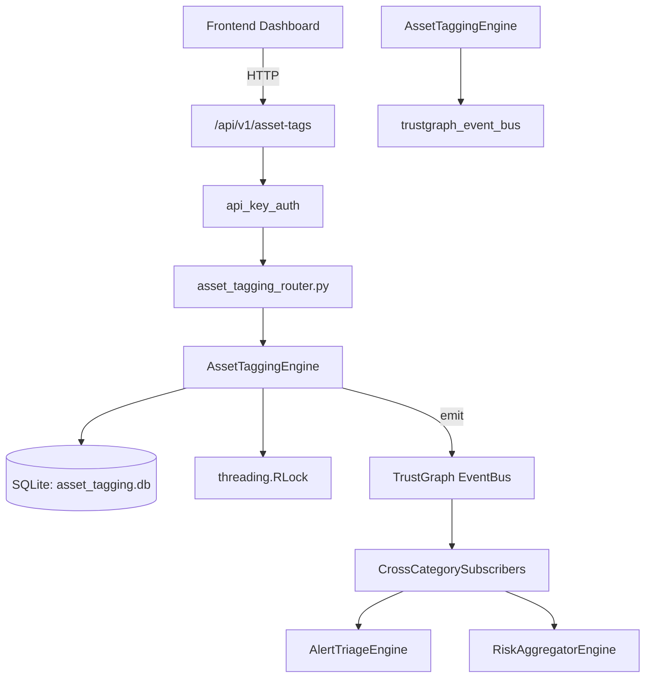

# US-0027: Asset Tagging

## Sub-Epic: Advanced
**Master Goal**: ALDECI — $35/mo enterprise security intelligence platform replacing $50K-500K/yr tools

## User Story
As a **Maria Lopez (IT Director)**, I need to maintain accurate asset inventory and risk scoring
so that the platform delivers enterprise-grade advanced capabilities at 1/1000th the cost of legacy tools.

## Why This Matters
Asset Tagging replaces functionality found in enterprise tools like CrowdStrike, Wiz, Snyk, and Rapid7.
By building this into ALDECI's $35/mo stack, customers save $50K+/yr on standalone Advanced tooling.

## Architecture

## Current State: 95% Complete
- ✅ `create_tag()` — Create a new asset tag. (line 151)
- ✅ `list_tags()` — List tags with optional category filter. (line 199)
- ✅ `get_tag()` — Retrieve a single tag by ID. Returns None if not found or wrong org. (line 215)
- ✅ `register_asset()` — Register a new asset for tagging. (line 228)
- ✅ `list_assets()` — List assets with optional filters. (line 274)
- ✅ `get_asset()` — Retrieve a single asset by asset_id. Returns None if not found or wrong org. (line 298)
- ❌ TrustGraph event emission — not yet verified

## Key Functions (from `suite-core/core/asset_tagging_engine.py` — 472 lines)
- `AssetTaggingEngine.create_tag()` — Create a new asset tag. (line 151)
- `AssetTaggingEngine.list_tags()` — List tags with optional category filter. (line 199)
- `AssetTaggingEngine.get_tag()` — Retrieve a single tag by ID. Returns None if not found or wrong org. (line 215)
- `AssetTaggingEngine.register_asset()` — Register a new asset for tagging. (line 228)
- `AssetTaggingEngine.list_assets()` — List assets with optional filters. (line 274)
- `AssetTaggingEngine.get_asset()` — Retrieve a single asset by asset_id. Returns None if not found or wrong org. (line 298)
- `AssetTaggingEngine.assign_tag()` — Assign a tag to an asset. Increments usage_count and tag_count. (line 311)
- `AssetTaggingEngine.list_asset_tags()` — Return all tags assigned to an asset (join with tag data). (line 379)

## Dependencies
- **Depends on**: trustgraph_event_bus
- **Depended by**: Routers, TrustGraph EventBus, CrossCategorySubscribers
- **TrustGraph**: Event emission wired via ResponseInterceptorMiddleware
- **Source file**: `suite-core/core/asset_tagging_engine.py` (472 lines)
- **Router file**: `suite-api/apps/api/asset_tagging_router.py`

## API Endpoints
| Method | Path | Description |
|--------|------|-------------|
| POST | `/api/v1/asset-tags/tags` | create tag |
| GET | `/api/v1/asset-tags/tags` | list tags |
| GET | `/api/v1/asset-tags/tags/{tag_id}` | get tag |
| POST | `/api/v1/asset-tags/assets` | register asset |
| GET | `/api/v1/asset-tags/assets` | list assets |
| GET | `/api/v1/asset-tags/assets/{asset_id}` | get asset |
| POST | `/api/v1/asset-tags/assets/{asset_id}/assign` | assign tag |
| GET | `/api/v1/asset-tags/assets/{asset_id}/tags` | list asset tags |
| POST | `/api/v1/asset-tags/bulk-assign` | bulk tag assets |
| GET | `/api/v1/asset-tags/stats` | get tag stats |

## Tasks Remaining
1. Verify TrustGraph event emission works end-to-end (2h)
2. Add integration test with real persona workflow (2h)
3. Wire CrossCategorySubscriber consumer chain (1h)
4. Validate with 30-persona walkthrough (1h)
5. Optimize query performance for large datasets (2h)
6. Expand test coverage to edge cases (2h)

## Definition of Done
- [ ] Maria Lopez (IT Director) can access /api/v1/asset-tags and get meaningful data
- [ ] All CRUD operations return correct HTTP status codes
- [ ] TrustGraph receives events from this engine
- [ ] 50+ tests passing in `tests/test_asset_tagging_engine.py`
- [ ] 30-persona walkthrough includes this endpoint at 100%
- [ ] No hardcoded org_id — all queries are org-scoped

## Sprint: Wave 42 (est. April 18-20, 2026)

## Test Coverage
- **Test file**: `tests/test_asset_tagging_engine.py`
- **Tests**: 50 tests
- **Status**: Passing
