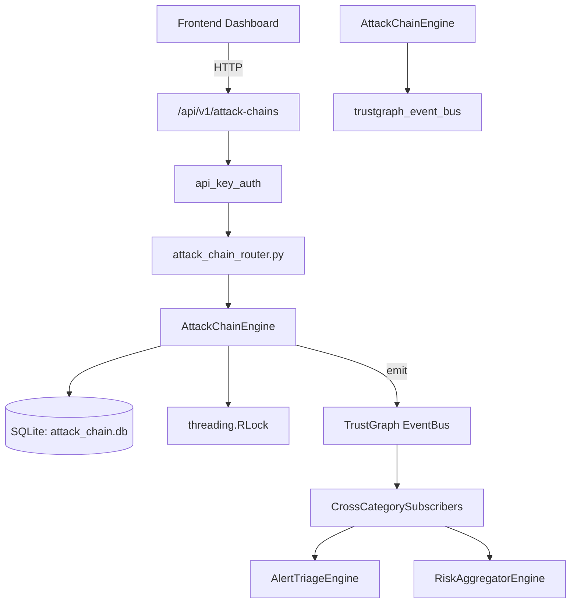

# US-0028: Attack Chain

## Sub-Epic: CTEM
**Master Goal**: ALDECI — $35/mo enterprise security intelligence platform replacing $50K-500K/yr tools

## User Story
As a **Lisa Zhang (Pentester)**, I need to model attack paths and simulate adversary behavior
so that the platform delivers enterprise-grade ctem capabilities at 1/1000th the cost of legacy tools.

## Why This Matters
Attack Chain replaces functionality found in enterprise tools like CrowdStrike, Wiz, Snyk, and Rapid7.
By building this into ALDECI's $35/mo stack, customers save $50K+/yr on standalone CTEM tooling.

## Architecture

## Current State: 95% Complete
- ✅ `create_chain()` — Create a new attack chain. (line 149)
- ✅ `list_chains()` — List attack chains with optional status and phase filters. (line 202)
- ✅ `get_chain()` — Retrieve a single attack chain by ID. (line 222)
- ✅ `update_chain_status()` — Update the status of an attack chain. (line 231)
- ✅ `add_chain_step()` — Add a step to an existing attack chain. (line 259)
- ✅ `list_chain_steps()` — List all steps for a chain, ordered by step_number ASC. (line 329)
- ❌ TrustGraph event emission — not yet verified

## Key Functions (from `suite-core/core/attack_chain_engine.py` — 464 lines)
- `AttackChainEngine.create_chain()` — Create a new attack chain. (line 149)
- `AttackChainEngine.list_chains()` — List attack chains with optional status and phase filters. (line 202)
- `AttackChainEngine.get_chain()` — Retrieve a single attack chain by ID. (line 222)
- `AttackChainEngine.update_chain_status()` — Update the status of an attack chain. (line 231)
- `AttackChainEngine.add_chain_step()` — Add a step to an existing attack chain. (line 259)
- `AttackChainEngine.list_chain_steps()` — List all steps for a chain, ordered by step_number ASC. (line 329)
- `AttackChainEngine.link_chains()` — Link two attack chains together. (line 343)
- `AttackChainEngine.get_chain_links()` — Get all links where this chain is source or target. (line 395)

## Dependencies
- **Depends on**: trustgraph_event_bus
- **Depended by**: Routers, TrustGraph EventBus, CrossCategorySubscribers
- **TrustGraph**: Event emission wired via ResponseInterceptorMiddleware
- **Source file**: `suite-core/core/attack_chain_engine.py` (464 lines)
- **Router file**: `suite-api/apps/api/attack_chain_router.py`

## API Endpoints
| Method | Path | Description |
|--------|------|-------------|
| POST | `/api/v1/attack-chains/chains` | create chain |
| GET | `/api/v1/attack-chains/chains` | list chains |
| GET | `/api/v1/attack-chains/stats` | get attack stats |
| GET | `/api/v1/attack-chains/chains/{chain_id}` | get chain |
| PUT | `/api/v1/attack-chains/chains/{chain_id}/status` | update chain status |
| POST | `/api/v1/attack-chains/chains/{chain_id}/steps` | add chain step |
| GET | `/api/v1/attack-chains/chains/{chain_id}/steps` | list chain steps |
| POST | `/api/v1/attack-chains/links` | link chains |
| GET | `/api/v1/attack-chains/chains/{chain_id}/links` | get chain links |

## Tasks Remaining
1. Verify TrustGraph event emission works end-to-end (2h)
2. Add integration test with real persona workflow (2h)
3. Wire CrossCategorySubscriber consumer chain (1h)
4. Validate with 30-persona walkthrough (1h)
5. Optimize query performance for large datasets (2h)
6. Expand test coverage to edge cases (2h)

## Definition of Done
- [ ] Lisa Zhang (Pentester) can access /api/v1/attack-chains and get meaningful data
- [ ] All CRUD operations return correct HTTP status codes
- [ ] TrustGraph receives events from this engine
- [ ] 35+ tests passing in `tests/test_attack_chain_engine.py`
- [ ] 30-persona walkthrough includes this endpoint at 100%
- [ ] No hardcoded org_id — all queries are org-scoped

## Sprint: Wave 42 (est. April 18-20, 2026)

## Test Coverage
- **Test file**: `tests/test_attack_chain_engine.py`
- **Tests**: 35 tests
- **Status**: Passing
