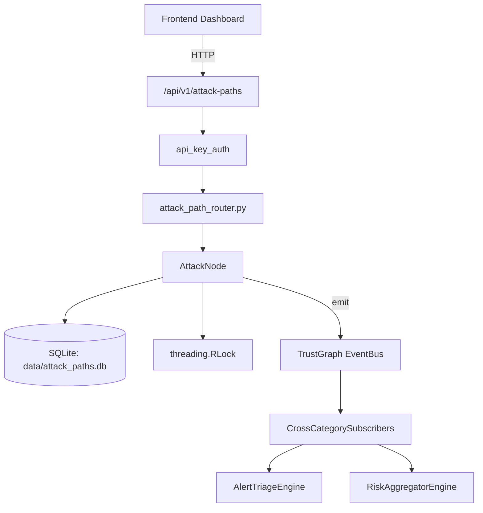

# US-0029: Attack Path

## Sub-Epic: CTEM
**Master Goal**: ALDECI — $35/mo enterprise security intelligence platform replacing $50K-500K/yr tools

## User Story
As a **Lisa Zhang (Pentester)**, I need to model attack paths and simulate adversary behavior
so that the platform delivers enterprise-grade ctem capabilities at 1/1000th the cost of legacy tools.

## Why This Matters
Attack Path replaces functionality found in enterprise tools like CrowdStrike, Wiz, Snyk, and Rapid7.
By building this into ALDECI's $35/mo stack, customers save $50K+/yr on standalone CTEM tooling.

## Architecture

## Current State: 95% Complete
- ✅ `to_dict()` — implemented (line 67)
- ✅ `to_dict()` — implemented (line 102)
- ✅ `add_node()` — Add a network node to the attack graph. (line 168)
- ✅ `get_node()` — Return node dict or None if not found. (line 203)
- ✅ `list_nodes()` — Return all nodes for org, optionally filtered by crown jewel status. (line 216)
- ✅ `remove_node()` — Remove a node (and its org-scoped edges). Returns True if node existed. (line 231)
- ❌ TrustGraph event emission — not yet verified

## Key Functions (from `suite-core/core/attack_path_engine.py` — 598 lines)
- `AttackNode.to_dict()` — Handle to dict (line 67)
- `AttackEdge.to_dict()` — Handle to dict (line 102)
- `AttackPathEngine.add_node()` — Add a network node to the attack graph. (line 168)
- `AttackPathEngine.get_node()` — Return node dict or None if not found. (line 203)
- `AttackPathEngine.list_nodes()` — Return all nodes for org, optionally filtered by crown jewel status. (line 216)
- `AttackPathEngine.remove_node()` — Remove a node (and its org-scoped edges). Returns True if node existed. (line 231)
- `AttackPathEngine.add_edge()` — Add a directed edge (possible lateral movement path). (line 260)
- `AttackPathEngine.find_attack_paths()` — Find all attack paths from entry_point to crown jewels (or specific target). (line 312)

## Dependencies
- **Depends on**: standalone
- **Depended by**: Routers, TrustGraph EventBus, CrossCategorySubscribers
- **TrustGraph**: Event emission wired via ResponseInterceptorMiddleware
- **Source file**: `suite-core/core/attack_path_engine.py` (598 lines)
- **Router file**: `suite-api/apps/api/attack_path_router.py`

## API Endpoints
| Method | Path | Description |
|--------|------|-------------|
| POST | `/api/v1/attack-paths/nodes` | add node |
| GET | `/api/v1/attack-paths/nodes` | list nodes |
| DELETE | `/api/v1/attack-paths/nodes/{node_id}` | remove node |
| POST | `/api/v1/attack-paths/edges` | add edge |
| POST | `/api/v1/attack-paths/analyze` | analyze |
| POST | `/api/v1/attack-paths/blast-radius` | blast radius |
| GET | `/api/v1/attack-paths/crown-jewels-at-risk` | crown jewels at risk |
| GET | `/api/v1/attack-paths/stats` | stats |

## Tasks Remaining
1. Verify TrustGraph event emission works end-to-end (2h)
2. Add integration test with real persona workflow (2h)
3. Wire CrossCategorySubscriber consumer chain (1h)
4. Validate with 30-persona walkthrough (1h)
5. Optimize query performance for large datasets (2h)
6. Expand test coverage to edge cases (2h)

## Definition of Done
- [ ] Lisa Zhang (Pentester) can access /api/v1/attack-paths and get meaningful data
- [ ] All CRUD operations return correct HTTP status codes
- [ ] TrustGraph receives events from this engine
- [ ] 26+ tests passing in `tests/test_attack_path_engine.py`
- [ ] 30-persona walkthrough includes this endpoint at 100%
- [ ] No hardcoded org_id — all queries are org-scoped

## Sprint: Wave 42 (est. April 18-20, 2026)

## Test Coverage
- **Test file**: `tests/test_attack_path_engine.py`
- **Tests**: 26 tests
- **Status**: Passing
