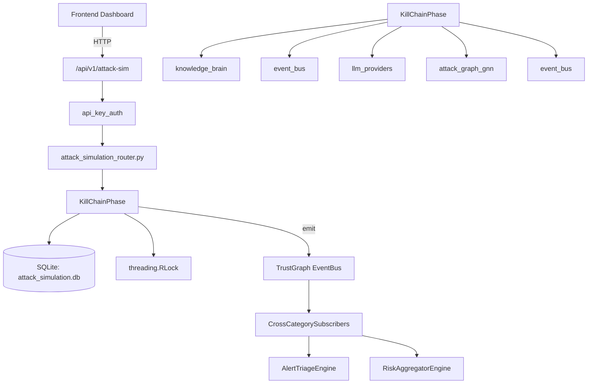

# US-0030: Attack Simulation

## Sub-Epic: CTEM
**Master Goal**: ALDECI — $35/mo enterprise security intelligence platform replacing $50K-500K/yr tools

## User Story
As a **Lisa Zhang (Pentester)**, I need to model attack paths and simulate adversary behavior
so that the platform delivers enterprise-grade ctem capabilities at 1/1000th the cost of legacy tools.

## Why This Matters
Attack Simulation replaces functionality found in enterprise tools like CrowdStrike, Wiz, Snyk, and Rapid7.
By building this into ALDECI's $35/mo stack, customers save $50K+/yr on standalone CTEM tooling.

## Architecture

## Current State: 95% Complete
- ✅ `create_scenario()` — Create a new attack scenario. (line 435)
- ✅ `list_scenarios()` — List all scenarios. (line 475)
- ✅ `get_scenario()` — Get a scenario by ID. (line 479)
- ✅ `generate_scenario_with_llm()` — Use LLM to generate an intelligent attack scenario. (line 483)
- ✅ `run_campaign()` — Execute a full attack simulation campaign. (line 547)
- ✅ `get_campaign()` — Get campaign by ID. (line 1095)
- ❌ TrustGraph event emission — not yet verified

## Key Functions (from `suite-core/core/attack_simulation_engine.py` — 1586 lines)
- `AttackSimulationEngine.create_scenario()` — Create a new attack scenario. (line 435)
- `AttackSimulationEngine.list_scenarios()` — List all scenarios. (line 475)
- `AttackSimulationEngine.get_scenario()` — Get a scenario by ID. (line 479)
- `AttackSimulationEngine.generate_scenario_with_llm()` — Use LLM to generate an intelligent attack scenario. (line 483)
- `AttackSimulationEngine.run_campaign()` — Execute a full attack simulation campaign. (line 547)
- `AttackSimulationEngine.get_campaign()` — Get campaign by ID. (line 1095)
- `AttackSimulationEngine.list_campaigns()` — List campaigns, optionally filtered by status. (line 1099)
- `AttackSimulationEngine.get_mitre_heatmap()` — Get MITRE ATT&CK heatmap across all campaigns. (line 1106)

## Dependencies
- **Depends on**: knowledge_brain, event_bus, llm_providers, attack_graph_gnn, event_bus
- **Depended by**: Routers, TrustGraph EventBus, CrossCategorySubscribers
- **TrustGraph**: Event emission wired via ResponseInterceptorMiddleware
- **Source file**: `suite-core/core/attack_simulation_engine.py` (1586 lines)
- **Router file**: `suite-api/apps/api/attack_simulation_router.py`

## API Endpoints
| Method | Path | Description |
|--------|------|-------------|
| POST | `/api/v1/attack-sim/simulations` | create simulation |
| GET | `/api/v1/attack-sim/simulations` | list simulations |
| GET | `/api/v1/attack-sim/simulations/{sim_id}` | get simulation |
| POST | `/api/v1/attack-sim/simulations/{sim_id}/attack-paths` | add attack path |
| GET | `/api/v1/attack-sim/simulations/{sim_id}/attack-paths` | list attack paths |
| POST | `/api/v1/attack-sim/simulations/{sim_id}/findings` | create finding |
| GET | `/api/v1/attack-sim/findings` | list findings |
| GET | `/api/v1/attack-sim/mitre-coverage` | get mitre coverage |
| GET | `/api/v1/attack-sim/stats` | get simulation stats |

## Tasks Remaining
1. Verify TrustGraph event emission works end-to-end (2h)
2. Add integration test with real persona workflow (2h)
3. Wire CrossCategorySubscriber consumer chain (1h)
4. Validate with 30-persona walkthrough (1h)
5. Optimize query performance for large datasets (2h)
6. Expand test coverage to edge cases (2h)

## Definition of Done
- [ ] Lisa Zhang (Pentester) can access /api/v1/attack-sim and get meaningful data
- [ ] All CRUD operations return correct HTTP status codes
- [ ] TrustGraph receives events from this engine
- [ ] 31+ tests passing in `tests/test_attack_simulation_engine.py`
- [ ] 30-persona walkthrough includes this endpoint at 100%
- [ ] No hardcoded org_id — all queries are org-scoped

## Sprint: Wave 43 (est. April 19-21, 2026)

## Test Coverage
- **Test file**: `tests/test_attack_simulation_engine.py`
- **Tests**: 31 tests
- **Status**: Passing
