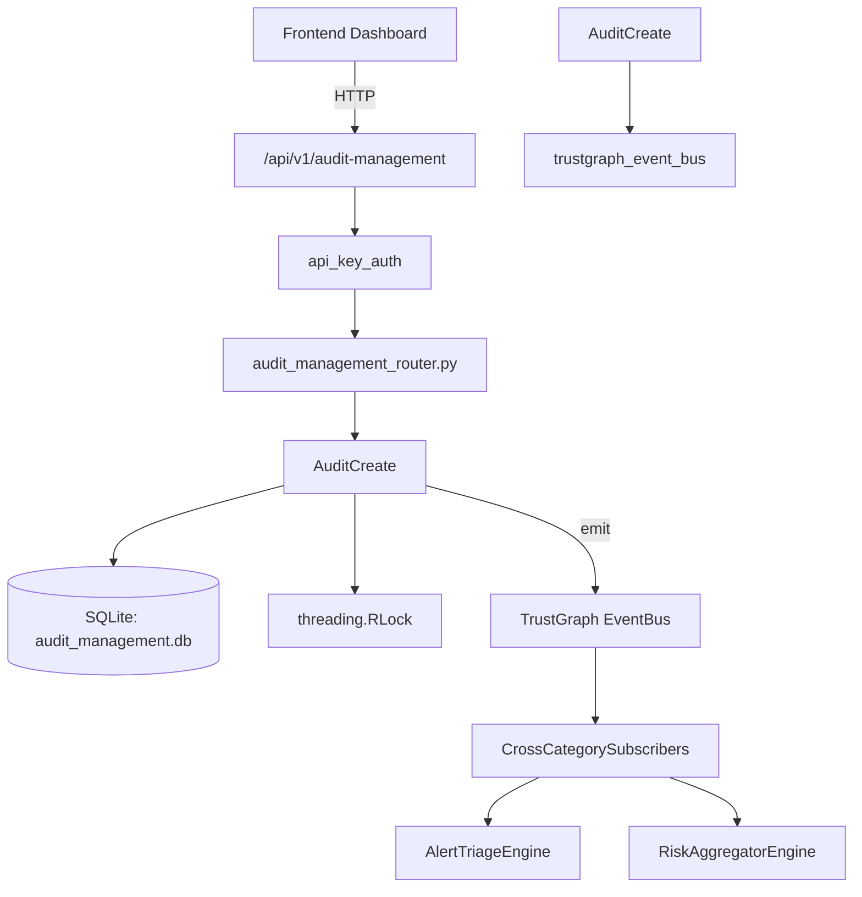

# US-0032: Audit Management

## Sub-Epic: GRC
**Master Goal**: ALDECI — $35/mo enterprise security intelligence platform replacing $50K-500K/yr tools

## User Story
As a **Michael Brown (Audit Manager)**, I need to manage audit trails and compliance evidence
so that the platform delivers enterprise-grade grc capabilities at 1/1000th the cost of legacy tools.

## Why This Matters
Audit Management replaces functionality found in enterprise tools like CrowdStrike, Wiz, Snyk, and Rapid7.
By building this into ALDECI's $35/mo stack, customers save $50K+/yr on standalone GRC tooling.

## Architecture

## Current State: 95% Complete
- ✅ `create_audit()` — Create a new audit in planned status. (line 148)
- ✅ `list_audits()` — List audits for org, optionally filtered. (line 190)
- ✅ `get_audit()` — Fetch a single audit scoped to org_id. (line 210)
- ✅ `start_audit()` — Transition audit to in_progress status. (line 221)
- ✅ `complete_audit()` — Mark audit as completed with a summary. (line 234)
- ✅ `record_finding()` — Record a new finding against an audit. Increments audit findings_count. (line 251)
- ❌ TrustGraph event emission — not yet verified

## Key Functions (from `suite-core/core/audit_management_engine.py` — 354 lines)
- `AuditManagementEngine.create_audit()` — Create a new audit in planned status. (line 148)
- `AuditManagementEngine.list_audits()` — List audits for org, optionally filtered. (line 190)
- `AuditManagementEngine.get_audit()` — Fetch a single audit scoped to org_id. (line 210)
- `AuditManagementEngine.start_audit()` — Transition audit to in_progress status. (line 221)
- `AuditManagementEngine.complete_audit()` — Mark audit as completed with a summary. (line 234)
- `AuditManagementEngine.record_finding()` — Record a new finding against an audit. Increments audit findings_count. (line 251)
- `AuditManagementEngine.resolve_finding()` — Resolve a finding with resolution text and resolver identity. (line 287)
- `AuditManagementEngine.get_audit_stats()` — Return audit statistics for the org. (line 317)

## Dependencies
- **Depends on**: trustgraph_event_bus
- **Depended by**: Routers, TrustGraph EventBus, CrossCategorySubscribers
- **TrustGraph**: Event emission wired via ResponseInterceptorMiddleware
- **Source file**: `suite-core/core/audit_management_engine.py` (354 lines)
- **Router file**: `suite-api/apps/api/audit_management_router.py`

## API Endpoints
| Method | Path | Description |
|--------|------|-------------|
| POST | `/api/v1/audit-management/audits` | create audit |
| GET | `/api/v1/audit-management/audits` | list audits |
| GET | `/api/v1/audit-management/audits/{audit_id}` | get audit |
| PUT | `/api/v1/audit-management/audits/{audit_id}/start` | start audit |
| PUT | `/api/v1/audit-management/audits/{audit_id}/complete` | complete audit |
| POST | `/api/v1/audit-management/audits/{audit_id}/findings` | record finding |
| PUT | `/api/v1/audit-management/findings/{finding_id}/resolve` | resolve finding |
| GET | `/api/v1/audit-management/stats` | get audit stats |

## Tasks Remaining
1. Verify TrustGraph event emission works end-to-end (2h)
2. Add integration test with real persona workflow (2h)
3. Wire CrossCategorySubscriber consumer chain (1h)
4. Validate with 30-persona walkthrough (1h)
5. Optimize query performance for large datasets (2h)
6. Expand test coverage to edge cases (2h)

## Definition of Done
- [ ] Michael Brown (Audit Manager) can access /api/v1/audit-management and get meaningful data
- [ ] All CRUD operations return correct HTTP status codes
- [ ] TrustGraph receives events from this engine
- [ ] 35+ tests passing in `tests/test_audit_management_engine.py`
- [ ] 30-persona walkthrough includes this endpoint at 100%
- [ ] No hardcoded org_id — all queries are org-scoped

## Sprint: Wave 43 (est. April 19-21, 2026)

## Test Coverage
- **Test file**: `tests/test_audit_management_engine.py`
- **Tests**: 35 tests
- **Status**: Passing
