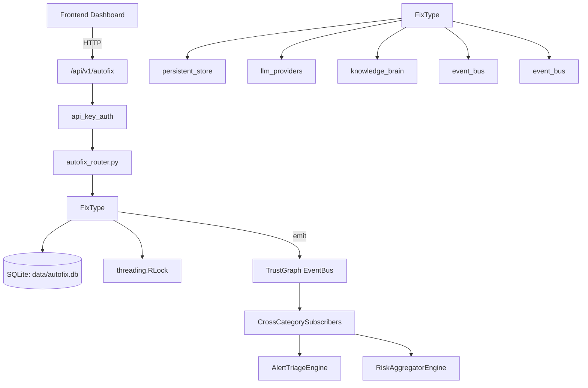

# US-0033: Autofix

## Sub-Epic: Advanced
**Master Goal**: ALDECI — $35/mo enterprise security intelligence platform replacing $50K-500K/yr tools

## User Story
As a **James Wilson (Security Engineer)**, I need to manage security operations
so that the platform delivers enterprise-grade advanced capabilities at 1/1000th the cost of legacy tools.

## Why This Matters
Autofix replaces functionality found in enterprise tools like CrowdStrike, Wiz, Snyk, and Rapid7.
By building this into ALDECI's $35/mo stack, customers save $50K+/yr on standalone Advanced tooling.

## Architecture

## Current State: 95% Complete
- ✅ `generate_fix()` — Generate an autofix suggestion for a security finding. (line 449)
- ✅ `should_auto_merge()` — Determine if a fix should be auto-merged without human review. (line 1341)
- ✅ `apply_fix()` — Apply a generated fix and optionally create a PR. (line 2028)
- ✅ `rollback_fix()` — Mark a fix as rolled back. (line 2147)
- ✅ `get_fix()` — Get a fix by ID. (line 2188)
- ✅ `list_fixes()` — List fixes with optional filters. (line 2192)
- ❌ TrustGraph event emission — not yet verified

## Key Functions (from `suite-core/core/autofix_engine.py` — 2308 lines)
- `AutoFixEngine.generate_fix()` — Generate an autofix suggestion for a security finding. (line 449)
- `AutoFixEngine.should_auto_merge()` — Determine if a fix should be auto-merged without human review. (line 1341)
- `AutoFixEngine.apply_fix()` — Apply a generated fix and optionally create a PR. (line 2028)
- `AutoFixEngine.rollback_fix()` — Mark a fix as rolled back. (line 2147)
- `AutoFixEngine.get_fix()` — Get a fix by ID. (line 2188)
- `AutoFixEngine.list_fixes()` — List fixes with optional filters. (line 2192)
- `AutoFixEngine.get_stats()` — Get autofix engine statistics. (line 2209)
- `AutoFixEngine.get_history()` — Get fix action history. (line 2213)

## Dependencies
- **Depends on**: persistent_store, llm_providers, knowledge_brain, event_bus, event_bus
- **Depended by**: Routers, TrustGraph EventBus, CrossCategorySubscribers
- **TrustGraph**: Event emission wired via ResponseInterceptorMiddleware
- **Source file**: `suite-core/core/autofix_engine.py` (2308 lines)
- **Router file**: `suite-api/apps/api/autofix_router.py`

## API Endpoints
| Method | Path | Description |
|--------|------|-------------|
| POST | `/api/v1/autofix/generate` | generate fix |
| POST | `/api/v1/autofix/generate/bulk` | generate bulk fixes |
| POST | `/api/v1/autofix/apply` | apply fix |
| POST | `/api/v1/autofix/validate` | validate fix |
| POST | `/api/v1/autofix/rollback` | rollback fix |
| GET | `/api/v1/autofix/fixes/{fix_id}` | get fix |
| GET | `/api/v1/autofix/suggestions/{finding_id}` | get suggestions |
| GET | `/api/v1/autofix/history` | get history |
| POST | `/api/v1/autofix/auto-merge/check` | check auto merge |
| GET | `/api/v1/autofix/stats` | get stats |
| GET | `/api/v1/autofix/health` | health |
| GET | `/api/v1/autofix/status` | autofix status |

## Tasks Remaining
1. Verify TrustGraph event emission works end-to-end (2h)
2. Add integration test with real persona workflow (2h)
3. Wire CrossCategorySubscriber consumer chain (1h)
4. Validate with 30-persona walkthrough (1h)
5. Optimize query performance for large datasets (2h)
6. Expand test coverage to edge cases (2h)

## Definition of Done
- [ ] James Wilson (Security Engineer) can access /api/v1/autofix and get meaningful data
- [ ] All CRUD operations return correct HTTP status codes
- [ ] TrustGraph receives events from this engine
- [ ] 31+ tests passing in `tests/test_autofix_engine.py`
- [ ] 30-persona walkthrough includes this endpoint at 100%
- [ ] No hardcoded org_id — all queries are org-scoped

## Sprint: Wave 43 (est. April 19-21, 2026)

## Test Coverage
- **Test file**: `tests/test_autofix_engine.py`
- **Tests**: 31 tests
- **Status**: Passing
