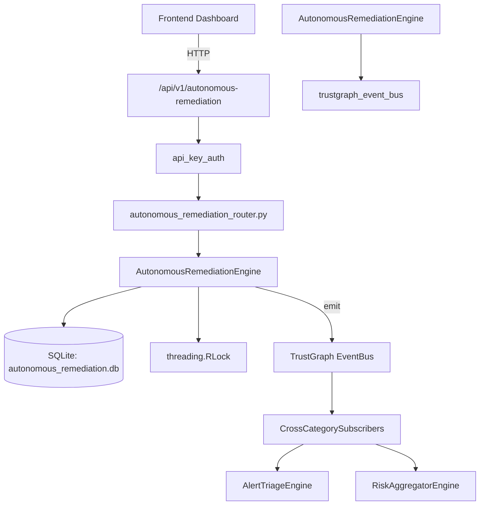

# US-0034: Autonomous Remediation

## Sub-Epic: Advanced
**Master Goal**: ALDECI — $35/mo enterprise security intelligence platform replacing $50K-500K/yr tools

## User Story
As a **James Wilson (Security Engineer)**, I need to manage security operations
so that the platform delivers enterprise-grade advanced capabilities at 1/1000th the cost of legacy tools.

## Why This Matters
Autonomous Remediation replaces functionality found in enterprise tools like CrowdStrike, Wiz, Snyk, and Rapid7.
By building this into ALDECI's $35/mo stack, customers save $50K+/yr on standalone Advanced tooling.

## Architecture

## Current State: 95% Complete
- ✅ `create_workflow()` — implemented (line 134)
- ✅ `list_workflows()` — implemented (line 205)
- ✅ `get_workflow()` — implemented (line 226)
- ✅ `activate_workflow()` — implemented (line 235)
- ✅ `record_execution()` — implemented (line 258)
- ✅ `list_executions()` — implemented (line 310)
- ❌ TrustGraph event emission — not yet verified

## Key Functions (from `suite-core/core/autonomous_remediation_engine.py` — 488 lines)
- `AutonomousRemediationEngine.create_workflow()` — Handle create workflow (line 134)
- `AutonomousRemediationEngine.list_workflows()` — Handle list workflows (line 205)
- `AutonomousRemediationEngine.get_workflow()` — Handle get workflow (line 226)
- `AutonomousRemediationEngine.activate_workflow()` — Handle activate workflow (line 235)
- `AutonomousRemediationEngine.record_execution()` — Handle record execution (line 258)
- `AutonomousRemediationEngine.list_executions()` — Handle list executions (line 310)
- `AutonomousRemediationEngine.create_playbook()` — Handle create playbook (line 335)
- `AutonomousRemediationEngine.list_playbooks()` — Handle list playbooks (line 378)

## Dependencies
- **Depends on**: trustgraph_event_bus
- **Depended by**: Routers, TrustGraph EventBus, CrossCategorySubscribers
- **TrustGraph**: Event emission wired via ResponseInterceptorMiddleware
- **Source file**: `suite-core/core/autonomous_remediation_engine.py` (488 lines)
- **Router file**: `suite-api/apps/api/autonomous_remediation_router.py`

## API Endpoints
| Method | Path | Description |
|--------|------|-------------|
| POST | `/api/v1/autonomous-remediation/workflows` | create workflow |
| GET | `/api/v1/autonomous-remediation/workflows` | list workflows |
| GET | `/api/v1/autonomous-remediation/workflows/{workflow_id}` | get workflow |
| PUT | `/api/v1/autonomous-remediation/workflows/{workflow_id}/activate` | activate workflow |
| POST | `/api/v1/autonomous-remediation/executions` | record execution |
| GET | `/api/v1/autonomous-remediation/executions` | list executions |
| POST | `/api/v1/autonomous-remediation/playbooks` | create playbook |
| GET | `/api/v1/autonomous-remediation/playbooks` | list playbooks |
| PUT | `/api/v1/autonomous-remediation/playbooks/{playbook_id}/run` | run playbook |
| GET | `/api/v1/autonomous-remediation/stats` | get remediation stats |

## Tasks Remaining
1. Verify TrustGraph event emission works end-to-end (2h)
2. Add integration test with real persona workflow (2h)
3. Wire CrossCategorySubscriber consumer chain (1h)
4. Validate with 30-persona walkthrough (1h)
5. Optimize query performance for large datasets (2h)
6. Expand test coverage to edge cases (2h)

## Definition of Done
- [ ] James Wilson (Security Engineer) can access /api/v1/autonomous-remediation and get meaningful data
- [ ] All CRUD operations return correct HTTP status codes
- [ ] TrustGraph receives events from this engine
- [ ] 34+ tests passing in `tests/test_autonomous_remediation_engine.py`
- [ ] 30-persona walkthrough includes this endpoint at 100%
- [ ] No hardcoded org_id — all queries are org-scoped

## Sprint: Wave 43 (est. April 19-21, 2026)

## Test Coverage
- **Test file**: `tests/test_autonomous_remediation_engine.py`
- **Tests**: 34 tests
- **Status**: Passing
