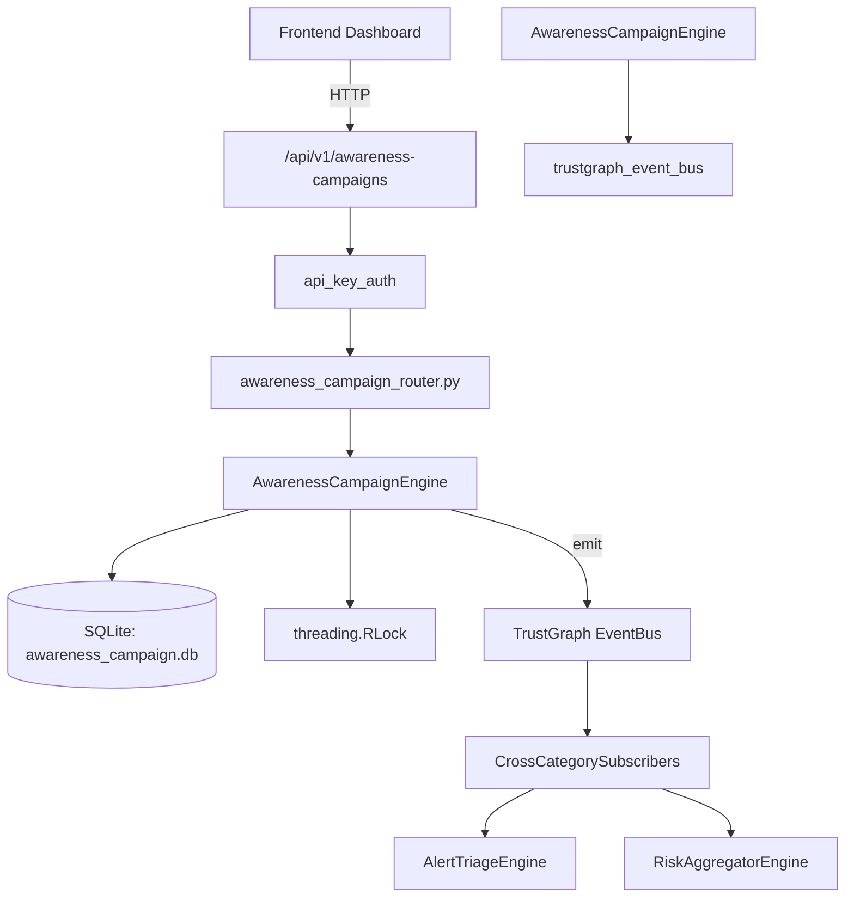

# US-0035: Awareness Campaign

## Sub-Epic: Advanced
**Master Goal**: ALDECI — $35/mo enterprise security intelligence platform replacing $50K-500K/yr tools

## User Story
As a **Emily Chang (Developer Security Champion)**, I need to track security training effectiveness
so that the platform delivers enterprise-grade advanced capabilities at 1/1000th the cost of legacy tools.

## Why This Matters
Awareness Campaign replaces functionality found in enterprise tools like CrowdStrike, Wiz, Snyk, and Rapid7.
By building this into ALDECI's $35/mo stack, customers save $50K+/yr on standalone Advanced tooling.

## Architecture

## Current State: 95% Complete
- ✅ `create_campaign()` — Create a new awareness campaign. (line 127)
- ✅ `list_campaigns()` — List campaigns with optional filters, newest first. (line 194)
- ✅ `get_campaign()` — Retrieve a single campaign by ID (org-scoped). (line 217)
- ✅ `update_campaign_status()` — Update campaign status. Validates new_status. (line 226)
- ✅ `record_participation()` — Record a user participation result. (line 253)
- ✅ `list_participations()` — List participations with optional filters. (line 329)
- ❌ TrustGraph event emission — not yet verified

## Key Functions (from `suite-core/core/awareness_campaign_engine.py` — 428 lines)
- `AwarenessCampaignEngine.create_campaign()` — Create a new awareness campaign. (line 127)
- `AwarenessCampaignEngine.list_campaigns()` — List campaigns with optional filters, newest first. (line 194)
- `AwarenessCampaignEngine.get_campaign()` — Retrieve a single campaign by ID (org-scoped). (line 217)
- `AwarenessCampaignEngine.update_campaign_status()` — Update campaign status. Validates new_status. (line 226)
- `AwarenessCampaignEngine.record_participation()` — Record a user participation result. (line 253)
- `AwarenessCampaignEngine.list_participations()` — List participations with optional filters. (line 329)
- `AwarenessCampaignEngine.get_campaign_stats()` — Return aggregate campaign statistics for the org. (line 360)

## Dependencies
- **Depends on**: trustgraph_event_bus
- **Depended by**: Routers, TrustGraph EventBus, CrossCategorySubscribers
- **TrustGraph**: Event emission wired via ResponseInterceptorMiddleware
- **Source file**: `suite-core/core/awareness_campaign_engine.py` (428 lines)
- **Router file**: `suite-api/apps/api/awareness_campaign_router.py`

## API Endpoints
| Method | Path | Description |
|--------|------|-------------|
| POST | `/api/v1/awareness-campaigns/campaigns` | create campaign |
| GET | `/api/v1/awareness-campaigns/campaigns` | list campaigns |
| GET | `/api/v1/awareness-campaigns/campaigns/{campaign_id}` | get campaign |
| PATCH | `/api/v1/awareness-campaigns/campaigns/{campaign_id}/status` | update campaign status |
| POST | `/api/v1/awareness-campaigns/campaigns/{campaign_id}/participations` | record participation |
| GET | `/api/v1/awareness-campaigns/participations` | list participations |
| GET | `/api/v1/awareness-campaigns/stats` | get campaign stats |

## Tasks Remaining
1. Verify TrustGraph event emission works end-to-end (2h)
2. Add integration test with real persona workflow (2h)
3. Wire CrossCategorySubscriber consumer chain (1h)
4. Validate with 30-persona walkthrough (1h)
5. Optimize query performance for large datasets (2h)
6. Expand test coverage to edge cases (2h)

## Definition of Done
- [ ] Emily Chang (Developer Security Champion) can access /api/v1/awareness-campaigns and get meaningful data
- [ ] All CRUD operations return correct HTTP status codes
- [ ] TrustGraph receives events from this engine
- [ ] 37+ tests passing in `tests/test_awareness_campaign_engine.py`
- [ ] 30-persona walkthrough includes this endpoint at 100%
- [ ] No hardcoded org_id — all queries are org-scoped

## Sprint: Wave 43 (est. April 19-21, 2026)

## Test Coverage
- **Test file**: `tests/test_awareness_campaign_engine.py`
- **Tests**: 37 tests
- **Status**: Passing
