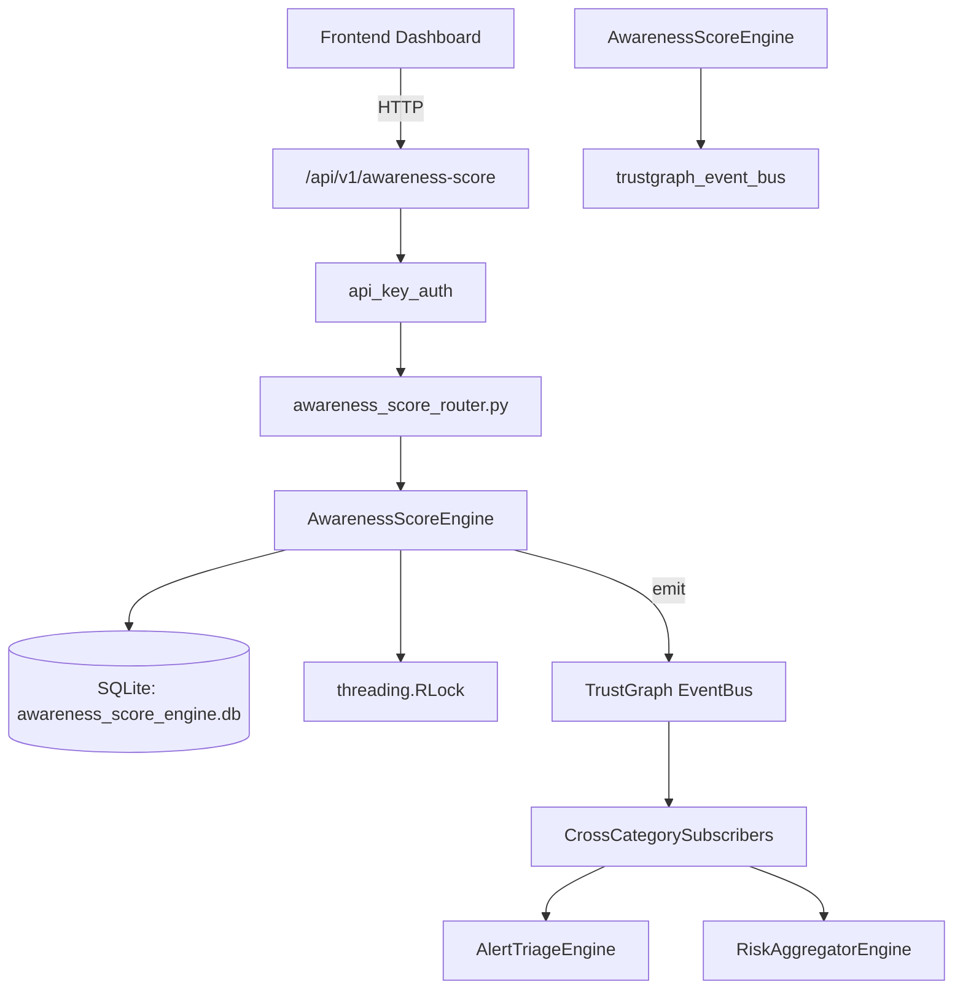

# US-0036: Awareness Score

## Sub-Epic: Advanced
**Master Goal**: ALDECI — $35/mo enterprise security intelligence platform replacing $50K-500K/yr tools

## User Story
As a **Emily Chang (Developer Security Champion)**, I need to track security training effectiveness
so that the platform delivers enterprise-grade advanced capabilities at 1/1000th the cost of legacy tools.

## Why This Matters
Awareness Score replaces functionality found in enterprise tools like CrowdStrike, Wiz, Snyk, and Rapid7.
By building this into ALDECI's $35/mo stack, customers save $50K+/yr on standalone Advanced tooling.

## Architecture

## Current State: 95% Complete
- ✅ `register_employee()` — Register or upsert an employee profile. (line 146)
- ✅ `list_employees()` — List employee profiles for an org. (line 192)
- ✅ `record_training()` — Record a training completion for an employee. (line 217)
- ✅ `record_phishing_test()` — Record a phishing simulation result. (line 269)
- ✅ `calculate_score()` — Compute composite awareness score for an employee. (line 316)
- ✅ `list_scores()` — List the latest score per employee for an org. (line 409)
- ❌ TrustGraph event emission — not yet verified

## Key Functions (from `suite-core/core/awareness_score_engine.py` — 565 lines)
- `AwarenessScoreEngine.register_employee()` — Register or upsert an employee profile. (line 146)
- `AwarenessScoreEngine.list_employees()` — List employee profiles for an org. (line 192)
- `AwarenessScoreEngine.record_training()` — Record a training completion for an employee. (line 217)
- `AwarenessScoreEngine.record_phishing_test()` — Record a phishing simulation result. (line 269)
- `AwarenessScoreEngine.calculate_score()` — Compute composite awareness score for an employee. (line 316)
- `AwarenessScoreEngine.list_scores()` — List the latest score per employee for an org. (line 409)
- `AwarenessScoreEngine.get_department_summary()` — Return awareness stats grouped by department. (line 440)
- `AwarenessScoreEngine.get_awareness_stats()` — Return high-level awareness stats for an org. (line 491)

## Dependencies
- **Depends on**: trustgraph_event_bus
- **Depended by**: Routers, TrustGraph EventBus, CrossCategorySubscribers
- **TrustGraph**: Event emission wired via ResponseInterceptorMiddleware
- **Source file**: `suite-core/core/awareness_score_engine.py` (565 lines)
- **Router file**: `suite-api/apps/api/awareness_score_router.py`

## API Endpoints
| Method | Path | Description |
|--------|------|-------------|
| POST | `/api/v1/awareness-score/orgs/{org_id}/employees` | register employee |
| GET | `/api/v1/awareness-score/orgs/{org_id}/employees` | list employees |
| POST | `/api/v1/awareness-score/orgs/{org_id}/employees/{employee_id}/training` | record training |
| POST | `/api/v1/awareness-score/orgs/{org_id}/employees/{employee_id}/phishing` | record phishing test |
| POST | `/api/v1/awareness-score/orgs/{org_id}/employees/{employee_id}/calculate-score` | calculate score |
| GET | `/api/v1/awareness-score/orgs/{org_id}/scores` | list scores |
| GET | `/api/v1/awareness-score/orgs/{org_id}/department-summary` | get department summary |
| GET | `/api/v1/awareness-score/orgs/{org_id}/stats` | get awareness stats |

## Tasks Remaining
1. Verify TrustGraph event emission works end-to-end (2h)
2. Add integration test with real persona workflow (2h)
3. Wire CrossCategorySubscriber consumer chain (1h)
4. Validate with 30-persona walkthrough (1h)
5. Optimize query performance for large datasets (2h)
6. Expand test coverage to edge cases (2h)

## Definition of Done
- [ ] Emily Chang (Developer Security Champion) can access /api/v1/awareness-score and get meaningful data
- [ ] All CRUD operations return correct HTTP status codes
- [ ] TrustGraph receives events from this engine
- [ ] 29+ tests passing in `tests/test_awareness_score_engine.py`
- [ ] 30-persona walkthrough includes this endpoint at 100%
- [ ] No hardcoded org_id — all queries are org-scoped

## Sprint: Wave 43 (est. April 19-21, 2026)

## Test Coverage
- **Test file**: `tests/test_awareness_score_engine.py`
- **Tests**: 29 tests
- **Status**: Passing
