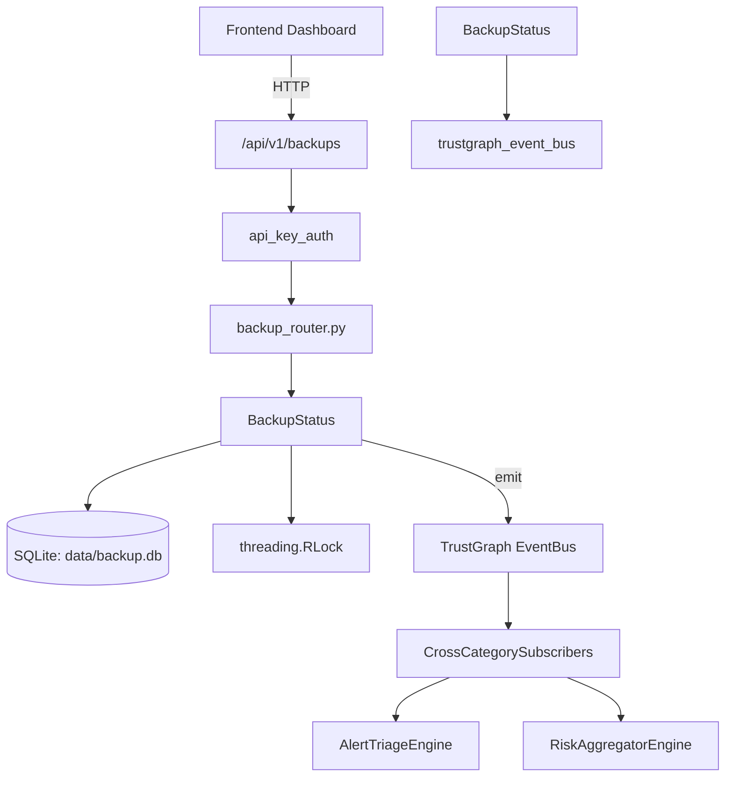

# US-0037: Backup

## Sub-Epic: Advanced
**Master Goal**: ALDECI — $35/mo enterprise security intelligence platform replacing $50K-500K/yr tools

## User Story
As a **Ryan Murphy (Platform Engineer)**, I need to ensure data backup integrity and recovery
so that the platform delivers enterprise-grade advanced capabilities at 1/1000th the cost of legacy tools.

## Why This Matters
Backup replaces functionality found in enterprise tools like CrowdStrike, Wiz, Snyk, and Rapid7.
By building this into ALDECI's $35/mo stack, customers save $50K+/yr on standalone Advanced tooling.

## Architecture

## Current State: 95% Complete
- ✅ `create_backup()` — Snapshot databases to a zip archive and return a BackupRecord. (line 180)
- ✅ `restore_backup()` — Restore databases from a backup archive. (line 264)
- ✅ `verify_backup()` — Verify backup file integrity via SHA-256 checksum. (line 333)
- ✅ `list_backups()` — implemented (line 347)
- ✅ `get_backup()` — implemented (line 368)
- ✅ `delete_backup()` — Remove backup file and database record. (line 384)
- ❌ TrustGraph event emission — not yet verified

## Key Functions (from `suite-core/core/backup_engine.py` — 633 lines)
- `BackupEngine.create_backup()` — Snapshot databases to a zip archive and return a BackupRecord. (line 180)
- `BackupEngine.restore_backup()` — Restore databases from a backup archive. (line 264)
- `BackupEngine.verify_backup()` — Verify backup file integrity via SHA-256 checksum. (line 333)
- `BackupEngine.list_backups()` — Handle list backups (line 347)
- `BackupEngine.get_backup()` — Handle get backup (line 368)
- `BackupEngine.delete_backup()` — Remove backup file and database record. (line 384)
- `BackupEngine.schedule_backup()` — Create a backup schedule entry. (line 405)
- `BackupEngine.get_schedules()` — Handle get schedules (line 445)

## Dependencies
- **Depends on**: trustgraph_event_bus
- **Depended by**: Routers, TrustGraph EventBus, CrossCategorySubscribers
- **TrustGraph**: Event emission wired via ResponseInterceptorMiddleware
- **Source file**: `suite-core/core/backup_engine.py` (633 lines)
- **Router file**: `suite-api/apps/api/backup_router.py`

## API Endpoints
| Method | Path | Description |
|--------|------|-------------|
| POST | `/api/v1/backups` | create backup |
| GET | `/api/v1/backups` | list backups |
| GET | `/api/v1/backups/schedules` | list schedules |
| GET | `/api/v1/backups/stats` | backup stats |
| GET | `/api/v1/backups/{backup_id}` | get backup |
| DELETE | `/api/v1/backups/{backup_id}` | delete backup |
| POST | `/api/v1/backups/{backup_id}/verify` | verify backup |
| POST | `/api/v1/backups/{backup_id}/restore` | restore backup |
| POST | `/api/v1/backups/schedule` | schedule backup |
| POST | `/api/v1/backups/cleanup` | cleanup expired |

## Tasks Remaining
1. Verify TrustGraph event emission works end-to-end (2h)
2. Add integration test with real persona workflow (2h)
3. Wire CrossCategorySubscriber consumer chain (1h)
4. Validate with 30-persona walkthrough (1h)
5. Optimize query performance for large datasets (2h)
6. Expand test coverage to edge cases (2h)

## Definition of Done
- [ ] Ryan Murphy (Platform Engineer) can access /api/v1/backups and get meaningful data
- [ ] All CRUD operations return correct HTTP status codes
- [ ] TrustGraph receives events from this engine
- [ ] 48+ tests passing in `tests/test_backup_engine.py`
- [ ] 30-persona walkthrough includes this endpoint at 100%
- [ ] No hardcoded org_id — all queries are org-scoped

## Sprint: Wave 43 (est. April 19-21, 2026)

## Test Coverage
- **Test file**: `tests/test_backup_engine.py`
- **Tests**: 48 tests
- **Status**: Passing
