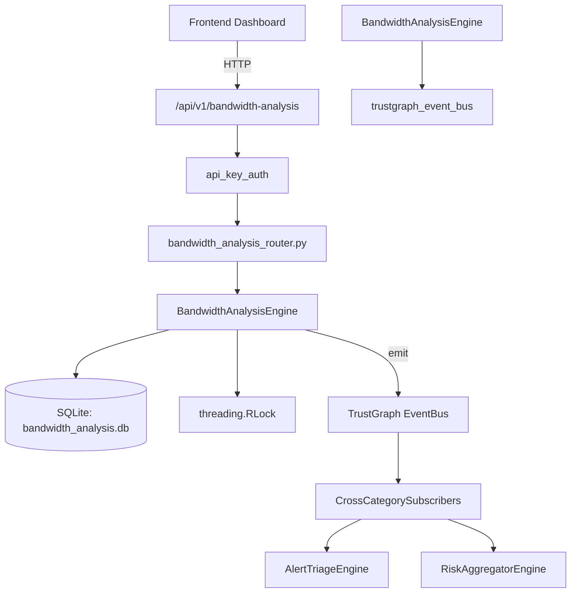

# US-0038: Bandwidth Analysis

## Sub-Epic: Network
**Master Goal**: ALDECI — $35/mo enterprise security intelligence platform replacing $50K-500K/yr tools

## User Story
As a **Ryan Murphy (Platform Engineer)**, I need to monitor network bandwidth and QoS
so that the platform delivers enterprise-grade network capabilities at 1/1000th the cost of legacy tools.

## Why This Matters
Bandwidth Analysis replaces functionality found in enterprise tools like CrowdStrike, Wiz, Snyk, and Rapid7.
By building this into ALDECI's $35/mo stack, customers save $50K+/yr on standalone Network tooling.

## Architecture

## Current State: 95% Complete
- ✅ `register_link()` — Register a new network link for bandwidth analysis. (line 108)
- ✅ `list_links()` — List all links registered for an org. (line 148)
- ✅ `record_utilization()` — Record a utilization sample for a link. (line 161)
- ✅ `get_utilization_trend()` — Return avg_pct, peak_pct, and sample list over the last N hours. (line 190)
- ✅ `detect_anomaly()` — Detect utilization anomaly using z-score against recent 24h baseline. (line 233)
- ✅ `create_qos_policy()` — Create a QoS policy for traffic shaping. (line 320)
- ❌ TrustGraph event emission — not yet verified

## Key Functions (from `suite-core/core/bandwidth_analysis_engine.py` — 408 lines)
- `BandwidthAnalysisEngine.register_link()` — Register a new network link for bandwidth analysis. (line 108)
- `BandwidthAnalysisEngine.list_links()` — List all links registered for an org. (line 148)
- `BandwidthAnalysisEngine.record_utilization()` — Record a utilization sample for a link. (line 161)
- `BandwidthAnalysisEngine.get_utilization_trend()` — Return avg_pct, peak_pct, and sample list over the last N hours. (line 190)
- `BandwidthAnalysisEngine.detect_anomaly()` — Detect utilization anomaly using z-score against recent 24h baseline. (line 233)
- `BandwidthAnalysisEngine.create_qos_policy()` — Create a QoS policy for traffic shaping. (line 320)
- `BandwidthAnalysisEngine.list_qos_policies()` — List QoS policies for an org ordered by priority. (line 356)
- `BandwidthAnalysisEngine.get_bandwidth_stats()` — Return aggregate bandwidth stats for an org. (line 369)

## Dependencies
- **Depends on**: trustgraph_event_bus
- **Depended by**: Routers, TrustGraph EventBus, CrossCategorySubscribers
- **TrustGraph**: Event emission wired via ResponseInterceptorMiddleware
- **Source file**: `suite-core/core/bandwidth_analysis_engine.py` (408 lines)
- **Router file**: `suite-api/apps/api/bandwidth_analysis_router.py`

## API Endpoints
| Method | Path | Description |
|--------|------|-------------|
| POST | `/api/v1/bandwidth-analysis/links` | register link |
| GET | `/api/v1/bandwidth-analysis/links` | list links |
| POST | `/api/v1/bandwidth-analysis/links/{link_id}/utilization` | record utilization |
| GET | `/api/v1/bandwidth-analysis/links/{link_id}/trend` | get utilization trend |
| GET | `/api/v1/bandwidth-analysis/links/{link_id}/anomaly` | detect anomaly |
| POST | `/api/v1/bandwidth-analysis/qos-policies` | create qos policy |
| GET | `/api/v1/bandwidth-analysis/qos-policies` | list qos policies |
| GET | `/api/v1/bandwidth-analysis/stats` | get bandwidth stats |

## Tasks Remaining
1. Verify TrustGraph event emission works end-to-end (2h)
2. Add integration test with real persona workflow (2h)
3. Wire CrossCategorySubscriber consumer chain (1h)
4. Validate with 30-persona walkthrough (1h)
5. Optimize query performance for large datasets (2h)
6. Expand test coverage to edge cases (2h)

## Definition of Done
- [ ] Ryan Murphy (Platform Engineer) can access /api/v1/bandwidth-analysis and get meaningful data
- [ ] All CRUD operations return correct HTTP status codes
- [ ] TrustGraph receives events from this engine
- [ ] 33+ tests passing in `tests/test_bandwidth_analysis_engine.py`
- [ ] 30-persona walkthrough includes this endpoint at 100%
- [ ] No hardcoded org_id — all queries are org-scoped

## Sprint: Wave 43 (est. April 19-21, 2026)

## Test Coverage
- **Test file**: `tests/test_bandwidth_analysis_engine.py`
- **Tests**: 33 tests
- **Status**: Passing
