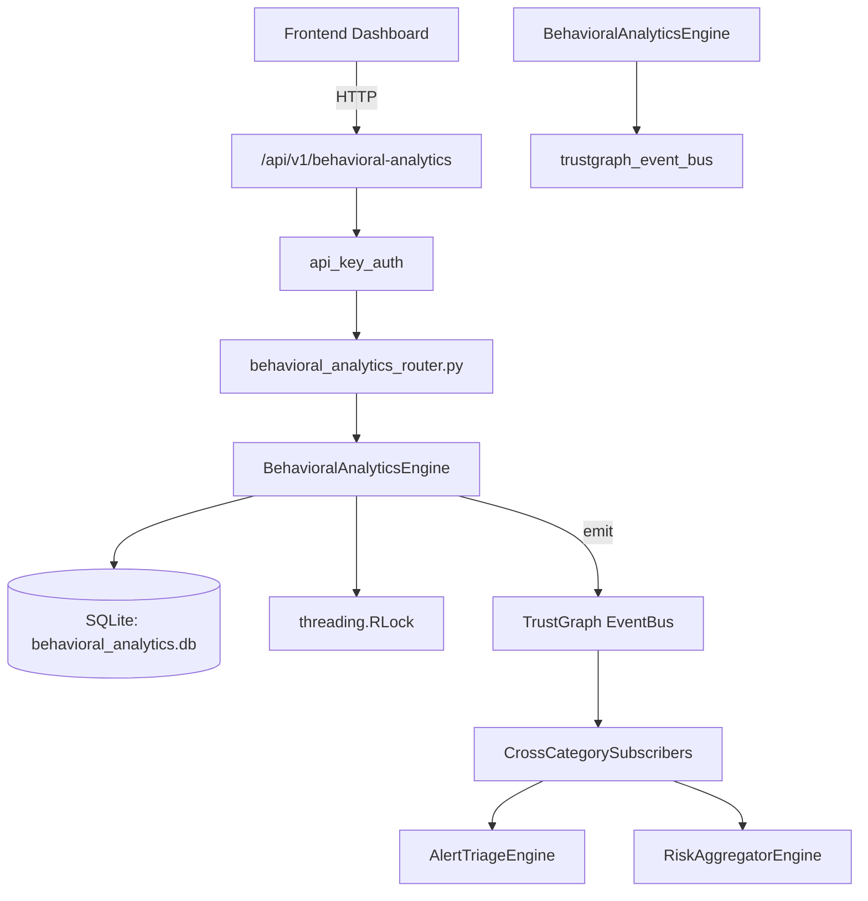

# US-0039: Behavioral Analytics

## Sub-Epic: AI Intelligence
**Master Goal**: ALDECI — $35/mo enterprise security intelligence platform replacing $50K-500K/yr tools

## User Story
As a **Priya Sharma (SOC T2 Analyst)**, I need to detect anomalous user behavior patterns
so that the platform delivers enterprise-grade ai intelligence capabilities at 1/1000th the cost of legacy tools.

## Why This Matters
Behavioral Analytics replaces functionality found in enterprise tools like CrowdStrike, Wiz, Snyk, and Rapid7.
By building this into ALDECI's $35/mo stack, customers save $50K+/yr on standalone AI Intelligence tooling.

## Architecture

## Current State: 95% Complete
- ✅ `establish_baseline()` — Create or update a user behavioral baseline. (line 128)
- ✅ `list_baselines()` — List baselines with optional filters. (line 190)
- ✅ `detect_anomaly()` — Record a detected behavioral anomaly. (line 216)
- ✅ `list_anomalies()` — List anomalies with optional filters, ordered newest first. (line 277)
- ✅ `update_anomaly_status()` — Update the status of an anomaly. (line 307)
- ✅ `get_user_risk_profile()` — Return a risk profile for a specific user. (line 349)
- ❌ TrustGraph event emission — not yet verified

## Key Functions (from `suite-core/core/behavioral_analytics_engine.py` — 456 lines)
- `BehavioralAnalyticsEngine.establish_baseline()` — Create or update a user behavioral baseline. (line 128)
- `BehavioralAnalyticsEngine.list_baselines()` — List baselines with optional filters. (line 190)
- `BehavioralAnalyticsEngine.detect_anomaly()` — Record a detected behavioral anomaly. (line 216)
- `BehavioralAnalyticsEngine.list_anomalies()` — List anomalies with optional filters, ordered newest first. (line 277)
- `BehavioralAnalyticsEngine.update_anomaly_status()` — Update the status of an anomaly. (line 307)
- `BehavioralAnalyticsEngine.get_user_risk_profile()` — Return a risk profile for a specific user. (line 349)
- `BehavioralAnalyticsEngine.get_behavioral_stats()` — Return org-level behavioral analytics statistics. (line 408)

## Dependencies
- **Depends on**: trustgraph_event_bus
- **Depended by**: Routers, TrustGraph EventBus, CrossCategorySubscribers
- **TrustGraph**: Event emission wired via ResponseInterceptorMiddleware
- **Source file**: `suite-core/core/behavioral_analytics_engine.py` (456 lines)
- **Router file**: `suite-api/apps/api/behavioral_analytics_router.py`

## API Endpoints
| Method | Path | Description |
|--------|------|-------------|
| POST | `/api/v1/behavioral-analytics/baselines` | establish baseline |
| GET | `/api/v1/behavioral-analytics/baselines` | list baselines |
| POST | `/api/v1/behavioral-analytics/anomalies` | detect anomaly |
| GET | `/api/v1/behavioral-analytics/anomalies` | list anomalies |
| PATCH | `/api/v1/behavioral-analytics/anomalies/{anomaly_id}/status` | update anomaly status |
| GET | `/api/v1/behavioral-analytics/users/{user_id}/profile` | get user risk profile |
| GET | `/api/v1/behavioral-analytics/stats` | get behavioral stats |

## Tasks Remaining
1. Verify TrustGraph event emission works end-to-end (2h)
2. Add integration test with real persona workflow (2h)
3. Wire CrossCategorySubscriber consumer chain (1h)
4. Validate with 30-persona walkthrough (1h)
5. Optimize query performance for large datasets (2h)
6. Expand test coverage to edge cases (2h)

## Definition of Done
- [ ] Priya Sharma (SOC T2 Analyst) can access /api/v1/behavioral-analytics and get meaningful data
- [ ] All CRUD operations return correct HTTP status codes
- [ ] TrustGraph receives events from this engine
- [ ] 33+ tests passing in `tests/test_behavioral_analytics_engine.py`
- [ ] 30-persona walkthrough includes this endpoint at 100%
- [ ] No hardcoded org_id — all queries are org-scoped

## Sprint: Wave 43 (est. April 19-21, 2026)

## Test Coverage
- **Test file**: `tests/test_behavioral_analytics_engine.py`
- **Tests**: 33 tests
- **Status**: Passing
