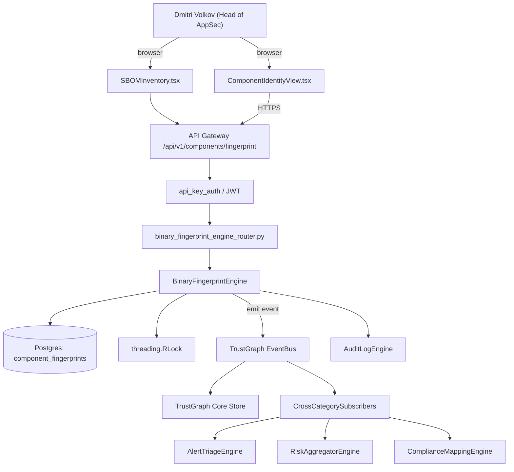

# US-0008: Ship Advanced Binary Fingerprint (ABF) to identify renamed/shaded/repackaged components

## Sub-Epic: SCA/Supply-chain
**Master Goal**: ALDECI — tiered $199-$1,499/mo enterprise security intelligence platform replacing $50K-$500K/yr tools

## User Story
As a **Dmitri Volkov (Head of AppSec)**, I need to ship Advanced Binary Fingerprint (ABF) to identify renamed/shaded/repackaged components so that Fixops delivers Sonatype-class supply-chain coverage while keeping the ALDECI price point.

## Why This Matters
Per competitor-sonatype.md §6, Sonatype's ABF is a cryptographic + structural hash (class-tree / bytecode signature) that matches components even when their coordinates have been changed. Without this, Fixops cannot identify relocated/shaded libraries in fat JARs, shaded Maven deps, or renamed npm packages. Build an ABF engine and match API.

This work is called out as a P1 gap in `competitor-sonatype.md`. Shipping it is load-bearing for ALDECI's tiered $199-$1,499/mo positioning against $50K-$500K/yr incumbents: every delayed gap becomes a displacement deal we lose.

## Architecture

## Current State: 0% — MISSING (new engine)
- [ ] Engine module `suite-core/core/binary_fingerprint_engine.py` does not exist yet
- [ ] Router `suite-api/apps/api/binary_fingerprint_engine_router.py` does not exist yet
- [ ] DB tables listed under Data Model do not exist yet
- [ ] Frontend screens listed under Key Functions do not exist yet
- [ ] No TrustGraph events emitted yet

## Key Functions
**Backend (engine methods):**
- `create_fingerprint()` — backs `POST /api/v1/components/fingerprint`
- `get_match_by_abf()` — backs `GET /api/v1/components/match-by-abf?abf={hash}`

**Frontend screens:**
- `ComponentIdentityView.tsx` — operator-facing UI surface for this gap
- `SBOMInventory.tsx` — operator-facing UI surface for this gap

## API Endpoints
| Method | Path | Auth | Purpose |
|--------|------|------|---------|
| POST | `/api/v1/components/fingerprint` | api_key_auth | components fingerprint |
| GET | `/api/v1/components/match-by-abf?abf={hash}` | api_key_auth | components match by abf?abf={hash} |

## Data Model
- add component_fingerprints table: abf_hash (primary), canonical_purl, confidence, class_tree_signature, updated_at

## Dependencies
**Depends on**: none explicit
**Depended by**: Router layer, TrustGraph EventBus, CrossCategorySubscribers, CrossCategoryEvidenceBuilder, AuditLogEngine
**New engine module**: `suite-core/core/binary_fingerprint_engine.py`
**New router module**: `suite-api/apps/api/binary_fingerprint_engine_router.py`
**Master gap id**: `GAP-008` (priority P1, effort L)

## Tasks Remaining
1. Schema migration: add component_fingerprints table (4h)
2. Implement endpoint POST /api/v1/components/fingerprint (6h)
3. Implement endpoint GET /api/v1/components/match-by-abf?abf={hash} (6h)
4. Wire frontend screen ComponentIdentityView.tsx (5h)
5. Wire frontend screen SBOMInventory.tsx (5h)
6. Write 4 pytest cases: test_abf_matches_shaded_jar, test_abf_matches_renamed_npm… (6h)
7. Wire TrustGraph event emission + CrossCategorySubscriber consumers (4h)
8. Persona walkthrough + integration test (3h)
9. Docs + API reference update (2h)

## Definition of Done
- [ ] Given a Maven shaded JAR that relocates log4j under `com.example.shadow.log4j`, When the scanner computes ABF, Then the match API returns log4j-core:2.17.1 with match_confidence >= 0.9.
- [ ] Given an npm package renamed from `foo@1.0.0` to `foo-renamed@1.0.0` with identical AST, When ABF is computed, Then both map to the same canonical component_id.
- [ ] Given ComponentIdentityView.tsx, When a finding has match_method=ABF, Then the UI shows the original claimed coordinate and the matched canonical component + signature strength.
- [ ] Given an unknown component (no ABF match), When POST /api/v1/components/fingerprint is called, Then the response includes a new candidate entry with status='awaiting_human_review'.
- [ ] Given two versions of the same library, When ABFs are compared, Then the structural similarity score correctly reflects class-tree diff.
- [ ] All endpoints are org-scoped (no hardcoded org_id) and gated by `api_key_auth`.
- [ ] TrustGraph emits at least one event type for this engine and a CrossCategorySubscriber consumes it.
- [ ] `Dmitri Volkov (Head of AppSec)` can execute the full workflow in the 30-persona walkthrough.

## Tests Required
- `test_abf_matches_shaded_jar`
- `test_abf_matches_renamed_npm`
- `test_abf_low_confidence_marked_for_review`
- `test_abf_structural_diff_score`

## Sprint: Wave 49 (est. Jun 03-Jun 09, 2026)

## Citation
Source research: `competitor-sonatype.md` (gap `GAP-008`, priority `P1`, effort `L`)
