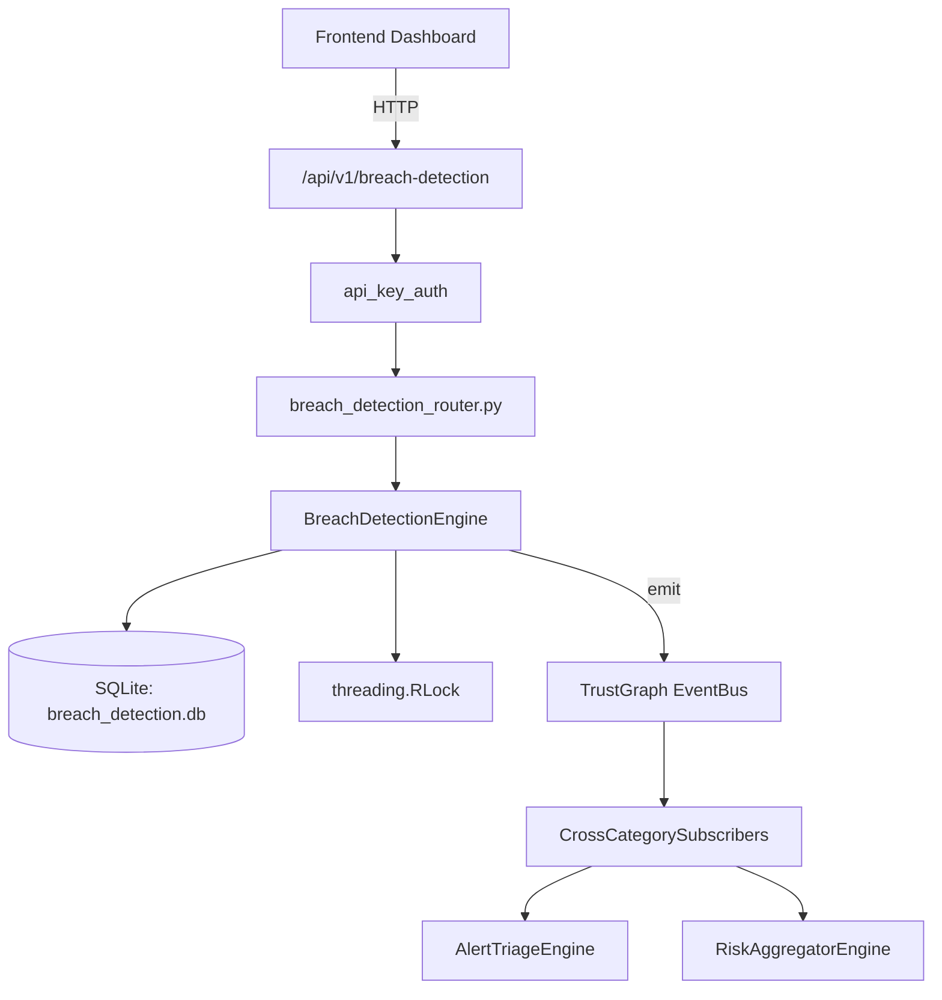

# US-0040: Breach Detection

## Sub-Epic: CTEM
**Master Goal**: ALDECI — $35/mo enterprise security intelligence platform replacing $50K-500K/yr tools

## User Story
As a **Karen Taylor (IR Lead)**, I need to detect and respond to security breaches rapidly
so that the platform delivers enterprise-grade ctem capabilities at 1/1000th the cost of legacy tools.

## Why This Matters
Breach Detection replaces functionality found in enterprise tools like CrowdStrike, Wiz, Snyk, and Rapid7.
By building this into ALDECI's $35/mo stack, customers save $50K+/yr on standalone CTEM tooling.

## Architecture

## Current State: 95% Complete
- ✅ `create_detection_rule()` — Create a detection rule. (line 114)
- ✅ `list_detection_rules()` — Return detection rules for the org, optionally filtered by rule_type and/or data (line 164)
- ✅ `record_detection_event()` — Record a detection event. (line 193)
- ✅ `list_detection_events()` — Return detection events for the org, ordered by detected_at DESC, limit 100. (line 263)
- ✅ `investigate_event()` — Mark an event as investigating. (line 297)
- ✅ `close_event()` — Close a detection event. (line 334)
- ❌ TrustGraph event emission — not yet verified

## Key Functions (from `suite-core/core/breach_detection_engine.py` — 482 lines)
- `BreachDetectionEngine.create_detection_rule()` — Create a detection rule. (line 114)
- `BreachDetectionEngine.list_detection_rules()` — Return detection rules for the org, optionally filtered by rule_type and/or data (line 164)
- `BreachDetectionEngine.record_detection_event()` — Record a detection event. (line 193)
- `BreachDetectionEngine.list_detection_events()` — Return detection events for the org, ordered by detected_at DESC, limit 100. (line 263)
- `BreachDetectionEngine.investigate_event()` — Mark an event as investigating. (line 297)
- `BreachDetectionEngine.close_event()` — Close a detection event. (line 334)
- `BreachDetectionEngine.get_detection_stats()` — Return aggregate detection statistics for the org. (line 379)

## Dependencies
- **Depends on**: standalone
- **Depended by**: Routers, TrustGraph EventBus, CrossCategorySubscribers
- **TrustGraph**: Event emission wired via ResponseInterceptorMiddleware
- **Source file**: `suite-core/core/breach_detection_engine.py` (482 lines)
- **Router file**: `suite-api/apps/api/breach_detection_router.py`

## API Endpoints
| Method | Path | Description |
|--------|------|-------------|
| POST | `/api/v1/breach-detection/rules` | create detection rule |
| GET | `/api/v1/breach-detection/rules` | list detection rules |
| POST | `/api/v1/breach-detection/events` | record detection event |
| GET | `/api/v1/breach-detection/events` | list detection events |
| POST | `/api/v1/breach-detection/events/{event_id}/investigate` | investigate event |
| POST | `/api/v1/breach-detection/events/{event_id}/close` | close event |
| GET | `/api/v1/breach-detection/stats` | get detection stats |

## Tasks Remaining
1. Verify TrustGraph event emission works end-to-end (2h)
2. Add integration test with real persona workflow (2h)
3. Wire CrossCategorySubscriber consumer chain (1h)
4. Validate with 30-persona walkthrough (1h)
5. Optimize query performance for large datasets (2h)
6. Expand test coverage to edge cases (2h)

## Definition of Done
- [ ] Karen Taylor (IR Lead) can access /api/v1/breach-detection and get meaningful data
- [ ] All CRUD operations return correct HTTP status codes
- [ ] TrustGraph receives events from this engine
- [ ] 50+ tests passing in `tests/test_breach_detection_engine.py`
- [ ] 30-persona walkthrough includes this endpoint at 100%
- [ ] No hardcoded org_id — all queries are org-scoped

## Sprint: Wave 43 (est. April 19-21, 2026)

## Test Coverage
- **Test file**: `tests/test_breach_detection_engine.py`
- **Tests**: 50 tests
- **Status**: Passing
