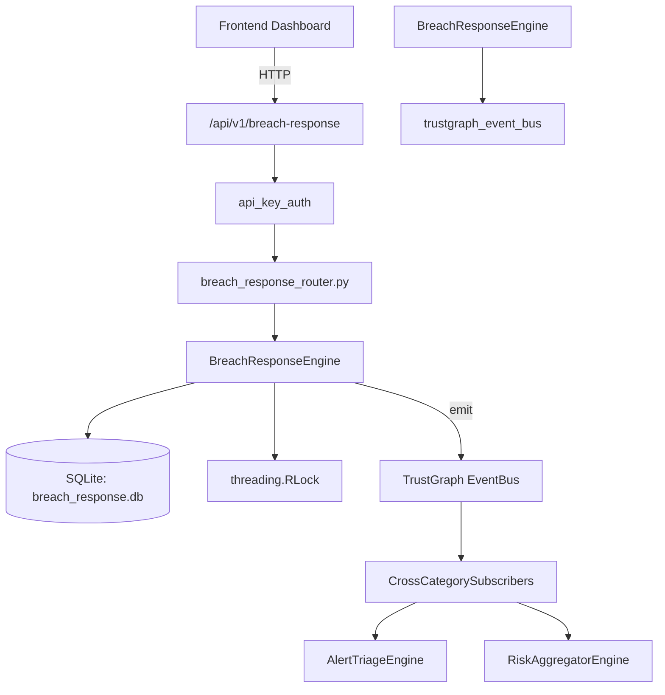

# US-0041: Breach Response

## Sub-Epic: CTEM
**Master Goal**: ALDECI — $35/mo enterprise security intelligence platform replacing $50K-500K/yr tools

## User Story
As a **Karen Taylor (IR Lead)**, I need to detect and respond to security breaches rapidly
so that the platform delivers enterprise-grade ctem capabilities at 1/1000th the cost of legacy tools.

## Why This Matters
Breach Response replaces functionality found in enterprise tools like CrowdStrike, Wiz, Snyk, and Rapid7.
By building this into ALDECI's $35/mo stack, customers save $50K+/yr on standalone CTEM tooling.

## Architecture

## Current State: 95% Complete
- ✅ `create_case()` — Create a new breach case. Returns the full case record. (line 142)
- ✅ `list_cases()` — List breach cases for an org, optionally filtered by status. (line 202)
- ✅ `get_case()` — Fetch a single breach case, enforcing org isolation. (line 218)
- ✅ `update_case()` — Update mutable breach case fields. Returns True if a row was updated. (line 228)
- ✅ `log_notification()` — Log a notification sent for a breach case. (line 274)
- ✅ `list_notifications()` — List notifications for a breach case. (line 314)
- ❌ TrustGraph event emission — not yet verified

## Key Functions (from `suite-core/core/breach_response_engine.py` — 452 lines)
- `BreachResponseEngine.create_case()` — Create a new breach case. Returns the full case record. (line 142)
- `BreachResponseEngine.list_cases()` — List breach cases for an org, optionally filtered by status. (line 202)
- `BreachResponseEngine.get_case()` — Fetch a single breach case, enforcing org isolation. (line 218)
- `BreachResponseEngine.update_case()` — Update mutable breach case fields. Returns True if a row was updated. (line 228)
- `BreachResponseEngine.log_notification()` — Log a notification sent for a breach case. (line 274)
- `BreachResponseEngine.list_notifications()` — List notifications for a breach case. (line 314)
- `BreachResponseEngine.add_regulatory_report()` — Create a regulatory report entry for a breach case. (line 332)
- `BreachResponseEngine.list_reports()` — List regulatory reports, optionally scoped to a specific case. (line 370)

## Dependencies
- **Depends on**: trustgraph_event_bus
- **Depended by**: Routers, TrustGraph EventBus, CrossCategorySubscribers
- **TrustGraph**: Event emission wired via ResponseInterceptorMiddleware
- **Source file**: `suite-core/core/breach_response_engine.py` (452 lines)
- **Router file**: `suite-api/apps/api/breach_response_router.py`

## API Endpoints
| Method | Path | Description |
|--------|------|-------------|
| GET | `/api/v1/breach-response/cases` | list cases |
| POST | `/api/v1/breach-response/cases` | create case |
| GET | `/api/v1/breach-response/cases/{case_id}` | get case |
| PATCH | `/api/v1/breach-response/cases/{case_id}` | update case |
| GET | `/api/v1/breach-response/cases/{case_id}/notifications` | list notifications |
| POST | `/api/v1/breach-response/cases/{case_id}/notifications` | log notification |
| GET | `/api/v1/breach-response/cases/{case_id}/reports` | list reports |
| POST | `/api/v1/breach-response/cases/{case_id}/reports` | add regulatory report |
| GET | `/api/v1/breach-response/stats` | get stats |

## Tasks Remaining
1. Verify TrustGraph event emission works end-to-end (2h)
2. Add integration test with real persona workflow (2h)
3. Wire CrossCategorySubscriber consumer chain (1h)
4. Validate with 30-persona walkthrough (1h)
5. Optimize query performance for large datasets (2h)
6. Expand test coverage to edge cases (2h)

## Definition of Done
- [ ] Karen Taylor (IR Lead) can access /api/v1/breach-response and get meaningful data
- [ ] All CRUD operations return correct HTTP status codes
- [ ] TrustGraph receives events from this engine
- [ ] 31+ tests passing in `tests/test_breach_response_engine.py`
- [ ] 30-persona walkthrough includes this endpoint at 100%
- [ ] No hardcoded org_id — all queries are org-scoped

## Sprint: Wave 43 (est. April 19-21, 2026)

## Test Coverage
- **Test file**: `tests/test_breach_response_engine.py`
- **Tests**: 31 tests
- **Status**: Passing
