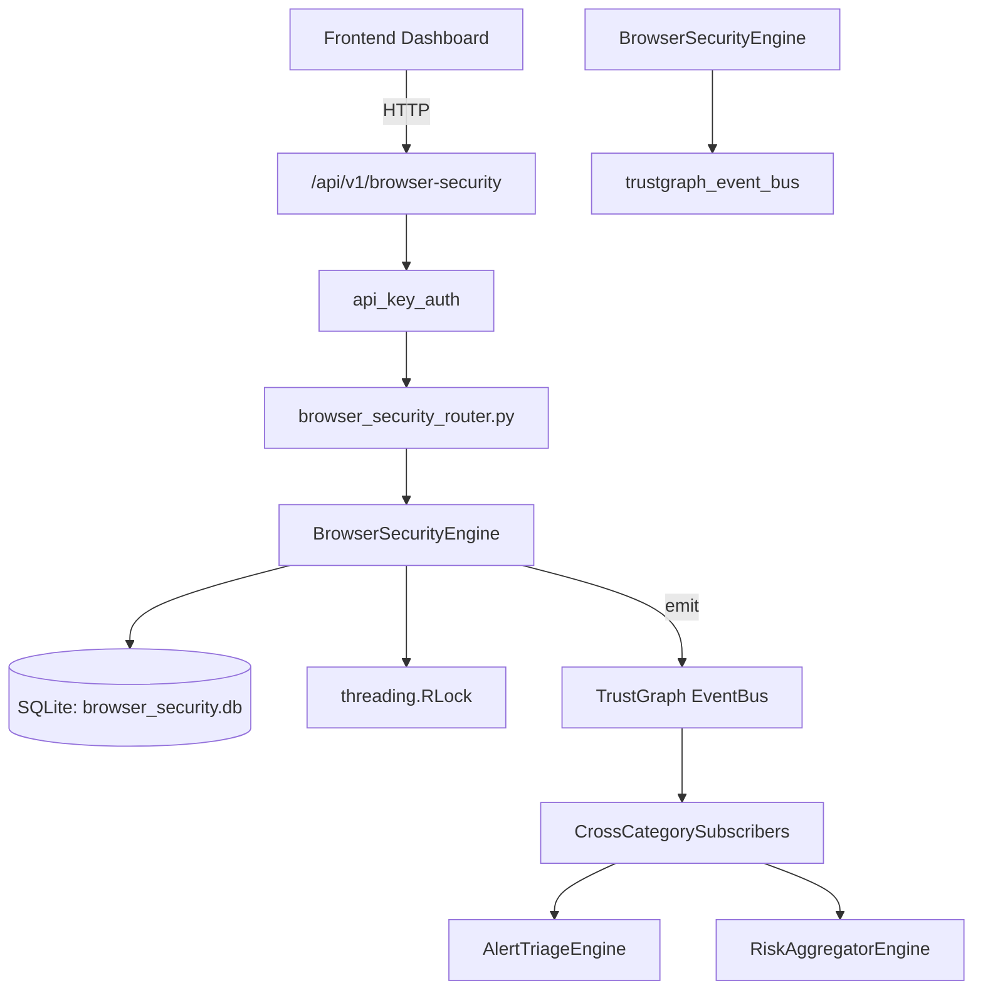

# US-0042: Browser Security

## Sub-Epic: Advanced
**Master Goal**: ALDECI — $35/mo enterprise security intelligence platform replacing $50K-500K/yr tools

## User Story
As a **Tom Anderson (AppSec Lead)**, I need to enforce browser security policies
so that the platform delivers enterprise-grade advanced capabilities at 1/1000th the cost of legacy tools.

## Why This Matters
Browser Security replaces functionality found in enterprise tools like CrowdStrike, Wiz, Snyk, and Rapid7.
By building this into ALDECI's $35/mo stack, customers save $50K+/yr on standalone Advanced tooling.

## Architecture

## Current State: 95% Complete
- ✅ `create_policy()` — Create a browser security policy. (line 160)
- ✅ `list_policies()` — List browser policies for the org with optional filters. (line 215)
- ✅ `get_policy()` — Return a single policy or None (with org isolation). (line 235)
- ✅ `record_event()` — Record a browser security event. (line 248)
- ✅ `list_events()` — List browser events for the org with optional filters. (line 292)
- ✅ `register_extension()` — Register a browser extension for review. (line 320)
- ❌ TrustGraph event emission — not yet verified

## Key Functions (from `suite-core/core/browser_security_engine.py` — 459 lines)
- `BrowserSecurityEngine.create_policy()` — Create a browser security policy. (line 160)
- `BrowserSecurityEngine.list_policies()` — List browser policies for the org with optional filters. (line 215)
- `BrowserSecurityEngine.get_policy()` — Return a single policy or None (with org isolation). (line 235)
- `BrowserSecurityEngine.record_event()` — Record a browser security event. (line 248)
- `BrowserSecurityEngine.list_events()` — List browser events for the org with optional filters. (line 292)
- `BrowserSecurityEngine.register_extension()` — Register a browser extension for review. (line 320)
- `BrowserSecurityEngine.list_extensions()` — List extensions for the org with optional filters. (line 364)
- `BrowserSecurityEngine.update_extension_status()` — Update extension status. Returns updated record or None if not found. (line 384)

## Dependencies
- **Depends on**: trustgraph_event_bus
- **Depended by**: Routers, TrustGraph EventBus, CrossCategorySubscribers
- **TrustGraph**: Event emission wired via ResponseInterceptorMiddleware
- **Source file**: `suite-core/core/browser_security_engine.py` (459 lines)
- **Router file**: `suite-api/apps/api/browser_security_router.py`

## API Endpoints
| Method | Path | Description |
|--------|------|-------------|
| POST | `/api/v1/browser-security/policies` | create policy |
| GET | `/api/v1/browser-security/policies` | list policies |
| GET | `/api/v1/browser-security/policies/{policy_id}` | get policy |
| POST | `/api/v1/browser-security/events` | record event |
| GET | `/api/v1/browser-security/events` | list events |
| POST | `/api/v1/browser-security/extensions` | register extension |
| GET | `/api/v1/browser-security/extensions` | list extensions |
| PUT | `/api/v1/browser-security/extensions/{ext_id}/status` | update extension status |
| GET | `/api/v1/browser-security/stats` | get browser stats |

## Tasks Remaining
1. Verify TrustGraph event emission works end-to-end (2h)
2. Add integration test with real persona workflow (2h)
3. Wire CrossCategorySubscriber consumer chain (1h)
4. Validate with 30-persona walkthrough (1h)
5. Optimize query performance for large datasets (2h)
6. Expand test coverage to edge cases (2h)

## Definition of Done
- [ ] Tom Anderson (AppSec Lead) can access /api/v1/browser-security and get meaningful data
- [ ] All CRUD operations return correct HTTP status codes
- [ ] TrustGraph receives events from this engine
- [ ] 36+ tests passing in `tests/test_browser_security_engine.py`
- [ ] 30-persona walkthrough includes this endpoint at 100%
- [ ] No hardcoded org_id — all queries are org-scoped

## Sprint: Wave 43 (est. April 19-21, 2026)

## Test Coverage
- **Test file**: `tests/test_browser_security_engine.py`
- **Tests**: 36 tests
- **Status**: Passing
