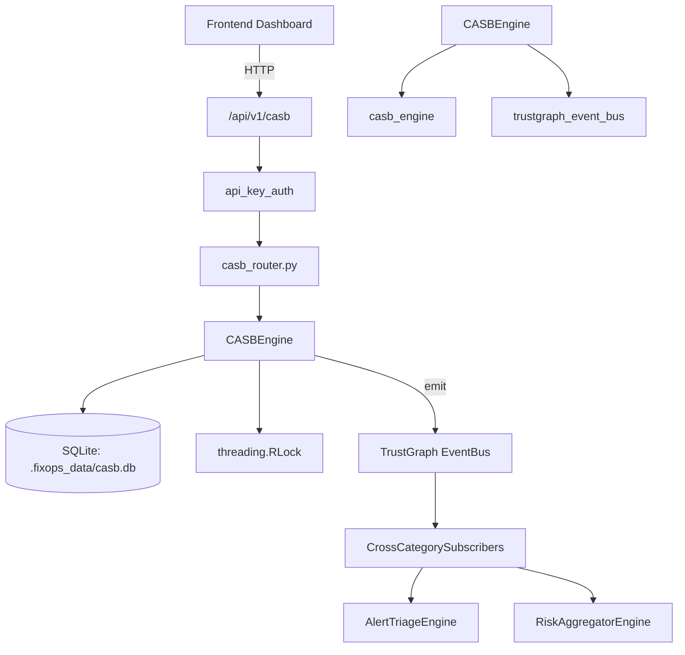

# US-0044: Casb

## Sub-Epic: CSPM
**Master Goal**: ALDECI — $35/mo enterprise security intelligence platform replacing $50K-500K/yr tools

## User Story
As a **Jennifer Wu (Cloud Security Architect)**, I need to control shadow IT and SaaS access
so that the platform delivers enterprise-grade cspm capabilities at 1/1000th the cost of legacy tools.

## Why This Matters
Casb replaces functionality found in enterprise tools like CrowdStrike, Wiz, Snyk, and Rapid7.
By building this into ALDECI's $35/mo stack, customers save $50K+/yr on standalone CSPM tooling.

## Architecture

## Current State: 95% Complete
- ✅ `discover_app()` — Register or update a discovered cloud app. (line 173)
- ✅ `list_apps()` — List cloud apps for org with optional filters. (line 235)
- ✅ `sanction_app()` — Mark an app as sanctioned (approved for use). (line 262)
- ✅ `unsanction_app()` — Mark an app as unsanctioned (shadow IT / blocked). (line 285)
- ✅ `record_data_activity()` — Record a data activity event (upload/download/share/delete). (line 312)
- ✅ `list_data_activities()` — List data activities with optional filters. (line 369)
- ❌ TrustGraph event emission — not yet verified

## Key Functions (from `suite-core/core/casb_engine.py` — 628 lines)
- `CASBEngine.discover_app()` — Register or update a discovered cloud app. (line 173)
- `CASBEngine.list_apps()` — List cloud apps for org with optional filters. (line 235)
- `CASBEngine.sanction_app()` — Mark an app as sanctioned (approved for use). (line 262)
- `CASBEngine.unsanction_app()` — Mark an app as unsanctioned (shadow IT / blocked). (line 285)
- `CASBEngine.record_data_activity()` — Record a data activity event (upload/download/share/delete). (line 312)
- `CASBEngine.list_data_activities()` — List data activities with optional filters. (line 369)
- `CASBEngine.create_policy()` — Create a CASB policy. (line 398)
- `CASBEngine.list_policies()` — List all CASB policies for org. (line 433)

## Dependencies
- **Depends on**: casb_engine, trustgraph_event_bus
- **Depended by**: Routers, TrustGraph EventBus, CrossCategorySubscribers
- **TrustGraph**: Event emission wired via ResponseInterceptorMiddleware
- **Source file**: `suite-core/core/casb_engine.py` (628 lines)
- **Router file**: `suite-api/apps/api/casb_router.py`

## API Endpoints
| Method | Path | Description |
|--------|------|-------------|
| GET | `/api/v1/casb/apps` | list apps |
| POST | `/api/v1/casb/apps` | discover app |
| POST | `/api/v1/casb/apps/{app_id}/sanction` | sanction app |
| POST | `/api/v1/casb/apps/{app_id}/unsanction` | unsanction app |
| GET | `/api/v1/casb/data-activities` | list data activities |
| POST | `/api/v1/casb/data-activities` | record data activity |
| GET | `/api/v1/casb/policies` | list policies |
| POST | `/api/v1/casb/policies` | create policy |
| GET | `/api/v1/casb/violations` | list violations |
| POST | `/api/v1/casb/violations` | record violation |
| GET | `/api/v1/casb/shadow-it-report` | shadow it report |
| GET | `/api/v1/casb/stats` | casb stats |

## Tasks Remaining
1. Verify TrustGraph event emission works end-to-end (2h)
2. Add integration test with real persona workflow (2h)
3. Wire CrossCategorySubscriber consumer chain (1h)
4. Validate with 30-persona walkthrough (1h)
5. Optimize query performance for large datasets (2h)
6. Expand test coverage to edge cases (2h)

## Definition of Done
- [ ] Jennifer Wu (Cloud Security Architect) can access /api/v1/casb and get meaningful data
- [ ] All CRUD operations return correct HTTP status codes
- [ ] TrustGraph receives events from this engine
- [ ] 43+ tests passing in `tests/test_casb_engine.py`
- [ ] 30-persona walkthrough includes this endpoint at 100%
- [ ] No hardcoded org_id — all queries are org-scoped

## Sprint: Wave 43 (est. April 19-21, 2026)

## Test Coverage
- **Test file**: `tests/test_casb_engine.py`
- **Tests**: 43 tests
- **Status**: Passing
