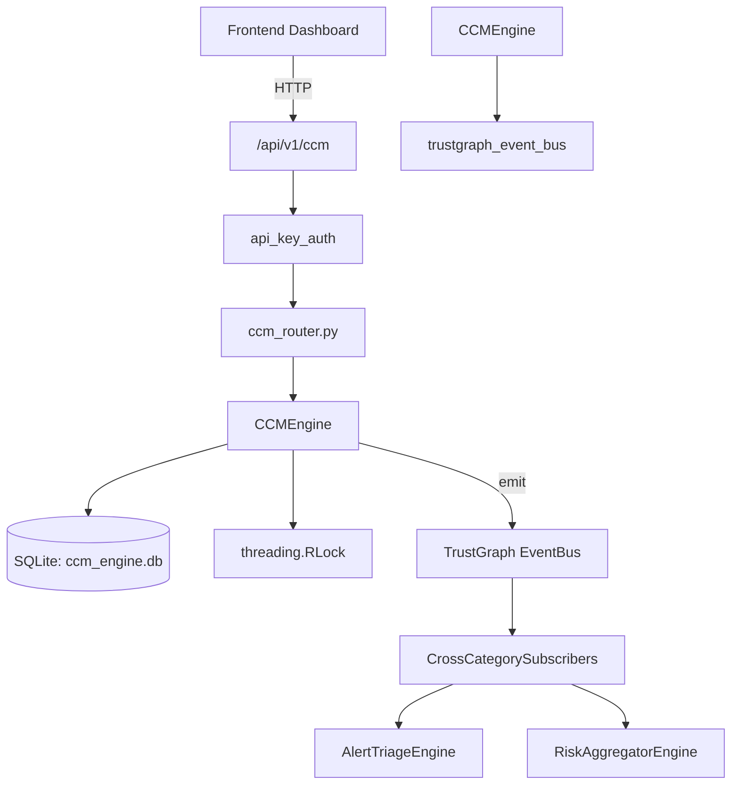

# US-0045: Ccm

## Sub-Epic: Advanced
**Master Goal**: ALDECI — $35/mo enterprise security intelligence platform replacing $50K-500K/yr tools

## User Story
As a **Robert Kim (Compliance Officer)**, I need to manage cloud controls matrix compliance
so that the platform delivers enterprise-grade advanced capabilities at 1/1000th the cost of legacy tools.

## Why This Matters
Ccm replaces functionality found in enterprise tools like CrowdStrike, Wiz, Snyk, and Rapid7.
By building this into ALDECI's $35/mo stack, customers save $50K+/yr on standalone Advanced tooling.

## Architecture

## Current State: 95% Complete
- ✅ `register_control()` — Register a new security control. (line 154)
- ✅ `list_controls()` — List controls for an org with optional filters. (line 200)
- ✅ `add_test()` — Add a test definition to a control. (line 228)
- ✅ `run_test()` — Simulate running a control test. (line 269)
- ✅ `list_tests()` — List tests for an org with optional filters. (line 335)
- ✅ `log_failure()` — Log a control failure. (line 360)
- ❌ TrustGraph event emission — not yet verified

## Key Functions (from `suite-core/core/ccm_engine.py` — 560 lines)
- `CCMEngine.register_control()` — Register a new security control. (line 154)
- `CCMEngine.list_controls()` — List controls for an org with optional filters. (line 200)
- `CCMEngine.add_test()` — Add a test definition to a control. (line 228)
- `CCMEngine.run_test()` — Simulate running a control test. (line 269)
- `CCMEngine.list_tests()` — List tests for an org with optional filters. (line 335)
- `CCMEngine.log_failure()` — Log a control failure. (line 360)
- `CCMEngine.remediate_failure()` — Mark a failure as remediated. (line 393)
- `CCMEngine.list_failures()` — List failures for an org. (line 405)

## Dependencies
- **Depends on**: trustgraph_event_bus
- **Depended by**: Routers, TrustGraph EventBus, CrossCategorySubscribers
- **TrustGraph**: Event emission wired via ResponseInterceptorMiddleware
- **Source file**: `suite-core/core/ccm_engine.py` (560 lines)
- **Router file**: `suite-api/apps/api/ccm_router.py`

## API Endpoints
| Method | Path | Description |
|--------|------|-------------|
| POST | `/api/v1/ccm/orgs/{org_id}/controls` | register control |
| GET | `/api/v1/ccm/orgs/{org_id}/controls` | list controls |
| POST | `/api/v1/ccm/orgs/{org_id}/controls/{control_id}/tests` | add test |
| POST | `/api/v1/ccm/orgs/{org_id}/tests/{test_id}/run` | run test |
| GET | `/api/v1/ccm/orgs/{org_id}/tests` | list tests |
| POST | `/api/v1/ccm/orgs/{org_id}/failures` | log failure |
| POST | `/api/v1/ccm/orgs/{org_id}/failures/{failure_id}/remediate` | remediate failure |
| GET | `/api/v1/ccm/orgs/{org_id}/failures` | list failures |
| GET | `/api/v1/ccm/orgs/{org_id}/coverage` | get control coverage |
| GET | `/api/v1/ccm/orgs/{org_id}/stats` | get ccm stats |

## Tasks Remaining
1. Verify TrustGraph event emission works end-to-end (2h)
2. Add integration test with real persona workflow (2h)
3. Wire CrossCategorySubscriber consumer chain (1h)
4. Validate with 30-persona walkthrough (1h)
5. Optimize query performance for large datasets (2h)
6. Expand test coverage to edge cases (2h)

## Definition of Done
- [ ] Robert Kim (Compliance Officer) can access /api/v1/ccm and get meaningful data
- [ ] All CRUD operations return correct HTTP status codes
- [ ] TrustGraph receives events from this engine
- [ ] 31+ tests passing in `tests/test_ccm_engine.py`
- [ ] 30-persona walkthrough includes this endpoint at 100%
- [ ] No hardcoded org_id — all queries are org-scoped

## Sprint: Wave 43 (est. April 19-21, 2026)

## Test Coverage
- **Test file**: `tests/test_ccm_engine.py`
- **Tests**: 31 tests
- **Status**: Passing
