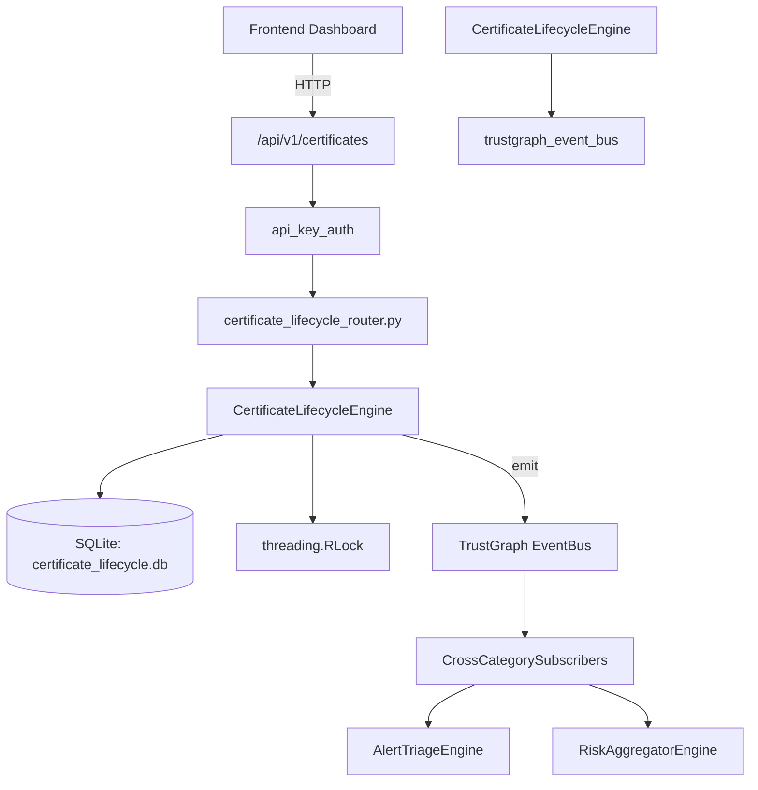

# US-0046: Certificate Lifecycle

## Sub-Epic: Advanced
**Master Goal**: ALDECI — $35/mo enterprise security intelligence platform replacing $50K-500K/yr tools

## User Story
As a **Ryan Murphy (Platform Engineer)**, I need to track certificate lifecycle and expiry
so that the platform delivers enterprise-grade advanced capabilities at 1/1000th the cost of legacy tools.

## Why This Matters
Certificate Lifecycle replaces functionality found in enterprise tools like CrowdStrike, Wiz, Snyk, and Rapid7.
By building this into ALDECI's $35/mo stack, customers save $50K+/yr on standalone Advanced tooling.

## Architecture

## Current State: 95% Complete
- ✅ `register_certificate()` — Register a new certificate. Returns the full certificate record. (line 135)
- ✅ `list_certificates()` — List certificates for an org, optionally filtered by cert_type and/or status. (line 198)
- ✅ `get_certificate()` — Fetch a single certificate by cert_id (org-scoped). (line 222)
- ✅ `get_expiring_certificates()` — Return non-revoked certificates expiring within the next N days. (line 232)
- ✅ `renew_certificate()` — Renew a certificate by updating its expiry date and logging the renewal. (line 256)
- ✅ `revoke_certificate()` — Revoke a certificate. Returns confirmation record. (line 297)
- ❌ TrustGraph event emission — not yet verified

## Key Functions (from `suite-core/core/certificate_lifecycle_engine.py` — 400 lines)
- `CertificateLifecycleEngine.register_certificate()` — Register a new certificate. Returns the full certificate record. (line 135)
- `CertificateLifecycleEngine.list_certificates()` — List certificates for an org, optionally filtered by cert_type and/or status. (line 198)
- `CertificateLifecycleEngine.get_certificate()` — Fetch a single certificate by cert_id (org-scoped). (line 222)
- `CertificateLifecycleEngine.get_expiring_certificates()` — Return non-revoked certificates expiring within the next N days. (line 232)
- `CertificateLifecycleEngine.renew_certificate()` — Renew a certificate by updating its expiry date and logging the renewal. (line 256)
- `CertificateLifecycleEngine.revoke_certificate()` — Revoke a certificate. Returns confirmation record. (line 297)
- `CertificateLifecycleEngine.get_renewal_history()` — Return all renewal records for a certificate. (line 325)
- `CertificateLifecycleEngine.get_certificate_stats()` — Return aggregated certificate statistics for the org. (line 341)

## Dependencies
- **Depends on**: trustgraph_event_bus
- **Depended by**: Routers, TrustGraph EventBus, CrossCategorySubscribers
- **TrustGraph**: Event emission wired via ResponseInterceptorMiddleware
- **Source file**: `suite-core/core/certificate_lifecycle_engine.py` (400 lines)
- **Router file**: `suite-api/apps/api/certificate_lifecycle_router.py`

## API Endpoints
| Method | Path | Description |
|--------|------|-------------|
| POST | `/api/v1/certificates/` | register certificate |
| GET | `/api/v1/certificates/expiring` | get expiring certificates |
| GET | `/api/v1/certificates/stats` | get certificate stats |
| GET | `/api/v1/certificates/` | list certificates |
| GET | `/api/v1/certificates/{cert_id}` | get certificate |
| POST | `/api/v1/certificates/{cert_id}/renew` | renew certificate |
| POST | `/api/v1/certificates/{cert_id}/revoke` | revoke certificate |
| GET | `/api/v1/certificates/{cert_id}/renewal-history` | get renewal history |

## Tasks Remaining
1. Verify TrustGraph event emission works end-to-end (2h)
2. Add integration test with real persona workflow (2h)
3. Wire CrossCategorySubscriber consumer chain (1h)
4. Validate with 30-persona walkthrough (1h)
5. Optimize query performance for large datasets (2h)
6. Expand test coverage to edge cases (2h)

## Definition of Done
- [ ] Ryan Murphy (Platform Engineer) can access /api/v1/certificates and get meaningful data
- [ ] All CRUD operations return correct HTTP status codes
- [ ] TrustGraph receives events from this engine
- [ ] 34+ tests passing in `tests/test_certificate_lifecycle_engine.py`
- [ ] 30-persona walkthrough includes this endpoint at 100%
- [ ] No hardcoded org_id — all queries are org-scoped

## Sprint: Wave 43 (est. April 19-21, 2026)

## Test Coverage
- **Test file**: `tests/test_certificate_lifecycle_engine.py`
- **Tests**: 34 tests
- **Status**: Passing
