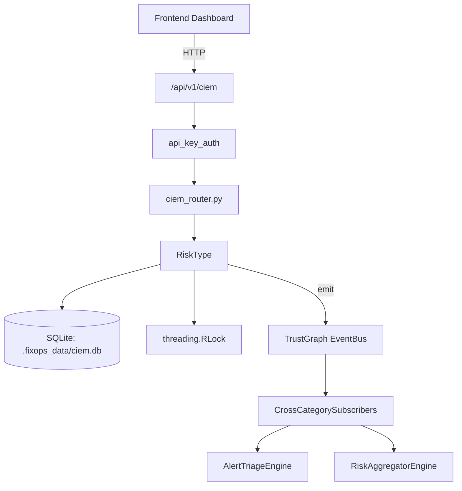

# US-0047: Ciem

## Sub-Epic: Advanced
**Master Goal**: ALDECI — $35/mo enterprise security intelligence platform replacing $50K-500K/yr tools

## User Story
As a **Jennifer Wu (Cloud Security Architect)**, I need to manage cloud IAM entitlements
so that the platform delivers enterprise-grade advanced capabilities at 1/1000th the cost of legacy tools.

## Why This Matters
Ciem replaces functionality found in enterprise tools like CrowdStrike, Wiz, Snyk, and Rapid7.
By building this into ALDECI's $35/mo stack, customers save $50K+/yr on standalone Advanced tooling.

## Architecture

## Current State: 95% Complete
- ✅ `to_dict()` — implemented (line 146)
- ✅ `analyze_aws_iam_policy()` — Analyse a single AWS IAM policy document and return risks. (line 286)
- ✅ `analyze_azure_role_assignment()` — Analyse an Azure role definition or assignment. (line 429)
- ✅ `detect_privilege_escalation_paths()` — Scan a list of policy dicts (each with 'principal' and 'policy' keys) (line 529)
- ✅ `suggest_least_privilege()` — Return a trimmed policy that contains only the permissions in (line 644)
- ✅ `score_policy()` — Score a policy 0–100 (100 = perfectly least-privilege). (line 704)
- ❌ TrustGraph event emission — not yet verified

## Key Functions (from `suite-core/core/ciem_engine.py` — 850 lines)
- `EntitlementRisk.to_dict()` — Handle to dict (line 146)
- `CIEMEngine.analyze_aws_iam_policy()` — Analyse a single AWS IAM policy document and return risks. (line 286)
- `CIEMEngine.analyze_azure_role_assignment()` — Analyse an Azure role definition or assignment. (line 429)
- `CIEMEngine.detect_privilege_escalation_paths()` — Scan a list of policy dicts (each with 'principal' and 'policy' keys) (line 529)
- `CIEMEngine.suggest_least_privilege()` — Return a trimmed policy that contains only the permissions in (line 644)
- `CIEMEngine.score_policy()` — Score a policy 0–100 (100 = perfectly least-privilege). (line 704)
- `CIEMEngine.run_account_analysis()` — Analyse all policies for an account and return a summary dict. (line 759)
- `CIEMEngine.list_risks()` — Return persisted risks, optionally filtered. (line 810)

## Dependencies
- **Depends on**: standalone
- **Depended by**: Routers, TrustGraph EventBus, CrossCategorySubscribers
- **TrustGraph**: Event emission wired via ResponseInterceptorMiddleware
- **Source file**: `suite-core/core/ciem_engine.py` (850 lines)
- **Router file**: `suite-api/apps/api/ciem_router.py`

## API Endpoints
| Method | Path | Description |
|--------|------|-------------|
| POST | `/api/v1/ciem/analyze/policy` | analyze policy |
| POST | `/api/v1/ciem/analyze/account` | analyze account |
| POST | `/api/v1/ciem/suggest/least-privilege` | suggest least privilege |
| GET | `/api/v1/ciem/risks` | list risks |
| POST | `/api/v1/ciem/escalation-paths` | detect escalation paths |
| POST | `/api/v1/ciem/analyze/azure` | analyze azure |
| POST | `/api/v1/ciem/score` | score policy |

## Tasks Remaining
1. Verify TrustGraph event emission works end-to-end (2h)
2. Add integration test with real persona workflow (2h)
3. Wire CrossCategorySubscriber consumer chain (1h)
4. Validate with 30-persona walkthrough (1h)
5. Optimize query performance for large datasets (2h)
6. Expand test coverage to edge cases (2h)

## Definition of Done
- [ ] Jennifer Wu (Cloud Security Architect) can access /api/v1/ciem and get meaningful data
- [ ] All CRUD operations return correct HTTP status codes
- [ ] TrustGraph receives events from this engine
- [ ] 35+ tests passing in `tests/test_ciem_engine.py`
- [ ] 30-persona walkthrough includes this endpoint at 100%
- [ ] No hardcoded org_id — all queries are org-scoped

## Sprint: Wave 43 (est. April 19-21, 2026)

## Test Coverage
- **Test file**: `tests/test_ciem_engine.py`
- **Tests**: 35 tests
- **Status**: Passing
