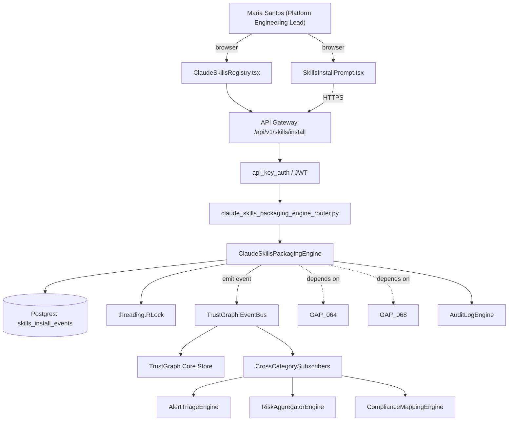

# US-0067: Claude Code Skills as first-class UX: /fixops-scan, /fixops-triage, /fixops-suppress, /fixops-hooks

## Sub-Epic: Integrations
**Master Goal**: ALDECI — tiered $199-$1,499/mo enterprise security intelligence platform replacing $50K-$500K/yr tools

## User Story
As a **Maria Santos (Platform Engineering Lead)**, I need the ability to claude Code Skills as first-class UX: /fixops-scan, /fixops-triage, /fixops-suppress, /fixops-hooks so that platform teams onboard Fixops in hours, not weeks, and CI integrations are first-class.

## Why This Matters
Per /tmp/truecourse-analysis.md §7 (Integrations) + §9 takeaway 9 and competitor-truecourse.md, TrueCourse ships four Claude Code skills (truecourse-analyze, -list, -fix, -hooks) under tools/cli/skills/truecourse/<name>/SKILL.md with YAML frontmatter (user_invocable: true + triggers[]) and numbered Markdown playbooks that call `npx -y truecourse …`. Installed into <repo>/.claude/skills/truecourse/ on first analyze with an opt-in prompt. Fixops should ship /fixops-scan, /fixops-triage, /fixops-suppress, /fixops-hooks with the same pattern so Claude-Code-first developer workflows include Fixops by default.

This work is called out as a P1 gap in `competitor-truecourse.md`. Shipping it is load-bearing for ALDECI's tiered $199-$1,499/mo positioning against $50K-$500K/yr incumbents: every delayed gap becomes a displacement deal we lose.

## Architecture

## Current State: 0% — MISSING (new engine)
- [ ] Engine module `suite-core/core/claude_skills_packaging_engine.py` does not exist yet
- [ ] Router `suite-api/apps/api/claude_skills_packaging_engine_router.py` does not exist yet
- [ ] DB tables listed under Data Model do not exist yet
- [ ] Frontend screens listed under Key Functions do not exist yet
- [ ] No TrustGraph events emitted yet

## Key Functions
**Backend (engine methods):**
- `create_install()` — backs `POST /api/v1/skills/install`
- `get_status()` — backs `GET /api/v1/skills/status`
- `create_uninstall()` — backs `POST /api/v1/skills/uninstall`

**Frontend screens:**
- `SkillsInstallPrompt.tsx` — operator-facing UI surface for this gap
- `ClaudeSkillsRegistry.tsx` — operator-facing UI surface for this gap

## API Endpoints
| Method | Path | Auth | Purpose |
|--------|------|------|---------|
| POST | `/api/v1/skills/install` | api_key_auth | skills install |
| GET | `/api/v1/skills/status` | api_key_auth | skills status |
| POST | `/api/v1/skills/uninstall` | api_key_auth | skills uninstall |

## Data Model
- add skills_install_events table: id, org_id, repo_id, event (install|uninstall), skills (JSONB array), invoked_at, invoked_by

## Dependencies
**Depends on**: GAP-064, GAP-068
**Depended by**: Router layer, TrustGraph EventBus, CrossCategorySubscribers, CrossCategoryEvidenceBuilder, AuditLogEngine
**New engine module**: `suite-core/core/claude_skills_packaging_engine.py`
**New router module**: `suite-api/apps/api/claude_skills_packaging_engine_router.py`
**Master gap id**: `GAP-067` (priority P1, effort S)

## Tasks Remaining
1. Schema migration: add skills_install_events table (2h)
2. Implement endpoint POST /api/v1/skills/install (3h)
3. Implement endpoint GET /api/v1/skills/status (3h)
4. Implement endpoint POST /api/v1/skills/uninstall (3h)
5. Wire frontend screen SkillsInstallPrompt.tsx (2h)
6. Wire frontend screen ClaudeSkillsRegistry.tsx (2h)
7. Write 6 pytest cases: test_skills_install_creates_four_directories, test_skill_md_yaml_frontmatter_valid… (3h)
8. Wire TrustGraph event emission + CrossCategorySubscriber consumers (2h)
9. Persona walkthrough + integration test (1h)
10. Docs + API reference update (1h)

## Definition of Done
- [ ] Given a repo and `fixops skills install`, When executed, Then four skill directories are created under <repo>/.claude/skills/fixops/: fixops-scan/, fixops-triage/, fixops-suppress/, fixops-hooks/ — each with SKILL.md containing valid YAML frontmatter (user_invocable: true, triggers: [...]) and a numbered Markdown playbook.
- [ ] Given `/fixops-scan` invoked in Claude Code, When the skill runs, Then it executes `npx -y fixops analyze` with correct arguments and streams progress to the user.
- [ ] Given `/fixops-triage <finding-id>`, When invoked, Then it fetches the finding, proposes remediation options, and offers to open a PR.
- [ ] Given `/fixops-suppress <finding-id>`, When invoked, Then it walks the user through a waiver request with justification and expiry, then posts to POST /api/v1/waivers/request (pairs with GAP-006).
- [ ] Given `/fixops-hooks`, When invoked, Then it runs `fixops hooks install/uninstall/status` interactively (pairs with GAP-068).
- [ ] Given the first `fixops analyze` run, When skills are not yet installed, Then the CLI prompts 'Install Claude Code skills? (Y/n)' and respects --install-skills / --no-skills flags for non-interactive use.
- [ ] Given installed skills, When `fixops skills uninstall` runs, Then all four skill directories are removed and POST /api/v1/skills/uninstall is called to record the event.
- [ ] All endpoints are org-scoped (no hardcoded org_id) and gated by `api_key_auth`.
- [ ] TrustGraph emits at least one event type for this engine and a CrossCategorySubscriber consumes it.
- [ ] `Maria Santos (Platform Engineering Lead)` can execute the full workflow in the 30-persona walkthrough.

## Tests Required
- `test_skills_install_creates_four_directories`
- `test_skill_md_yaml_frontmatter_valid`
- `test_fixops_scan_skill_invokes_cli`
- `test_fixops_triage_surfaces_finding`
- `test_fixops_suppress_posts_waiver_request`
- `test_install_prompt_respects_flags`

## Sprint: Wave 49 (est. Jun 03-Jun 09, 2026)

## Citation
Source research: `competitor-truecourse.md` (gap `GAP-067`, priority `P1`, effort `S`)
