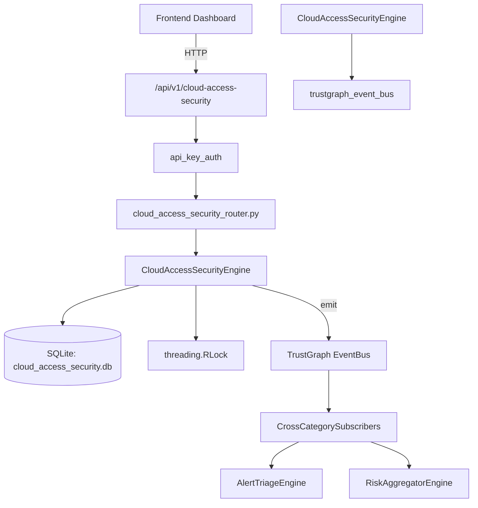

# US-0048: Cloud Access Security

## Sub-Epic: CSPM
**Master Goal**: ALDECI — $35/mo enterprise security intelligence platform replacing $50K-500K/yr tools

## User Story
As a **Jennifer Wu (Cloud Security Architect)**, I need to secure cloud infrastructure and workloads
so that the platform delivers enterprise-grade cspm capabilities at 1/1000th the cost of legacy tools.

## Why This Matters
Cloud Access Security replaces functionality found in enterprise tools like CrowdStrike, Wiz, Snyk, and Rapid7.
By building this into ALDECI's $35/mo stack, customers save $50K+/yr on standalone CSPM tooling.

## Architecture

## Current State: 95% Complete
- ✅ `register_cloud_app()` — Register a cloud application. (line 124)
- ✅ `list_cloud_apps()` — List cloud apps with optional filters. (line 190)
- ✅ `get_cloud_app()` — Return a single cloud app or None. (line 216)
- ✅ `record_access_event()` — Record a cloud app access event. (line 229)
- ✅ `create_policy()` — Create a cloud access policy. (line 291)
- ✅ `list_policies()` — List policies with optional filters. (line 339)
- ❌ TrustGraph event emission — not yet verified

## Key Functions (from `suite-core/core/cloud_access_security_engine.py` — 405 lines)
- `CloudAccessSecurityEngine.register_cloud_app()` — Register a cloud application. (line 124)
- `CloudAccessSecurityEngine.list_cloud_apps()` — List cloud apps with optional filters. (line 190)
- `CloudAccessSecurityEngine.get_cloud_app()` — Return a single cloud app or None. (line 216)
- `CloudAccessSecurityEngine.record_access_event()` — Record a cloud app access event. (line 229)
- `CloudAccessSecurityEngine.create_policy()` — Create a cloud access policy. (line 291)
- `CloudAccessSecurityEngine.list_policies()` — List policies with optional filters. (line 339)
- `CloudAccessSecurityEngine.get_cloud_access_stats()` — Return aggregated stats for an org. (line 365)

## Dependencies
- **Depends on**: trustgraph_event_bus
- **Depended by**: Routers, TrustGraph EventBus, CrossCategorySubscribers
- **TrustGraph**: Event emission wired via ResponseInterceptorMiddleware
- **Source file**: `suite-core/core/cloud_access_security_engine.py` (405 lines)
- **Router file**: `suite-api/apps/api/cloud_access_security_router.py`

## API Endpoints
| Method | Path | Description |
|--------|------|-------------|
| POST | `/api/v1/cloud-access-security/apps` | register cloud app |
| GET | `/api/v1/cloud-access-security/apps` | list cloud apps |
| GET | `/api/v1/cloud-access-security/apps/{app_id}` | get cloud app |
| POST | `/api/v1/cloud-access-security/events` | record access event |
| POST | `/api/v1/cloud-access-security/policies` | create policy |
| GET | `/api/v1/cloud-access-security/policies` | list policies |
| GET | `/api/v1/cloud-access-security/stats` | get cloud access stats |

## Tasks Remaining
1. Verify TrustGraph event emission works end-to-end (2h)
2. Add integration test with real persona workflow (2h)
3. Wire CrossCategorySubscriber consumer chain (1h)
4. Validate with 30-persona walkthrough (1h)
5. Optimize query performance for large datasets (2h)
6. Expand test coverage to edge cases (2h)

## Definition of Done
- [ ] Jennifer Wu (Cloud Security Architect) can access /api/v1/cloud-access-security and get meaningful data
- [ ] All CRUD operations return correct HTTP status codes
- [ ] TrustGraph receives events from this engine
- [ ] 33+ tests passing in `tests/test_cloud_access_security_engine.py`
- [ ] 30-persona walkthrough includes this endpoint at 100%
- [ ] No hardcoded org_id — all queries are org-scoped

## Sprint: Wave 43 (est. April 19-21, 2026)

## Test Coverage
- **Test file**: `tests/test_cloud_access_security_engine.py`
- **Tests**: 33 tests
- **Status**: Passing
