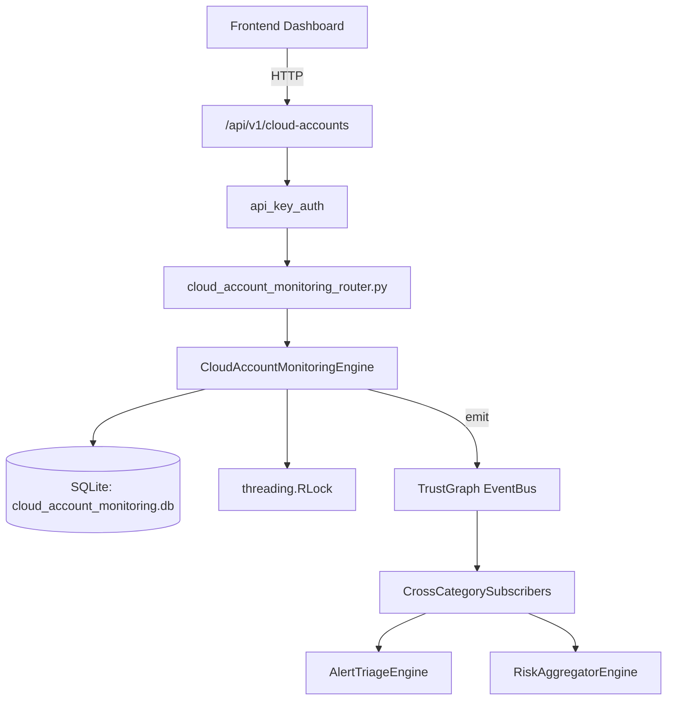

# US-0049: Cloud Account Monitoring

## Sub-Epic: CSPM
**Master Goal**: ALDECI — $35/mo enterprise security intelligence platform replacing $50K-500K/yr tools

## User Story
As a **Jennifer Wu (Cloud Security Architect)**, I need to secure cloud infrastructure and workloads
so that the platform delivers enterprise-grade cspm capabilities at 1/1000th the cost of legacy tools.

## Why This Matters
Cloud Account Monitoring replaces functionality found in enterprise tools like CrowdStrike, Wiz, Snyk, and Rapid7.
By building this into ALDECI's $35/mo stack, customers save $50K+/yr on standalone CSPM tooling.

## Architecture

## Current State: 95% Complete
- ✅ `register_account()` — Register a new cloud account. (line 145)
- ✅ `update_account_scan()` — Update scan results and recompute account status. (line 189)
- ✅ `get_account()` — Get account with its 20 most recent events. (line 221)
- ✅ `list_accounts()` — List accounts with optional provider/status filters. (line 240)
- ✅ `record_event()` — Record a security event for an account. (line 264)
- ✅ `resolve_event()` — Mark an event as resolved. (line 309)
- ❌ TrustGraph event emission — not yet verified

## Key Functions (from `suite-core/core/cloud_account_monitoring_engine.py` — 455 lines)
- `CloudAccountMonitoringEngine.register_account()` — Register a new cloud account. (line 145)
- `CloudAccountMonitoringEngine.update_account_scan()` — Update scan results and recompute account status. (line 189)
- `CloudAccountMonitoringEngine.get_account()` — Get account with its 20 most recent events. (line 221)
- `CloudAccountMonitoringEngine.list_accounts()` — List accounts with optional provider/status filters. (line 240)
- `CloudAccountMonitoringEngine.record_event()` — Record a security event for an account. (line 264)
- `CloudAccountMonitoringEngine.resolve_event()` — Mark an event as resolved. (line 309)
- `CloudAccountMonitoringEngine.get_unresolved_events()` — Return events with status != 'resolved', optionally filtered by severity. (line 332)
- `CloudAccountMonitoringEngine.create_policy()` — Create an account security policy. (line 350)

## Dependencies
- **Depends on**: standalone
- **Depended by**: Routers, TrustGraph EventBus, CrossCategorySubscribers
- **TrustGraph**: Event emission wired via ResponseInterceptorMiddleware
- **Source file**: `suite-core/core/cloud_account_monitoring_engine.py` (455 lines)
- **Router file**: `suite-api/apps/api/cloud_account_monitoring_router.py`

## API Endpoints
| Method | Path | Description |
|--------|------|-------------|
| POST | `/api/v1/cloud-accounts/accounts` | register account |
| GET | `/api/v1/cloud-accounts/accounts` | list accounts |
| GET | `/api/v1/cloud-accounts/accounts/{account_id}` | get account |
| POST | `/api/v1/cloud-accounts/accounts/{account_id}/scan` | update account scan |
| POST | `/api/v1/cloud-accounts/accounts/{account_id}/events` | record event |
| POST | `/api/v1/cloud-accounts/accounts/{account_id}/events/{event_id}/resolve` | resolve event |
| GET | `/api/v1/cloud-accounts/events/unresolved` | get unresolved events |
| POST | `/api/v1/cloud-accounts/policies` | create policy |
| POST | `/api/v1/cloud-accounts/policies/{policy_id}/evaluate` | evaluate policy |
| GET | `/api/v1/cloud-accounts/risk-summary` | get risk summary |

## Tasks Remaining
1. Verify TrustGraph event emission works end-to-end (2h)
2. Add integration test with real persona workflow (2h)
3. Wire CrossCategorySubscriber consumer chain (1h)
4. Validate with 30-persona walkthrough (1h)
5. Optimize query performance for large datasets (2h)
6. Expand test coverage to edge cases (2h)

## Definition of Done
- [ ] Jennifer Wu (Cloud Security Architect) can access /api/v1/cloud-accounts and get meaningful data
- [ ] All CRUD operations return correct HTTP status codes
- [ ] TrustGraph receives events from this engine
- [ ] 45+ tests passing in `tests/test_cloud_account_monitoring_engine.py`
- [ ] 30-persona walkthrough includes this endpoint at 100%
- [ ] No hardcoded org_id — all queries are org-scoped

## Sprint: Wave 43 (est. April 19-21, 2026)

## Test Coverage
- **Test file**: `tests/test_cloud_account_monitoring_engine.py`
- **Tests**: 45 tests
- **Status**: Passing
