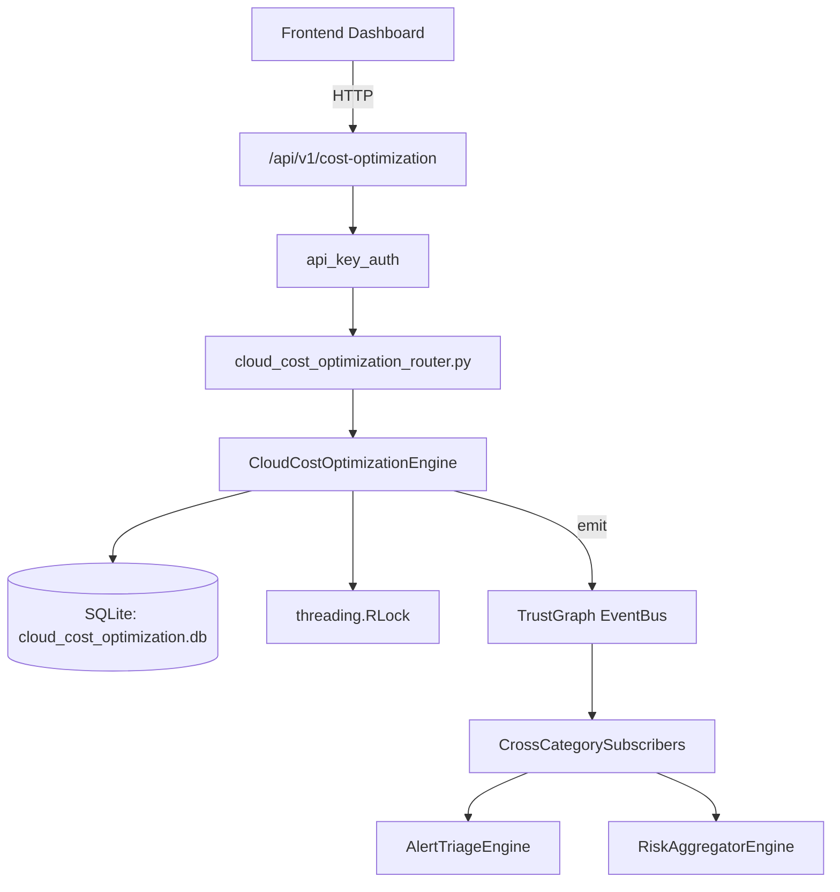

# US-0051: Cloud Cost Optimization

## Sub-Epic: CSPM
**Master Goal**: ALDECI — $35/mo enterprise security intelligence platform replacing $50K-500K/yr tools

## User Story
As a **Jennifer Wu (Cloud Security Architect)**, I need to secure cloud infrastructure and workloads
so that the platform delivers enterprise-grade cspm capabilities at 1/1000th the cost of legacy tools.

## Why This Matters
Cloud Cost Optimization replaces functionality found in enterprise tools like CrowdStrike, Wiz, Snyk, and Rapid7.
By building this into ALDECI's $35/mo stack, customers save $50K+/yr on standalone CSPM tooling.

## Architecture

## Current State: 95% Complete
- ✅ `register_tool()` — Register a new security tool with cost tracking. (line 182)
- ✅ `update_utilization()` — Update tool utilization and risk coverage. (line 223)
- ✅ `list_tools()` — List all tools for an org. (line 248)
- ✅ `add_optimization()` — Identify a cost optimization opportunity. (line 261)
- ✅ `implement_optimization()` — Mark an optimization as implemented with actual savings. (line 302)
- ✅ `add_roi_assessment()` — Add a ROI assessment for a security tool. (line 334)
- ❌ TrustGraph event emission — not yet verified

## Key Functions (from `suite-core/core/cloud_cost_optimization_engine.py` — 543 lines)
- `CloudCostOptimizationEngine.register_tool()` — Register a new security tool with cost tracking. (line 182)
- `CloudCostOptimizationEngine.update_utilization()` — Update tool utilization and risk coverage. (line 223)
- `CloudCostOptimizationEngine.list_tools()` — List all tools for an org. (line 248)
- `CloudCostOptimizationEngine.add_optimization()` — Identify a cost optimization opportunity. (line 261)
- `CloudCostOptimizationEngine.implement_optimization()` — Mark an optimization as implemented with actual savings. (line 302)
- `CloudCostOptimizationEngine.add_roi_assessment()` — Add a ROI assessment for a security tool. (line 334)
- `CloudCostOptimizationEngine.get_tool_roi()` — Return tool details, assessments, optimizations, and total realized savings. (line 382)
- `CloudCostOptimizationEngine.get_underutilized_tools()` — Return active tools with utilization <= max_utilization, ordered by monthly_cost (line 411)

## Dependencies
- **Depends on**: standalone
- **Depended by**: Routers, TrustGraph EventBus, CrossCategorySubscribers
- **TrustGraph**: Event emission wired via ResponseInterceptorMiddleware
- **Source file**: `suite-core/core/cloud_cost_optimization_engine.py` (543 lines)
- **Router file**: `suite-api/apps/api/cloud_cost_optimization_router.py`

## API Endpoints
| Method | Path | Description |
|--------|------|-------------|
| POST | `/api/v1/cost-optimization/tools` | register tool |
| GET | `/api/v1/cost-optimization/tools` | list tools |
| GET | `/api/v1/cost-optimization/tools/{tool_id}/roi` | get tool roi |
| PATCH | `/api/v1/cost-optimization/tools/{tool_id}/utilization` | update utilization |
| POST | `/api/v1/cost-optimization/tools/{tool_id}/optimizations` | add optimization |
| POST | `/api/v1/cost-optimization/optimizations/{optimization_id}/implement` | implement optimization |
| POST | `/api/v1/cost-optimization/tools/{tool_id}/roi-assessment` | add roi assessment |
| GET | `/api/v1/cost-optimization/underutilized` | get underutilized tools |
| GET | `/api/v1/cost-optimization/portfolio` | get portfolio summary |
| GET | `/api/v1/cost-optimization/cost-per-risk` | get cost per risk |

## Tasks Remaining
1. Verify TrustGraph event emission works end-to-end (2h)
2. Add integration test with real persona workflow (2h)
3. Wire CrossCategorySubscriber consumer chain (1h)
4. Validate with 30-persona walkthrough (1h)
5. Optimize query performance for large datasets (2h)
6. Expand test coverage to edge cases (2h)

## Definition of Done
- [ ] Jennifer Wu (Cloud Security Architect) can access /api/v1/cost-optimization and get meaningful data
- [ ] All CRUD operations return correct HTTP status codes
- [ ] TrustGraph receives events from this engine
- [ ] 49+ tests passing in `tests/test_cloud_cost_optimization_engine.py`
- [ ] 30-persona walkthrough includes this endpoint at 100%
- [ ] No hardcoded org_id — all queries are org-scoped

## Sprint: Wave 43 (est. April 19-21, 2026)

## Test Coverage
- **Test file**: `tests/test_cloud_cost_optimization_engine.py`
- **Tests**: 49 tests
- **Status**: Passing
