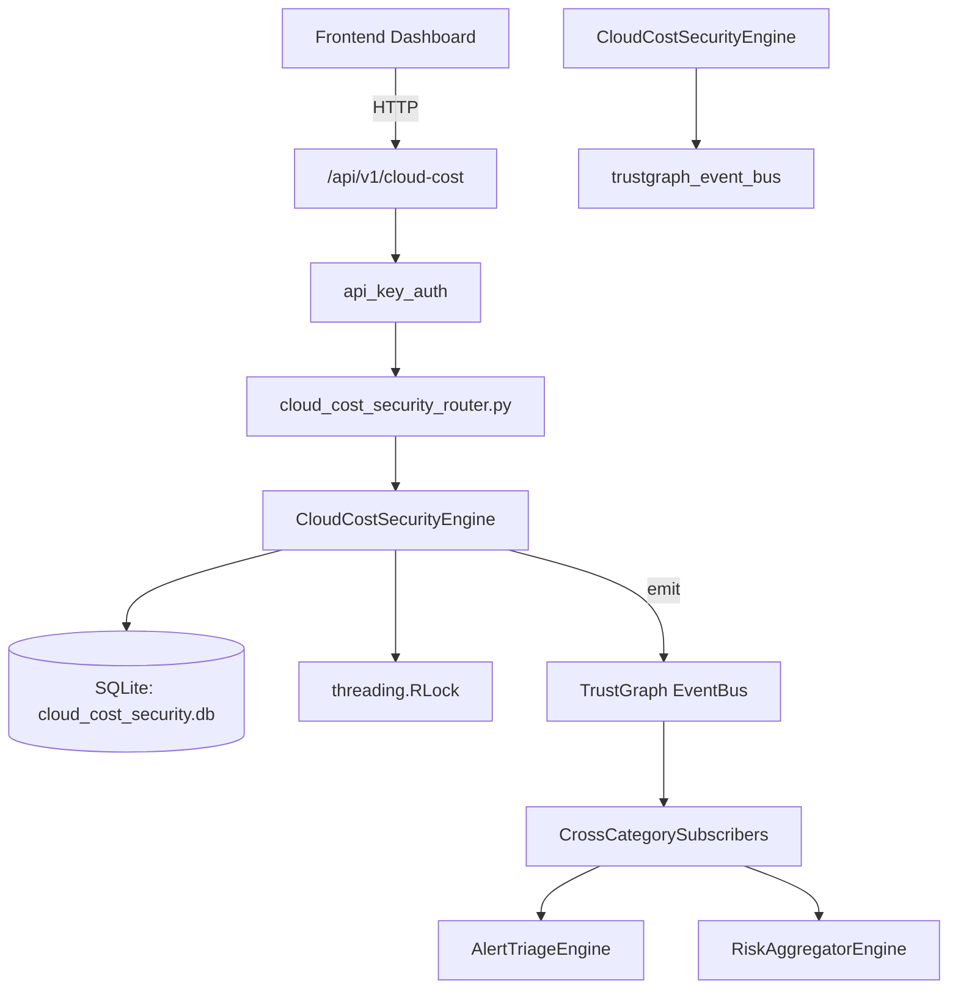

# US-0052: Cloud Cost Security

## Sub-Epic: CSPM
**Master Goal**: ALDECI — $35/mo enterprise security intelligence platform replacing $50K-500K/yr tools

## User Story
As a **Jennifer Wu (Cloud Security Architect)**, I need to secure cloud infrastructure and workloads
so that the platform delivers enterprise-grade cspm capabilities at 1/1000th the cost of legacy tools.

## Why This Matters
Cloud Cost Security replaces functionality found in enterprise tools like CrowdStrike, Wiz, Snyk, and Rapid7.
By building this into ALDECI's $35/mo stack, customers save $50K+/yr on standalone CSPM tooling.

## Architecture

## Current State: 95% Complete
- ✅ `record_snapshot()` — Save a cost snapshot and auto-detect anomalies. (line 213)
- ✅ `list_snapshots()` — List cost snapshots with optional filters. (line 312)
- ✅ `add_abandoned_resource()` — Register an abandoned/zombie/orphaned resource. (line 335)
- ✅ `list_abandoned_resources()` — List abandoned resources with optional filters. (line 373)
- ✅ `terminate_resource()` — Mark a resource as terminated. Returns True if found. (line 392)
- ✅ `create_budget()` — Create a cloud cost budget. (line 407)
- ❌ TrustGraph event emission — not yet verified

## Key Functions (from `suite-core/core/cloud_cost_security_engine.py` — 856 lines)
- `CloudCostSecurityEngine.record_snapshot()` — Save a cost snapshot and auto-detect anomalies. (line 213)
- `CloudCostSecurityEngine.list_snapshots()` — List cost snapshots with optional filters. (line 312)
- `CloudCostSecurityEngine.add_abandoned_resource()` — Register an abandoned/zombie/orphaned resource. (line 335)
- `CloudCostSecurityEngine.list_abandoned_resources()` — List abandoned resources with optional filters. (line 373)
- `CloudCostSecurityEngine.terminate_resource()` — Mark a resource as terminated. Returns True if found. (line 392)
- `CloudCostSecurityEngine.create_budget()` — Create a cloud cost budget. (line 407)
- `CloudCostSecurityEngine.list_budgets()` — List all budgets for an org with computed status. (line 459)
- `CloudCostSecurityEngine.record_anomaly()` — Save a cost anomaly record. (line 489)

## Dependencies
- **Depends on**: trustgraph_event_bus
- **Depended by**: Routers, TrustGraph EventBus, CrossCategorySubscribers
- **TrustGraph**: Event emission wired via ResponseInterceptorMiddleware
- **Source file**: `suite-core/core/cloud_cost_security_engine.py` (856 lines)
- **Router file**: `suite-api/apps/api/cloud_cost_security_router.py`

## API Endpoints
| Method | Path | Description |
|--------|------|-------------|
| POST | `/api/v1/cloud-cost/snapshots` | record snapshot |
| GET | `/api/v1/cloud-cost/snapshots` | list snapshots |
| POST | `/api/v1/cloud-cost/abandoned-resources` | add abandoned resource |
| GET | `/api/v1/cloud-cost/abandoned-resources` | list abandoned resources |
| POST | `/api/v1/cloud-cost/abandoned-resources/{resource_id}/terminate` | terminate resource |
| POST | `/api/v1/cloud-cost/budgets` | create budget |
| GET | `/api/v1/cloud-cost/budgets` | list budgets |
| POST | `/api/v1/cloud-cost/anomalies` | record anomaly |
| GET | `/api/v1/cloud-cost/anomalies` | list anomalies |
| POST | `/api/v1/cloud-cost/anomalies/{anomaly_id}/resolve` | resolve anomaly |
| GET | `/api/v1/cloud-cost/stats` | get cost stats |
| POST | `/api/v1/cloud-cost/items` | record cost item |

## Tasks Remaining
1. Verify TrustGraph event emission works end-to-end (2h)
2. Add integration test with real persona workflow (2h)
3. Wire CrossCategorySubscriber consumer chain (1h)
4. Validate with 30-persona walkthrough (1h)
5. Optimize query performance for large datasets (2h)
6. Expand test coverage to edge cases (2h)

## Definition of Done
- [ ] Jennifer Wu (Cloud Security Architect) can access /api/v1/cloud-cost and get meaningful data
- [ ] All CRUD operations return correct HTTP status codes
- [ ] TrustGraph receives events from this engine
- [ ] 54+ tests passing in `tests/test_cloud_cost_security_engine.py`
- [ ] 30-persona walkthrough includes this endpoint at 100%
- [ ] No hardcoded org_id — all queries are org-scoped

## Sprint: Wave 43 (est. April 19-21, 2026)

## Test Coverage
- **Test file**: `tests/test_cloud_cost_security_engine.py`
- **Tests**: 54 tests
- **Status**: Passing
