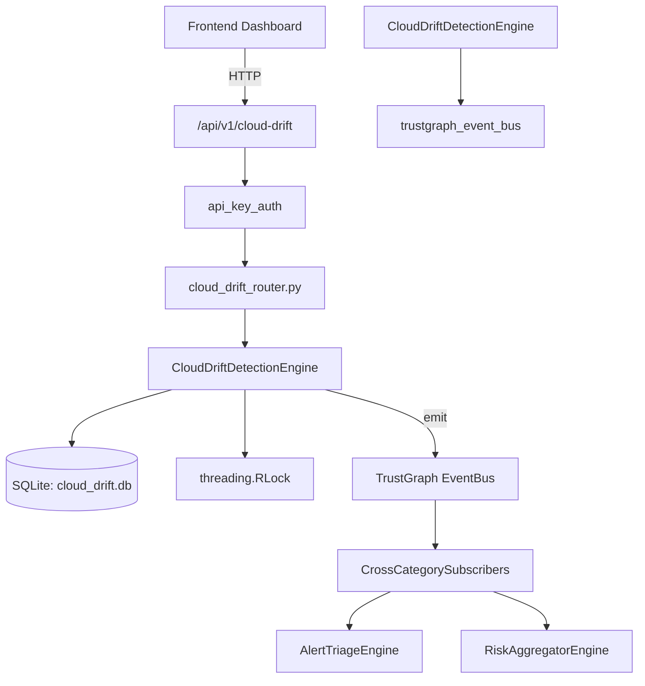

# US-0053: Cloud Drift

## Sub-Epic: CSPM
**Master Goal**: ALDECI — $35/mo enterprise security intelligence platform replacing $50K-500K/yr tools

## User Story
As a **Jennifer Wu (Cloud Security Architect)**, I need to secure cloud infrastructure and workloads
so that the platform delivers enterprise-grade cspm capabilities at 1/1000th the cost of legacy tools.

## Why This Matters
Cloud Drift replaces functionality found in enterprise tools like CrowdStrike, Wiz, Snyk, and Rapid7.
By building this into ALDECI's $35/mo stack, customers save $50K+/yr on standalone CSPM tooling.

## Architecture

## Current State: 95% Complete
- ✅ `register_baseline()` — Register a new IaC baseline for a cloud resource. (line 131)
- ✅ `list_baselines()` — List baselines, optionally filtered by environment. (line 175)
- ✅ `record_drift()` — Record a detected drift event. (line 201)
- ✅ `list_drifts()` — List drift events with optional filters. (line 242)
- ✅ `acknowledge_drift()` — Acknowledge a drift event. (line 267)
- ✅ `remediate_drift()` — Mark a drift event as remediated. (line 298)
- ❌ TrustGraph event emission — not yet verified

## Key Functions (from `suite-core/core/cloud_drift_engine.py` — 467 lines)
- `CloudDriftDetectionEngine.register_baseline()` — Register a new IaC baseline for a cloud resource. (line 131)
- `CloudDriftDetectionEngine.list_baselines()` — List baselines, optionally filtered by environment. (line 175)
- `CloudDriftDetectionEngine.record_drift()` — Record a detected drift event. (line 201)
- `CloudDriftDetectionEngine.list_drifts()` — List drift events with optional filters. (line 242)
- `CloudDriftDetectionEngine.acknowledge_drift()` — Acknowledge a drift event. (line 267)
- `CloudDriftDetectionEngine.remediate_drift()` — Mark a drift event as remediated. (line 298)
- `CloudDriftDetectionEngine.run_drift_scan()` — Simulate a drift scan across all baselines. (line 335)
- `CloudDriftDetectionEngine.get_drift_stats()` — Return aggregated drift statistics for an org. (line 411)

## Dependencies
- **Depends on**: trustgraph_event_bus
- **Depended by**: Routers, TrustGraph EventBus, CrossCategorySubscribers
- **TrustGraph**: Event emission wired via ResponseInterceptorMiddleware
- **Source file**: `suite-core/core/cloud_drift_engine.py` (467 lines)
- **Router file**: `suite-api/apps/api/cloud_drift_router.py`

## API Endpoints
| Method | Path | Description |
|--------|------|-------------|
| GET | `/api/v1/cloud-drift/baselines` | list baselines |
| POST | `/api/v1/cloud-drift/baselines` | register baseline |
| GET | `/api/v1/cloud-drift/drifts` | list drifts |
| POST | `/api/v1/cloud-drift/drifts` | record drift |
| POST | `/api/v1/cloud-drift/drifts/{drift_id}/acknowledge` | acknowledge drift |
| POST | `/api/v1/cloud-drift/drifts/{drift_id}/remediate` | remediate drift |
| POST | `/api/v1/cloud-drift/scan` | run drift scan |
| GET | `/api/v1/cloud-drift/stats` | get drift stats |

## Tasks Remaining
1. Verify TrustGraph event emission works end-to-end (2h)
2. Add integration test with real persona workflow (2h)
3. Wire CrossCategorySubscriber consumer chain (1h)
4. Validate with 30-persona walkthrough (1h)
5. Optimize query performance for large datasets (2h)
6. Expand test coverage to edge cases (2h)

## Definition of Done
- [ ] Jennifer Wu (Cloud Security Architect) can access /api/v1/cloud-drift and get meaningful data
- [ ] All CRUD operations return correct HTTP status codes
- [ ] TrustGraph receives events from this engine
- [ ] 40+ tests passing in `tests/test_cloud_drift_engine.py`
- [ ] 30-persona walkthrough includes this endpoint at 100%
- [ ] No hardcoded org_id — all queries are org-scoped

## Sprint: Wave 43 (est. April 19-21, 2026)

## Test Coverage
- **Test file**: `tests/test_cloud_drift_engine.py`
- **Tests**: 40 tests
- **Status**: Passing
