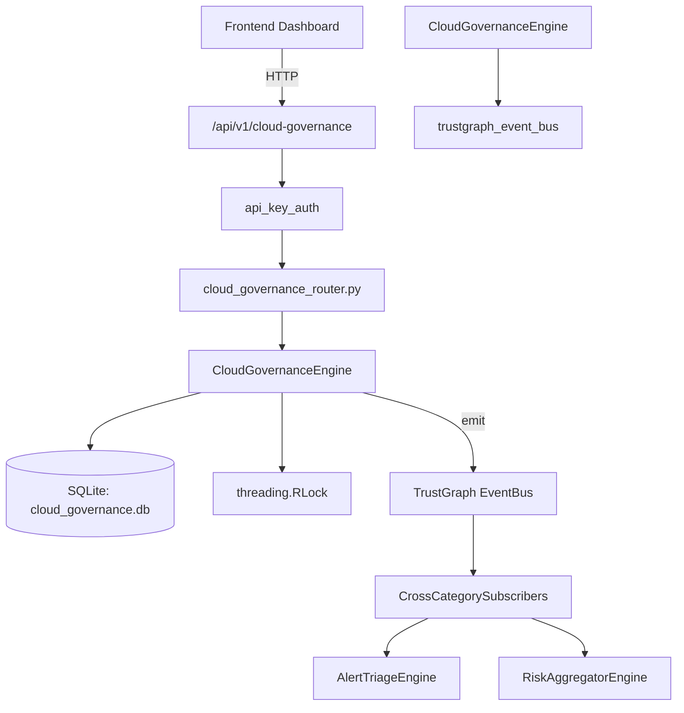

# US-0054: Cloud Governance

## Sub-Epic: CSPM
**Master Goal**: ALDECI — $35/mo enterprise security intelligence platform replacing $50K-500K/yr tools

## User Story
As a **Jennifer Wu (Cloud Security Architect)**, I need to secure cloud infrastructure and workloads
so that the platform delivers enterprise-grade cspm capabilities at 1/1000th the cost of legacy tools.

## Why This Matters
Cloud Governance replaces functionality found in enterprise tools like CrowdStrike, Wiz, Snyk, and Rapid7.
By building this into ALDECI's $35/mo stack, customers save $50K+/yr on standalone CSPM tooling.

## Architecture

## Current State: 95% Complete
- ✅ `create_governance_policy()` — Create a governance policy. Validates name, policy_type, cloud_provider, enforce (line 105)
- ✅ `list_governance_policies()` — List governance policies for an org with optional filters. (line 164)
- ✅ `get_governance_policy()` — Return a single governance policy or None if not found. (line 191)
- ✅ `record_violation()` — Record a policy violation and increment the policy's violation_count. (line 204)
- ✅ `list_violations()` — List violations for an org with optional filters. Returns up to 100 ordered by d (line 265)
- ✅ `remediate_violation()` — Mark a violation as remediated. (line 292)
- ❌ TrustGraph event emission — not yet verified

## Key Functions (from `suite-core/core/cloud_governance_engine.py` — 405 lines)
- `CloudGovernanceEngine.create_governance_policy()` — Create a governance policy. Validates name, policy_type, cloud_provider, enforce (line 105)
- `CloudGovernanceEngine.list_governance_policies()` — List governance policies for an org with optional filters. (line 164)
- `CloudGovernanceEngine.get_governance_policy()` — Return a single governance policy or None if not found. (line 191)
- `CloudGovernanceEngine.record_violation()` — Record a policy violation and increment the policy's violation_count. (line 204)
- `CloudGovernanceEngine.list_violations()` — List violations for an org with optional filters. Returns up to 100 ordered by d (line 265)
- `CloudGovernanceEngine.remediate_violation()` — Mark a violation as remediated. (line 292)
- `CloudGovernanceEngine.get_governance_stats()` — Return aggregated governance statistics for an org. (line 324)

## Dependencies
- **Depends on**: trustgraph_event_bus
- **Depended by**: Routers, TrustGraph EventBus, CrossCategorySubscribers
- **TrustGraph**: Event emission wired via ResponseInterceptorMiddleware
- **Source file**: `suite-core/core/cloud_governance_engine.py` (405 lines)
- **Router file**: `suite-api/apps/api/cloud_governance_router.py`

## API Endpoints
| Method | Path | Description |
|--------|------|-------------|
| POST | `/api/v1/cloud-governance/policies` | create governance policy |
| GET | `/api/v1/cloud-governance/policies` | list governance policies |
| GET | `/api/v1/cloud-governance/policies/{policy_id}` | get governance policy |
| POST | `/api/v1/cloud-governance/violations` | record violation |
| GET | `/api/v1/cloud-governance/violations` | list violations |
| PUT | `/api/v1/cloud-governance/violations/{violation_id}/remediate` | remediate violation |
| GET | `/api/v1/cloud-governance/stats` | get governance stats |

## Tasks Remaining
1. Verify TrustGraph event emission works end-to-end (2h)
2. Add integration test with real persona workflow (2h)
3. Wire CrossCategorySubscriber consumer chain (1h)
4. Validate with 30-persona walkthrough (1h)
5. Optimize query performance for large datasets (2h)
6. Expand test coverage to edge cases (2h)

## Definition of Done
- [ ] Jennifer Wu (Cloud Security Architect) can access /api/v1/cloud-governance and get meaningful data
- [ ] All CRUD operations return correct HTTP status codes
- [ ] TrustGraph receives events from this engine
- [ ] 36+ tests passing in `tests/test_cloud_governance_engine.py`
- [ ] 30-persona walkthrough includes this endpoint at 100%
- [ ] No hardcoded org_id — all queries are org-scoped

## Sprint: Wave 43 (est. April 19-21, 2026)

## Test Coverage
- **Test file**: `tests/test_cloud_governance_engine.py`
- **Tests**: 36 tests
- **Status**: Passing
