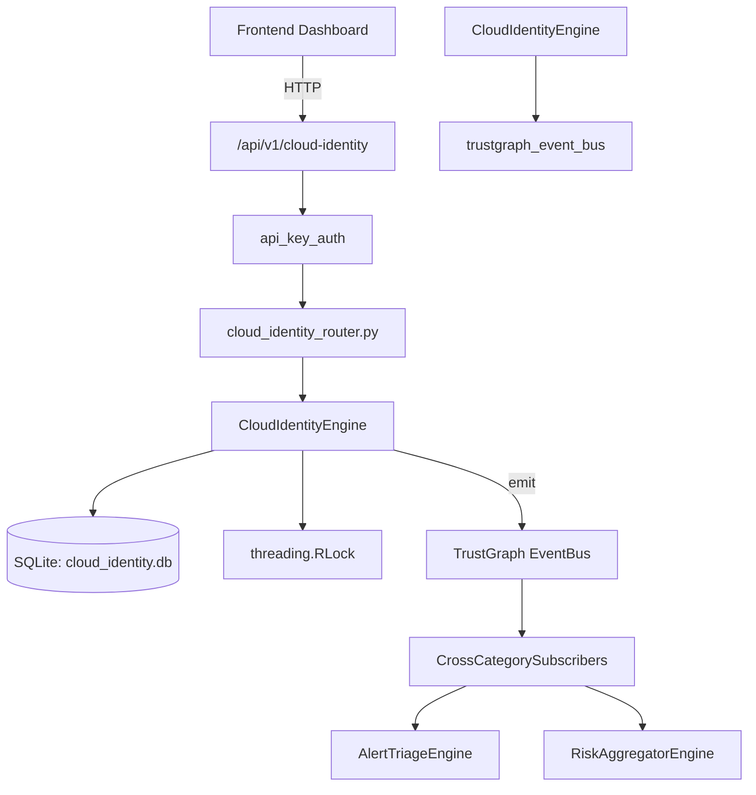

# US-0055: Cloud Identity

## Sub-Epic: CSPM
**Master Goal**: ALDECI — $35/mo enterprise security intelligence platform replacing $50K-500K/yr tools

## User Story
As a **Jennifer Wu (Cloud Security Architect)**, I need to secure cloud infrastructure and workloads
so that the platform delivers enterprise-grade cspm capabilities at 1/1000th the cost of legacy tools.

## Why This Matters
Cloud Identity replaces functionality found in enterprise tools like CrowdStrike, Wiz, Snyk, and Rapid7.
By building this into ALDECI's $35/mo stack, customers save $50K+/yr on standalone CSPM tooling.

## Architecture

## Current State: 95% Complete
- ✅ `register_identity()` — Register a new cloud identity. (line 167)
- ✅ `list_identities()` — List cloud identities with optional filters. (line 239)
- ✅ `get_identity()` — Retrieve a single identity; None if not found or wrong org. (line 263)
- ✅ `update_permissions()` — Update an identity's permissions and recalculate privilege_level. (line 274)
- ✅ `record_access_review()` — Record an access review for an identity. (line 309)
- ✅ `list_access_reviews()` — List access reviews with optional filters. (line 365)
- ❌ TrustGraph event emission — not yet verified

## Key Functions (from `suite-core/core/cloud_identity_engine.py` — 523 lines)
- `CloudIdentityEngine.register_identity()` — Register a new cloud identity. (line 167)
- `CloudIdentityEngine.list_identities()` — List cloud identities with optional filters. (line 239)
- `CloudIdentityEngine.get_identity()` — Retrieve a single identity; None if not found or wrong org. (line 263)
- `CloudIdentityEngine.update_permissions()` — Update an identity's permissions and recalculate privilege_level. (line 274)
- `CloudIdentityEngine.record_access_review()` — Record an access review for an identity. (line 309)
- `CloudIdentityEngine.list_access_reviews()` — List access reviews with optional filters. (line 365)
- `CloudIdentityEngine.record_permission_change()` — Record a permission change for an identity. (line 389)
- `CloudIdentityEngine.list_permission_changes()` — List permission changes with optional filters. (line 438)

## Dependencies
- **Depends on**: trustgraph_event_bus
- **Depended by**: Routers, TrustGraph EventBus, CrossCategorySubscribers
- **TrustGraph**: Event emission wired via ResponseInterceptorMiddleware
- **Source file**: `suite-core/core/cloud_identity_engine.py` (523 lines)
- **Router file**: `suite-api/apps/api/cloud_identity_router.py`

## API Endpoints
| Method | Path | Description |
|--------|------|-------------|
| POST | `/api/v1/cloud-identity/identities` | register identity |
| GET | `/api/v1/cloud-identity/identities` | list identities |
| GET | `/api/v1/cloud-identity/identities/{identity_id}` | get identity |
| PUT | `/api/v1/cloud-identity/identities/{identity_id}/permissions` | update permissions |
| POST | `/api/v1/cloud-identity/reviews` | record access review |
| GET | `/api/v1/cloud-identity/reviews` | list access reviews |
| POST | `/api/v1/cloud-identity/permission-changes` | record permission change |
| GET | `/api/v1/cloud-identity/permission-changes` | list permission changes |
| GET | `/api/v1/cloud-identity/stats` | get cloud identity stats |

## Tasks Remaining
1. Verify TrustGraph event emission works end-to-end (2h)
2. Add integration test with real persona workflow (2h)
3. Wire CrossCategorySubscriber consumer chain (1h)
4. Validate with 30-persona walkthrough (1h)
5. Optimize query performance for large datasets (2h)
6. Expand test coverage to edge cases (2h)

## Definition of Done
- [ ] Jennifer Wu (Cloud Security Architect) can access /api/v1/cloud-identity and get meaningful data
- [ ] All CRUD operations return correct HTTP status codes
- [ ] TrustGraph receives events from this engine
- [ ] 39+ tests passing in `tests/test_cloud_identity_engine.py`
- [ ] 30-persona walkthrough includes this endpoint at 100%
- [ ] No hardcoded org_id — all queries are org-scoped

## Sprint: Wave 43 (est. April 19-21, 2026)

## Test Coverage
- **Test file**: `tests/test_cloud_identity_engine.py`
- **Tests**: 39 tests
- **Status**: Passing
