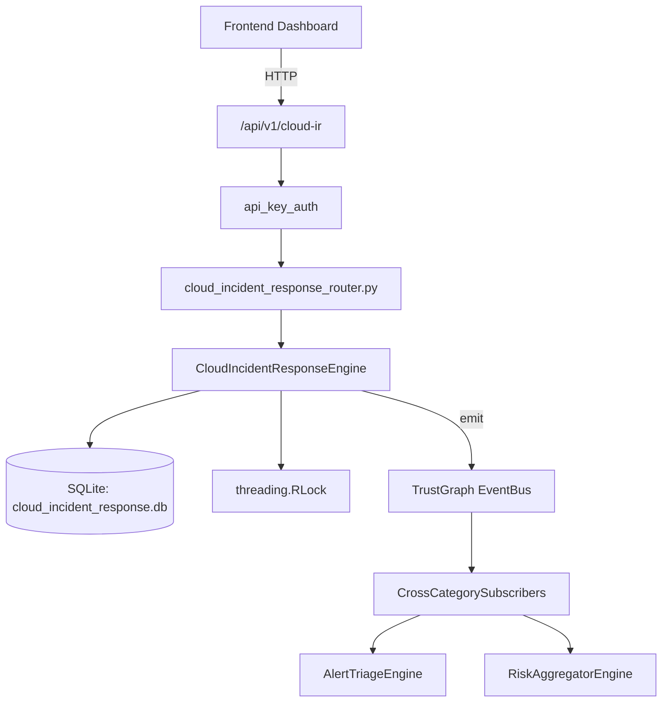

# US-0056: Cloud Incident Response

## Sub-Epic: CSPM
**Master Goal**: ALDECI — $35/mo enterprise security intelligence platform replacing $50K-500K/yr tools

## User Story
As a **Jennifer Wu (Cloud Security Architect)**, I need to secure cloud infrastructure and workloads
so that the platform delivers enterprise-grade cspm capabilities at 1/1000th the cost of legacy tools.

## Why This Matters
Cloud Incident Response replaces functionality found in enterprise tools like CrowdStrike, Wiz, Snyk, and Rapid7.
By building this into ALDECI's $35/mo stack, customers save $50K+/yr on standalone CSPM tooling.

## Architecture

## Current State: 95% Complete
- ✅ `create_incident()` — implemented (line 157)
- ✅ `contain_incident()` — Mark incident as contained; compute containment_time_mins via julianday. (line 216)
- ✅ `resolve_incident()` — Mark incident as resolved; compute resolution_time_mins via julianday. (line 243)
- ✅ `list_incidents()` — implemented (line 270)
- ✅ `get_incident()` — Return incident dict + actions list + matching playbooks (same provider+type). (line 289)
- ✅ `add_containment_action()` — implemented (line 319)
- ❌ TrustGraph event emission — not yet verified

## Key Functions (from `suite-core/core/cloud_incident_response_engine.py` — 511 lines)
- `CloudIncidentResponseEngine.create_incident()` — Handle create incident (line 157)
- `CloudIncidentResponseEngine.contain_incident()` — Mark incident as contained; compute containment_time_mins via julianday. (line 216)
- `CloudIncidentResponseEngine.resolve_incident()` — Mark incident as resolved; compute resolution_time_mins via julianday. (line 243)
- `CloudIncidentResponseEngine.list_incidents()` — Handle list incidents (line 270)
- `CloudIncidentResponseEngine.get_incident()` — Return incident dict + actions list + matching playbooks (same provider+type). (line 289)
- `CloudIncidentResponseEngine.add_containment_action()` — Handle add containment action (line 319)
- `CloudIncidentResponseEngine.complete_action()` — Mark containment action as completed. (line 359)
- `CloudIncidentResponseEngine.create_playbook()` — Handle create playbook (line 387)

## Dependencies
- **Depends on**: standalone
- **Depended by**: Routers, TrustGraph EventBus, CrossCategorySubscribers
- **TrustGraph**: Event emission wired via ResponseInterceptorMiddleware
- **Source file**: `suite-core/core/cloud_incident_response_engine.py` (511 lines)
- **Router file**: `suite-api/apps/api/cloud_incident_response_router.py`

## API Endpoints
| Method | Path | Description |
|--------|------|-------------|
| POST | `/api/v1/cloud-ir/incidents` | create incident |
| GET | `/api/v1/cloud-ir/incidents` | list incidents |
| GET | `/api/v1/cloud-ir/incidents/{incident_id}` | get incident |
| POST | `/api/v1/cloud-ir/incidents/{incident_id}/contain` | contain incident |
| POST | `/api/v1/cloud-ir/incidents/{incident_id}/actions` | add containment action |
| POST | `/api/v1/cloud-ir/actions/{action_id}/complete` | complete action |
| POST | `/api/v1/cloud-ir/incidents/{incident_id}/resolve` | resolve incident |
| POST | `/api/v1/cloud-ir/playbooks` | create playbook |
| GET | `/api/v1/cloud-ir/playbooks` | list playbooks |
| POST | `/api/v1/cloud-ir/playbooks/{playbook_id}/execute` | execute playbook |
| GET | `/api/v1/cloud-ir/metrics` | get ir metrics |

## Tasks Remaining
1. Verify TrustGraph event emission works end-to-end (2h)
2. Add integration test with real persona workflow (2h)
3. Wire CrossCategorySubscriber consumer chain (1h)
4. Validate with 30-persona walkthrough (1h)
5. Optimize query performance for large datasets (2h)
6. Expand test coverage to edge cases (2h)

## Definition of Done
- [ ] Jennifer Wu (Cloud Security Architect) can access /api/v1/cloud-ir and get meaningful data
- [ ] All CRUD operations return correct HTTP status codes
- [ ] TrustGraph receives events from this engine
- [ ] 56+ tests passing in `tests/test_cloud_incident_response_engine.py`
- [ ] 30-persona walkthrough includes this endpoint at 100%
- [ ] No hardcoded org_id — all queries are org-scoped

## Sprint: Wave 43 (est. April 19-21, 2026)

## Test Coverage
- **Test file**: `tests/test_cloud_incident_response_engine.py`
- **Tests**: 56 tests
- **Status**: Passing
