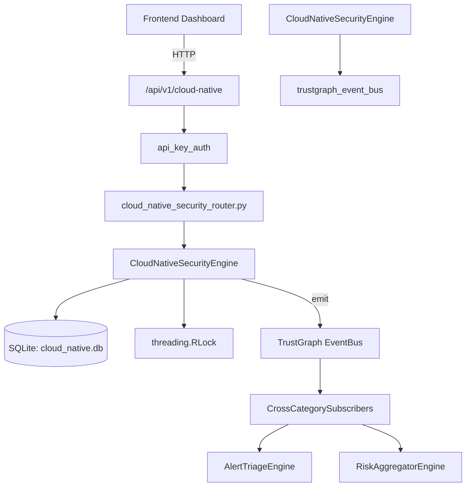

# US-0057: Cloud Native Security

## Sub-Epic: CSPM
**Master Goal**: ALDECI — $35/mo enterprise security intelligence platform replacing $50K-500K/yr tools

## User Story
As a **Jennifer Wu (Cloud Security Architect)**, I need to secure cloud infrastructure and workloads
so that the platform delivers enterprise-grade cspm capabilities at 1/1000th the cost of legacy tools.

## Why This Matters
Cloud Native Security replaces functionality found in enterprise tools like CrowdStrike, Wiz, Snyk, and Rapid7.
By building this into ALDECI's $35/mo stack, customers save $50K+/yr on standalone CSPM tooling.

## Architecture

## Current State: 95% Complete
- ✅ `register_cloud_account()` — Register a cloud account for an org. (line 141)
- ✅ `list_accounts()` — List cloud accounts for an org, optionally filtered by provider. (line 181)
- ✅ `record_misconfiguration()` — Record a cloud misconfiguration finding. (line 198)
- ✅ `list_misconfigurations()` — List misconfigurations with optional filters. (line 248)
- ✅ `mark_compliant()` — Mark a misconfiguration as compliant (remediated). (line 285)
- ✅ `run_posture_check()` — Run a posture check against a registered cloud account. (line 314)
- ❌ TrustGraph event emission — not yet verified

## Key Functions (from `suite-core/core/cloud_native_security_engine.py` — 433 lines)
- `CloudNativeSecurityEngine.register_cloud_account()` — Register a cloud account for an org. (line 141)
- `CloudNativeSecurityEngine.list_accounts()` — List cloud accounts for an org, optionally filtered by provider. (line 181)
- `CloudNativeSecurityEngine.record_misconfiguration()` — Record a cloud misconfiguration finding. (line 198)
- `CloudNativeSecurityEngine.list_misconfigurations()` — List misconfigurations with optional filters. (line 248)
- `CloudNativeSecurityEngine.mark_compliant()` — Mark a misconfiguration as compliant (remediated). (line 285)
- `CloudNativeSecurityEngine.run_posture_check()` — Run a posture check against a registered cloud account. (line 314)
- `CloudNativeSecurityEngine.get_cloud_stats()` — Aggregate stats across all cloud accounts for an org. (line 376)

## Dependencies
- **Depends on**: trustgraph_event_bus
- **Depended by**: Routers, TrustGraph EventBus, CrossCategorySubscribers
- **TrustGraph**: Event emission wired via ResponseInterceptorMiddleware
- **Source file**: `suite-core/core/cloud_native_security_engine.py` (433 lines)
- **Router file**: `suite-api/apps/api/cloud_native_security_router.py`

## API Endpoints
| Method | Path | Description |
|--------|------|-------------|
| GET | `/api/v1/cloud-native/accounts` | list accounts |
| POST | `/api/v1/cloud-native/accounts` | register account |
| GET | `/api/v1/cloud-native/misconfigurations` | list misconfigurations |
| POST | `/api/v1/cloud-native/misconfigurations` | record misconfiguration |
| POST | `/api/v1/cloud-native/misconfigurations/{finding_id}/mark-compliant` | mark compliant |
| POST | `/api/v1/cloud-native/accounts/{account_id}/posture-check` | run posture check |
| GET | `/api/v1/cloud-native/stats` | get stats |

## Tasks Remaining
1. Verify TrustGraph event emission works end-to-end (2h)
2. Add integration test with real persona workflow (2h)
3. Wire CrossCategorySubscriber consumer chain (1h)
4. Validate with 30-persona walkthrough (1h)
5. Optimize query performance for large datasets (2h)
6. Expand test coverage to edge cases (2h)

## Definition of Done
- [ ] Jennifer Wu (Cloud Security Architect) can access /api/v1/cloud-native and get meaningful data
- [ ] All CRUD operations return correct HTTP status codes
- [ ] TrustGraph receives events from this engine
- [ ] 57+ tests passing in `tests/test_cloud_native_security_engine.py`
- [ ] 30-persona walkthrough includes this endpoint at 100%
- [ ] No hardcoded org_id — all queries are org-scoped

## Sprint: Wave 43 (est. April 19-21, 2026)

## Test Coverage
- **Test file**: `tests/test_cloud_native_security_engine.py`
- **Tests**: 57 tests
- **Status**: Passing
