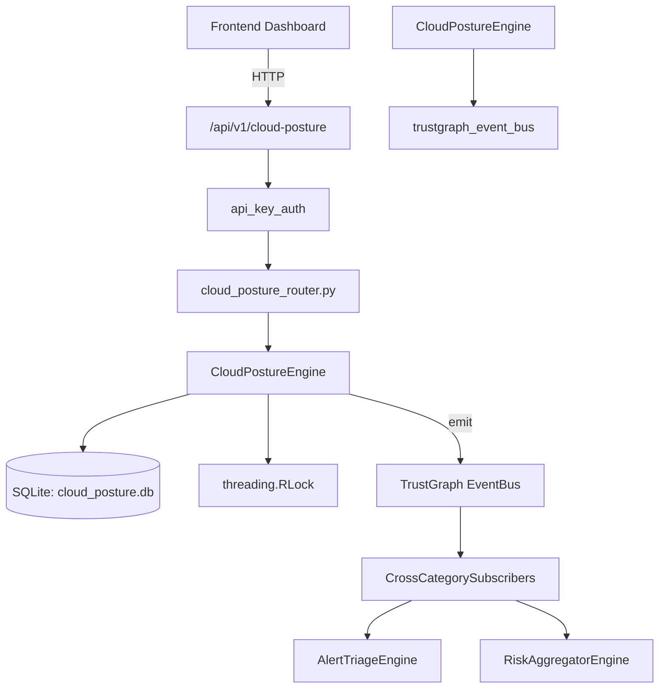

# US-0058: Cloud Posture

## Sub-Epic: CSPM
**Master Goal**: ALDECI — $35/mo enterprise security intelligence platform replacing $50K-500K/yr tools

## User Story
As a **Jennifer Wu (Cloud Security Architect)**, I need to secure cloud infrastructure and workloads
so that the platform delivers enterprise-grade cspm capabilities at 1/1000th the cost of legacy tools.

## Why This Matters
Cloud Posture replaces functionality found in enterprise tools like CrowdStrike, Wiz, Snyk, and Rapid7.
By building this into ALDECI's $35/mo stack, customers save $50K+/yr on standalone CSPM tooling.

## Architecture

## Current State: 95% Complete
- ✅ `register_account()` — Register a cloud account for posture tracking. (line 102)
- ✅ `list_accounts()` — List cloud accounts for the org, optionally filtered by provider. (line 148)
- ✅ `get_account()` — Get a single cloud account by internal id, org-isolated. (line 163)
- ✅ `record_finding()` — Record a cloud posture finding and adjust account posture score. (line 177)
- ✅ `list_findings()` — List findings with optional filters. (line 228)
- ✅ `update_finding_status()` — Update a finding's status. Restores posture score when resolved. (line 257)
- ❌ TrustGraph event emission — not yet verified

## Key Functions (from `suite-core/core/cloud_posture_engine.py` — 352 lines)
- `CloudPostureEngine.register_account()` — Register a cloud account for posture tracking. (line 102)
- `CloudPostureEngine.list_accounts()` — List cloud accounts for the org, optionally filtered by provider. (line 148)
- `CloudPostureEngine.get_account()` — Get a single cloud account by internal id, org-isolated. (line 163)
- `CloudPostureEngine.record_finding()` — Record a cloud posture finding and adjust account posture score. (line 177)
- `CloudPostureEngine.list_findings()` — List findings with optional filters. (line 228)
- `CloudPostureEngine.update_finding_status()` — Update a finding's status. Restores posture score when resolved. (line 257)
- `CloudPostureEngine.get_posture_stats()` — Return aggregate posture statistics for the org. (line 305)

## Dependencies
- **Depends on**: trustgraph_event_bus
- **Depended by**: Routers, TrustGraph EventBus, CrossCategorySubscribers
- **TrustGraph**: Event emission wired via ResponseInterceptorMiddleware
- **Source file**: `suite-core/core/cloud_posture_engine.py` (352 lines)
- **Router file**: `suite-api/apps/api/cloud_posture_router.py`

## API Endpoints
| Method | Path | Description |
|--------|------|-------------|
| POST | `/api/v1/cloud-posture/accounts` | register account |
| GET | `/api/v1/cloud-posture/accounts` | list accounts |
| GET | `/api/v1/cloud-posture/accounts/{account_id}` | get account |
| POST | `/api/v1/cloud-posture/findings` | record finding |
| GET | `/api/v1/cloud-posture/findings` | list findings |
| PATCH | `/api/v1/cloud-posture/findings/{finding_id}/status` | update finding status |
| GET | `/api/v1/cloud-posture/stats` | get posture stats |

## Tasks Remaining
1. Verify TrustGraph event emission works end-to-end (2h)
2. Add integration test with real persona workflow (2h)
3. Wire CrossCategorySubscriber consumer chain (1h)
4. Validate with 30-persona walkthrough (1h)
5. Optimize query performance for large datasets (2h)
6. Expand test coverage to edge cases (2h)

## Definition of Done
- [ ] Jennifer Wu (Cloud Security Architect) can access /api/v1/cloud-posture and get meaningful data
- [ ] All CRUD operations return correct HTTP status codes
- [ ] TrustGraph receives events from this engine
- [ ] 37+ tests passing in `tests/test_cloud_posture_engine.py`
- [ ] 30-persona walkthrough includes this endpoint at 100%
- [ ] No hardcoded org_id — all queries are org-scoped

## Sprint: Wave 43 (est. April 19-21, 2026)

## Test Coverage
- **Test file**: `tests/test_cloud_posture_engine.py`
- **Tests**: 37 tests
- **Status**: Passing
